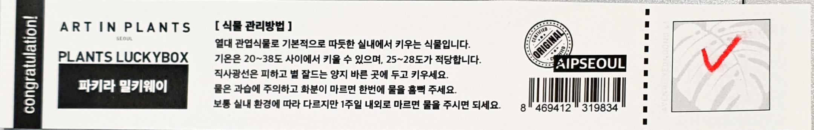
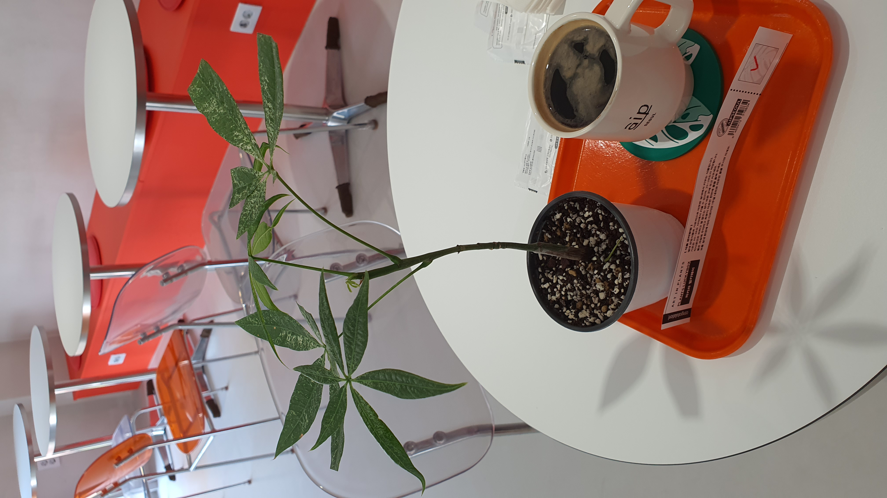
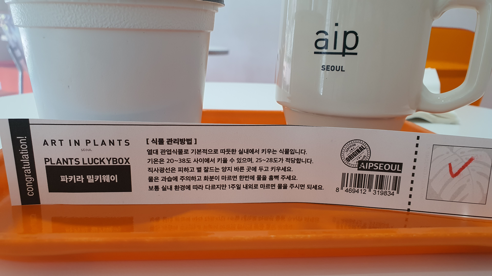
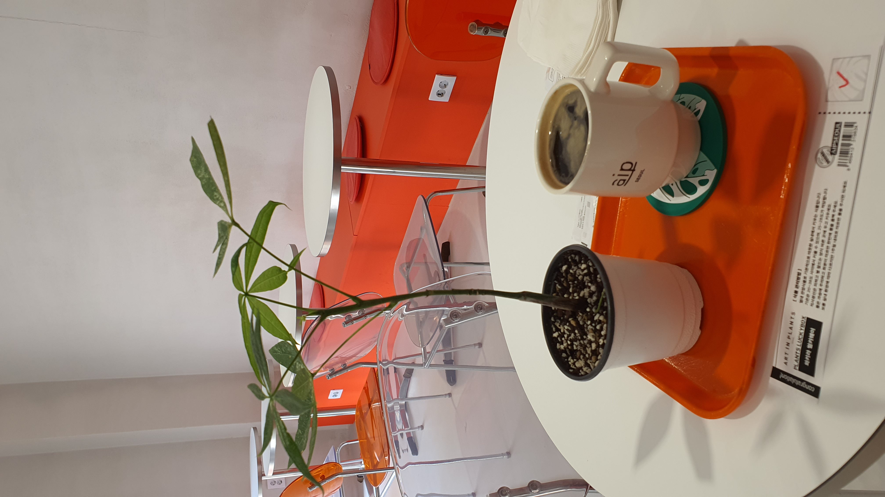
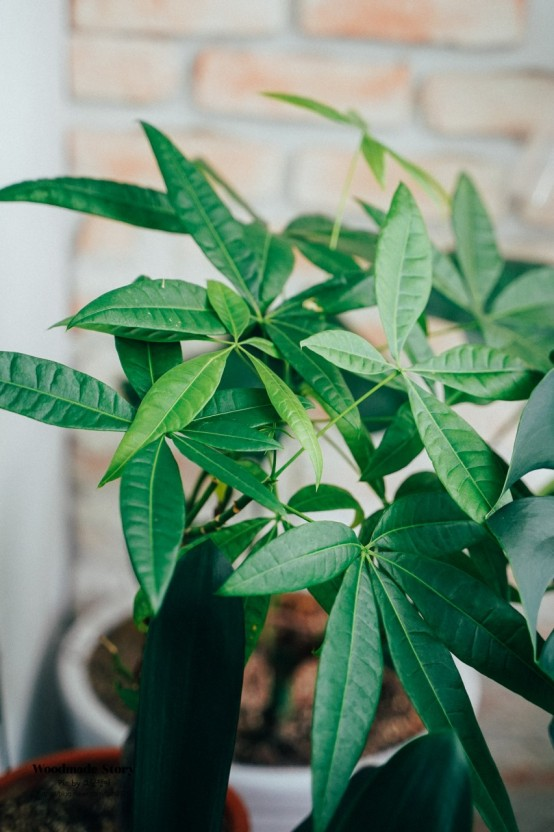

### # 알로카시아 드래곤스케일
  - https://hgarden.net/portfolio/alocasia-dragon-scale/

#### # 파키라 밀키웨이 이렇게 하면 성공해요.
  - https://www.youtube.com/watch?v=0yRKwDjSd-o

#### # 학명 : Pachira aquatica
  - 식물 > 속씨식물 > 쌍떡잎식물 > 아욱목
  - 관엽식물, 교목, 실내원예
  - 밀키웨이 : 하얗게 얼룩덜룩.

  - 학명 : Pachira aquatica
  - 계 : 식물
  - 문 : 속씨식물
  - 강 : 쌍떡잎식물
  - 목 : 아욱목
  - 원산지 : 멕시코에서 남아메리카
  - 크기 : 높이 30∼200cm

#### # 개요
  - 멕시코에서 남아메리카가 원산지이다. 보기에는 팔손이와 비슷하지만 실내원예에서 이국적인 정취를 풍겨 인기 있는 관엽식물이다. 높이는 30∼200cm까지 다양하다. 두꺼운 줄기와 거기서 뻗은 가느다란 가지가 특징적이다. 줄기는 벽오동처럼 생겼으나 밑부분은 갈색의 곤봉처럼 생겼다. 가지 끝에는 손바닥 모양으로 된 복엽(겹잎)이 달리고 작은잎은 긴 타원형이다. 꽃은 크고 매우 아름다워 감상하기에 좋다. 열매는 식용이 가능하다.
[네이버 지식백과] 파키라 [money tree] (두산백과 두피디아, 두산백과)

  
#### # 키우기 / 관리방법
  반그늘을 좋아하고 배수가 잘 되는 땅에서 잘 자란다. 건조하지 않도록 주의해야 한다. 씨뿌리기와 꺾꽂이로 번식한다. 줄기를 자르면 여러 개의 새순이 나오기 때문에 1∼2개의 줄기에 여러 개의 작은 줄기와 잎을 가꾸면 상품가치가 있다.
이산화탄소를 없애는 능력이 뛰어나 공기정화에 좋은 식물이기 때문에 아파트의 베란다 또는 거실에서 키우면 좋다.
[네이버 지식백과] 파키라 [money tree] (두산백과 두피디아, 두산백과)
  - 
