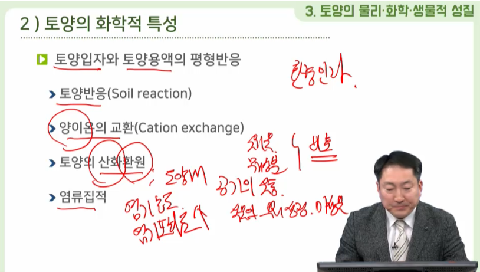

### # 1강. 농업환경
##### # 학습개요
  - 품질이 우수하고 안전한 농축산물을 효율적으로 생산하기 위해서는 농업생물체인 작물이나 가축을 둘러싸고 있는 환경과의 관계, 즉 농업 환경 이해하고 이를 바탕으로 농업 환경을 개선시키는 방안이 중요하다고 할 수 있다. 현대의 농업은 생산성 향상과 환경보전을 담보하지 못하면 지속가능한 생명산업으로 발전하는데 한계를 가지고 있다고 하겠다. 따라서 본 강에서는 일반적인 농업환경의 특성과 우리나라의 농업환경에 대한 기초 지식들에 대하여 학습하고자 한다.

##### # 학습목표
  - 환경은 구성하는 환경 요인들을 이해할 수 있다.
  - 자연과 농경지의 생물상의 차이를 설명할 수 있다.
  - 우리나라의 기후 조건을 설명할 수 있다.
  - 기상 요소와 작물의 생산 활동 간의 관계를 이해할 수 있다.
  - 기상 재해의 종류와 발생 원인을 말할 수 있다.
  - 농업의 환경보전기능과 환경저해요인들에 대하여 설명할 수 있다.

##### # 주요용어 주요용어
  - 환경 요인(Environmental factor) : 생물체를 둘러싸는 환경을 구성하는 요인으로 환경과 생물관계를 음미하는 데 있어 기상 환경, 토양 환경 및 생물 환경으로 나눌 수 있다.

  - 생물상(Biota) : 특정 생태계내에 존재하는 모든 생물적 요소

  - 물질순환(Matter cycle) : 생태계에서 생물들간 또는 생물과 비생물과의 사이에서 물질을 무한하게 이용하는 메카니즘

  - 기상 재해(Meteorological disaster) : 기상이 원인이 되어 발생되는 큰 피해

  - 산성비(Acid rain) : 산성도를 나타내는 수소이온 농도지수(pH)가 5.6미만인 비를 말하며, 대기오염물질이 대기 중의 수증기와 만나 황산이나 질산으로 변하여 비에 흡수된 것

##### # 학습정리
  - 자연 환경과 생물
    - 환경의 개념
    - 환경 요인 : 기상 환경, 토양 환경, 생물 환경
    - 물질 순환

- 농업 환경의 특성
    - 자연과 농경지의 생물상 차이
    - 농업 유형과 물질 순환

- 기후와 농업
    - 우리나라의 기후
    - 생물 계절
    - 생물 계절 지표 식물과 동물
    - 기상 요소와 작물 생산
       ① 대기물질
       ② 태양광(빛) 
       ③ 온도 
       ④ 물 
       ⑤ 이산화탄소
    - 기상 재해
      ① 온도에 의한 재해 
      ② 물에 의한 재해 
      ③ 바람에 의한 재해

  - 우리나라의 농업환경
    - 농업의 환경보전기능
    - 농업의 환경저해요인
    - 농업환경의 현황
      ① 대기질 
      ② 수질 
      ③ 토양 
      ④ 농산물 안전성
  - 농업환경의 전망

##### # 교안 - 1강
1) 자연 환경과 생물
   - 환경의 개념
        - 환경(environment)
            - 생물체의 개체 및 집단을 둘러싸고 있는 상황 혹은 조건
            -  생물체에 영향을 주는 것들의 총합

    - 환경 요인
        - 기상 환경 : 식물의 지상부 및 동물의 생활환경
        - 토양 환경 : 식물의 지하부 환경
        - 생물 환경 : 식물, 동물 및 미생물

    - 물질 순환 
        - 기권, 수건, 지권의 순환
1) 생물상의 변화
    - 자연과 농경지의 생물상
        - 다양한 생물상
        - 단순한 생물상
        - 완전순환계
        - 불완전순환계
1) 우리나라의 기후
    - 기상과 기후
        - 기상(weather) : 시시각각 변하는 대기현상
        - 기후(climate) : 장기간에 이루어진 대기현상들의 평균상태
        - 계절(season) : 기후의 연 주기를 구분
    - 4계절과 농업
        - 비교적 뚜렷한 4계절
        - 하지와 동지를 기준으로 24절기
        - 여름철 덥도 습합
        - 겨울철 춥고 건조함
        - 여름과 겨울의 온도차가 심하며, 강수량은 여름에 집중

2) 기상 요소와 작물 생산
  - 대기물질
    - 지구를 둘러싸고 있는 공기
    - 건조 고기의 구성 성분
        - 질수(78.1%), 산소(20.9%), 이산화탄소(0.03%)
    - 대기 중 공해 물질
        - 아황산가스, 이산화질소, 플루오르, 에틸렌
  - 태양광(빛)
    - 태양 에너지는 지구상 모든 에너지의 근원과 기상변화의 원동력
    - 여러 가지 파장의 묶음
      - 자외선(380nm 이하),
      - 가시광선(380-770nm)
      - 적외선(770nm 이상)
    - 광합성에 사용되는 빛의 파장
      - 가시광선과 근적외선의 일부
  - 태양광(가스광선)
  - 광합성과 태양 에너지 이용률
    - 태양 에너지 이용 이산화탄소 고정
      - 육지 식물(73%), 바다 생물(27%)
    - 육상 식물의 빛 에너지 이용률은 태양 상수의 2-4%
    - 광 보상점
      - 광합성량과 호흡에 의한 소모량이 같음
    - 광 포화점
      - 광합성량이 더 이상 증가하지 않음
  - 일장 효과
    - 낮의 길이가 꽃눈의 발육과 개화에 영향
        - 장일 식물 : 1일 낮 시간이 14 - 16 시간
        - 단일 식물 : 낮 시간이 8-10시간으로 짧음
        - 중성 식물 : 낮의 길이가 개화에 영향을 주지 않음
    - 장일 식물 : 완두, 시금치, 딸기, 백합, 무
    - 단일 식물 : 늦벼, 조, 수수, 옥수수, 콩, 국화
    - 중성 식물 : 가지, 토마토, 강나콩, 올벼

  - 온도
    - 기온 : 대기의 온도
    - 식물의 광합성과 호흡, 물의 흡수, 증사산 작용 및 대사 활동
    - 생육 적온 : 대부분의 작물은 20-35🌡️
    - 유효 온도 : 생물의 활동이 이루어지는 온도
    - 적산 온도 : 일정기간 매일의 평균 기온을 합산한 온도
  - 물 
    - 모은 생명체의 기본물질이며, 생물체 대사반응을 수행
      - 세포 내 모양과 형태유지, 생체물질의 용매, 체온조절 기능
    - 대기 중의 물은 수증기 형태로 습도로 결정
      - 대기 중 습도 ↑ :> 증산작용 ↓, 식물 생육에 지장
      - 대기 중 습도 ↓ :> 증산작용 ↑, 수분 부족 장해
    - 강수량 : 지표에 떨어진 물의 총량
  - 이산화탄소
    - 이산화탄소의 농도는 광합성 속도에 영향
    - 식생과 계절, 바람등의 요인으로 농도 변화
        - 여름철 낮고, 겨울철이 높음
        - 하루 중에서는 낮에는 낮고, 밤에 높음
    - 밀폐된 온실이나 시설재배지의 이산화 탄소 농도 변화 큼
      - 노지의 낮과 밤의 농도 차이 150-200mg/L
      - 온실의 낮과 밤의 농도 차이 225-250mg/L

3) 농업기상재해
  - 기상재해
    - 기상의 변화에 의하여 발생되는 모든 피해
    - 온도의 관련된 재해
        - 동상해, 냉해, 고온해
    - 물과 관련된 재해
        - 한발해, 수해
    - 바람과 관련된 재해
        - 폭우를 동반한 태풍, 폭풍
  - 기상재해
    - 기상재홰 종류별 빈도
        - 한발해 > 수해 > 냉해
    - 한발지수(증발량/강수량) 기준 농업기후지대 4개 구분
    - 풍수해 발생빈도(회/2년)에 따른 농업기후지대 구분
    - 저온 출현율(5/15-6/5일평균기온 13도 이하 출현비율)
    - 동해안 남-북-중부 지대가 주요 기상재해 빈도가 높음

1) 농업이 환경에 미치는 영향
  - 농업의 환경보전기능
      - 대기정화 기능
      - 기온상승 억제
      - 홍수의 조절 및 방지
      - 지하수 함량 증대
      - 하천 생태계 유지 및 수질개선
      - 토사유출이나 토양침식 방지
      - 휴양과 전통문화 공간 제공

  - 농업의 환경 저해 요인
    - 자연생태계 파괴
    - 지역적 조건에 따른 토양유실
    - 하류지역 하천생태계 변화
    - 농약과 비료의 과다 사용
    - 비점오염원 작용
    - 가축분뇨의 부적절한 관리와 이용
    - 폐비닐, 빈 농약병 등 농업환경물질
2) 농업환경의 현황
  - 대기질
    - 산업화에 다른 오존, 산성비를 포함한 산성 강하물
      - 토양 pH 저하
    - 온실가스 배출에 의한 지구온난화
      - 매탄(CH4), 아산화질소(N2O)
    - 수질
        - 농업용수 : 지표수와 지하수
        - 농업용수 오염원 : 중금속, 농약 및 비료의 영양염류
        - 농업용 지하수
          - 논농사용 관정은 수질 양호
          - 시설원예 재배지는 농업용수 수질기준 초과 증가
    - 토양
      - 농경지 토양조사 주기적 실시
        - 농촌진흥청(토양비옥도), 환경부(토양오염도)
      - 토양에서의 농약 잔류성은 꾸준히 낮아지고 있음
      - 논 토양 : 유기물은 적정 수준, 유효인산은 증가
      - 밭 토양 : 유기물 적정 수준 : 유효과다 및 염류집적

    - 농산물 안전성
      - 잔류농약, 항생물질, 중금속 및 마이코톡신
        - 농촌징흥청(토양비옥도), 환경부(토양오염도)
      - 농약안전사용기준 설정
        - 수확 전 최종 살포시기와 횟수
      - 농산물 농약잔류허용기준 설정운영
3) 농업환경의 전망
   - OECD 농업환경지표
     - 토양, 용수, 대기, 자연, 농장재정 및 사회문화의  6개지표
     - 양분사용, 농약사용, 농업용수 등 13개 세부지표 보고

   - 농산물품질인증제
   - 농산물우수관리(GAP)
   - 친환경농산물 인증 :> 화학비료 사용불가

   - 가축분뇨 이용 등 비점오염원 관리

##### # 연습문제

|||
|:--:|:--:|
|문제1|문제2|
|{: width="400"}|{: width="400"}|
|문제3|문제4|
|{: width="400"}|{: width="400"}|
|문제5|-|
|{: width="400"}||

### # 2강. 농업생태계
##### # 학습개요
 - 생태계는 생물이 점거하고 살아가는 환경과 상호작용을 통해 일어나는 계층간․생물간의 체계를 말하는 것으로, 자기 보존이나 자기 조절 기능을 가지고 있다. 농업생태계는 생태계에 포함되는 하나의 개념이지만 농업생산이 이루어지고 있는 장소이자 인위적인 관리와 자원이 투입되기 때문에 자연생태계와는 다른 특성을 가지게 된다. 따라서 본 강에서는 생태계의 구조, 특성 및 작용에 대한 이해를 바탕으로 농업생태계에 대한 기초 지식들에 대하여 학습하고자 한다.

##### # 학습목표
  - 생태계의 개념과 구성요소들을 이해할 수 있다.
  - 생태계의 구조, 특성과 작용의 관계를 설명할 수 있다.
  - 자연생태계와 농업생태계의 차이를 이해할 수 있다.
  - 농업생태계에서의 물질순환(탄소, 질소 및 인)에 대하여 설명할 수 있다.

##### # 주요용어
  - 생태계(ecosystem) - 특정 지역과 공간에서의 비생물적 환경과 생물 공동체가 종합적으로 결합된 물질계 또는 기능계
  - 군집(community) - 일정한 생육조건하에서 생활하고 있는 모든 생물 개체군의 모임으로 생물군집을 이루고 있는 개체군은 먹이관계와 양분순환 등의 유기적인 관계를 가지게 된다.

  - 항상성 (Homostasis) - 생물체 또는 생태계가 내․외부의 변화에 저항하거나 대응하면서 평형상태를 유지해 나가는 경향

  - 탄소순환(carbon cycle) - 대기 중의 이산화탄소가 광합성에 의하여 유기물로 고정되고, 유기물은 먹이사슬과 호흡현상 및 미생물의 분해에 의하여 이산화탄소로 되어 무기물로 순환하는 현상

  - 질소순환(nitrogen cycle) - 생태계내에서 질소가 생물학적 과정과 비생물학적 과정을 거쳐 다양한 화학 형태로 바뀌어 생물체에 이용되거나 환경으로 전환되어 순환되는 과정

##### # 학습정리
  - 생태계외 농업환경
    - 생태계 개념
    - 생태계 구성요소 : 영양적 입장에서 구성요소, 구조적 입장에서 구성요소
    - 농업환경

  - 생태계 구조
    - 생태계의 조직화 단계
    - 군집의 구조적 특성
    - 생태계의 항상성

  - 농업생태계
    - 자연생태계의 특징
    - 관행농업생태계
    - 유기농업생태계
    - 농업생태계의 특징
      ① 에너지 흐름 
      ② 영양물질의 순환 
      ③ 개체군의 조정 
      ④ 안정성
    - 농업생태계의 에너지 이동과 물질 순환
    - 농업생태계의 지속적 특성
    - 지속가능한 농업

##### # 교안 - 2강
1) 생태계
   - 생태계 개념
     - 생태계(ecosystem)
       생물과 비생물적 환경의 상호 작용
       모든 생물은 물리적 환경과 상호관계를 가지며,
        에너지 흐름이 system 속에서 뚜렷한 영양단계,
        생물의 다양성, 물질의 순환을 만들어 내고 있는 상태

    - 생태계 개념
      - 생태계(ecosystem)
        환경(토양, 물, 대기) + 생물학적 요소
        생태계가 환경보다 광범위
    
    - 생태계 구성 요소 
      - 영양적 입장에서 생태계 구성 요소
       독립영양 부분
        - 빛 에너지를 이용하여 유기물을 합성
       종속영양 부분
        - 유기물의 이용, 분해, 재분비가 이루어짐

    - 생태계 구성 요소
      구조적 입장에서 생태계 구성 요소
       비생물적 구성요소
        - 순환무기물(C, N, CO2 등)
        - 유기화합물(단백질, 탄수화물, 지방 등)
        - 기후조건(온도, 기타 물리적 조건)
       생체량(Biomass)
        - 생산자 : 독립 영양 생물
        - 대형소비자 또는 섭식 영양자 : 종속 영양 생물
        - 미세소비자
1) 농업환경
   - 농업환경의 개념
     - 농업환경(Agriculture Environment)
         농업이 이루어지는 생산의 장
         자연환경과 도시환경 사이에 위치
        보전과지속

        자연환경, 농업환경, 도시환경
        
        완충력

1) 생태계 구조
   - 생태계 조직화 단계
   - 생물개체 < 개체군 < 군집 < 생태계
   
   - 군집의 구조적 특성
      - 종 다양성
      - 우점과 상대밀도
      - 식생의 구조
      - 영양구조
      - 안정성
   - 생태계의 항상성
       - 항상기구 : Feedback : 자동조절기구
       - 평형 수준의 개념
       - 피식 과 포식의 FeedBack
         - 생물과 피생물의 조절 과정
  
       

1) 자연생태계
   - 육상과 수상생태계
     - 독립영양생물 : 자급영양층
     - 종속영향생물 : 타급영양층

   - **자연생태계**의 특징 : **비일률적이고 비직선적이다.**
      - 에너지 흐름 : **군집의 에너지 흐름**
      - 영양물질의 순환
      - 개체군의 조정
      - 생태계의 변화   

2) 관행농업생태계
   - 현대농업생태계
     - 불완전순환계(현대농업) <> 완전순환계(자연상태)
      
3) 유기농업생태계 : 자연생태계와 유사하게 유지하자. 농약,화학적비료를 줄임으로써
에너지의 단절을 줄이고, 자연순환계 물질 순환을 촉진시킴으로써, 농업환경의 부하를 줄여주고
 생태계 자정과 조율기능을 효율을 높이자.
    - 유기농업생태계
4) 농업생태계 특징
   - 에너지 흐름
   - 영양물질의 순환 : 자연생태계보다 작다.
   - 개체군의 조정
   - 안정성

4) 농업생태계
   - 에너지 이동 : 에너지 이용효율이 떨어진다. ( 태양의 5프로 미만의 이용률 )

   - 물질순환 : 탄소
     - 이산화탄소 : 0.034%
     - 영양물질의 이동과 수탈이 심하다.
     - 탄소 -> 외부 반출
       -> 퇴비, 구비, 식물체 환원
    
   - 물질순환 : 질소
     - 환경조건에 따라서. 이동 특성이 달라짐.
     - N3 : 안정화된 질소
       - 화학작용에 나온 비료 : N질소를 이용함.
         - 암모니아(NH3) ==> 질산태질소 : 무기화되는작용 질산화작용
      - 용탈에의한 오염원으로 작용
      - 질소고정 : 대기중에 존재하는 안정화공중질소(n3)를 식물이 이용할 수 있는 질소로 변화시키는 과정, 질소 이용효율을 높힘.
        - 클로버(두과작물 뿌리혹박테리아)

    - 물질순환 : 인
      - 가축 ATP, 광합성 종실 구성에 영향을 줌
      - 자연생태계에서 흡수가 덜어지고 : 순환이 떨어짐
      - 토양 강우 침식에 의해서 자연생태계로 유입되면 부영양화를 일으킴

      

5) 농업태계와 자연생태계
   - 농업생태계의 투입환경과 산출환경
     - 투입환경 : 에너지= 태양에너지 + 보조에너지
      물질과 생물 유기체

6) 농업생태계의 지속성
   - 농업생태계의 지속성 특성
   - 환경 부하의 최소화
   - 토양비옥도 보전 및 건전성 유지
   - 지하수 보전 수자원 활용
   - 야생생태계와 순화된 생물적 다양성 유지
   - 농업자원의 국부적 지역적 조절 가능

7) **지속가능한 농업**
   - 지속가능한 농업 개념
   - 집약적 농업 → 저투입 지속적 농업
   - 토양검정, 비료 농약 최적 관리 →생산성 유지·향상
   - 환경의 질을 보전·향상
   - 환경친화형농업(ESA)
   
##### # 연습문제

|||
|:--:|:--:|
|문제1|문제2|
|{: width="300"}|{: width="300"}|
|문제3|문제4|
|{: width="300"}|{: width="300"}|

### 3강. 토양환경과 토양오염
##### # 학습개요
  - 토양은 물과 대기환경의 중간 위치에서 인간을 비롯한 모든 동식물이 생육하는 터전이며, 환경의 총체적 균형을 유지하는 완충역활을 수행하는 환경의 중요한 구성 요소이다. 작물의 생산성을 포함한 모든 농업생산성은 토양의 성질에 의해 결정되므로 건전한 토양환경을 지속적으로 유지하고 관리하는 일은 농축산물의 생산과 자연생태계의 물질순환에 있어 무엇보다 중요하겠다. 따라서 본 강에서는 토양의 특성과 기능 그리고 토양 오염에 대하여 학습하고자 한다.

##### # 학습목표
  - 토양의 단면 형태와 토양 생성 인자와의 관계를 말할 수 있다.
  - 토양환경의 구성과 기능을 이해할 수 있다.
  - 토양의 물리적․화학적․생물학적 성질을 이해할 수 있다.
  - 우리나라 토양의 특성
  - 토양오염의 특징과 오염원에 대하여 설명할 수 있다.

##### # 주요용어
  - 토양 단면(soil profile) 
    - 토양을 지표면에 대하여 수직으로 잘랐을 때 토양층들이 모두 나타나는 단면으로 이를 관찰하여 토양의 색, 성질, 구조 따위를 알 수 있다.
  - 토양 3상(Three phases of soil) 
    - 토양은 토양광물과 유기물인 고체상태의 입자인 고상과 그 사이의 공극으로 이루어져 있다. 공극에는 여러 가지 용질이 녹아 있는 액상, 수증기와 이산화탄소 등 대기 구성분이 함께 있는 기상으로 채워져 있다.
  - 토성(soil texture) 
    - 토양의 무기입자를 모래, 미사 및 점토로 구분하고 이들의 함량비에 따라 결정되는 토양의 종류
  - 양이온 교환(cation exchange) 
    - 토양콜로이드 표면에 흡착되어 있는 양이온이 용액 중의 양이온과 교환하는 현상
  - 토양오염(soil pollution) 
    - 산업활동에 의해 배출되는 유해물질이 토양에 축적되어 그 농도가 자연함유량보다 높아지고 이로 인하여 토양에 악영향을 주어 그 기능과 질이 저하되며, 토양에서 생산된 생산물에 오염물질이 축적되어 인체에 악영향을 미치는 경우
 - 비점오염원(Non-point source pollutant) 
  - 농경지, 양식장, 야적장, 도시노면배수 등과 같이 불특정하게 산발적으로 오염물질이 배출되는 오염원

##### # 학습정리
  - 토양의 생성
    - 토양의 정의
    - 토양의 생성 작용
    - 토양의 생성 인자
    - 토양의 단면

  - 토양환경의 구성과 기능
    - 토양의 구성
    - 토양의 기능

  - 토양의 물리적, 화학적, 생물학적 성질
    - 물리적 성질 : 토양의 입경, 토성, 구조, 밀도
    - 화학적 성질 : 유효태 성분, 토양 콜로이드, 양이온 교환
    - 생물학적 성질 : 미생물, 토양동물, 토양식물

  - 우리나라 토양의 특성
    - 논 토양
    - 밭 토양
    - 시설재배지 토양

  - 토양오염
    - 토양오염 정의
    - 토양오염의 특징
    - 토양오염 물질 및 오염원
    - 토양오염과 생태계

##### # 교안 - 3강
1) 토양
   - 토양의 정의
     - **암석**의 풍화산물인 **모재** → 토양생성작용 → 토양
     - 식물생산 측면 → **식물의 배지**
     - **지각**의 가장 윗부분을 덮고 있는 **부드러운 물질**로서
       - **암석**의 풍화산물인 작은 **무기성분** 입자와
         **동·식물**에서 유래된 **유기물** 및 이들 **고체입자**들에
         채워진 **공기** 또는 **수분**으로 이루어져 있으며
         식물을 기계적으로 지지하고 수분과 양분을
         저장·공급하여 주는 **자연체**

2) 토양 생성 인자 >> 토양의 성질에 작용
    - **기후** : 가장중요한 인자중 하나 >> 강수량, 온도
    - 생물 : 유기물함량, 공극형성에 작용
    - 모재
    - 지형
    - 풍화 기간

3) 토양의 단면 형태
  - 토층 : 5개로 구성
    - 유기물층 : O층
    - 용탈층 : A층 : 강수나 이용에의해서 유기물 용탈
    - 집적층 : B층
    - 모재층
    - 암반 

1) 토양의 구성
   - **토양 3상** : 고상, 액상, 기상
     - 공극 : 기상 + 액상

   
1) 토양의 구성
   - 토양 3상의 구성비율
      - 이상적 구성 비율
        - 고상 : **무기물 45%, 유기물 5%** 
        - 공극 : 공기 25%, 물 25%

      - 양분과 물의 보유량
      - 산소의 공급량
      - 뿌리 생육
    - 고상 비율이 작을 수록 뿌리가 뻗기가 쉬워진다.
    - 고상 비율이 클수록 보수성과 통기성이 나빠진다.
    - 고상 비율이 일정할 때 기상의 비율이 커지면 수분 흡수량이 적어진다.

2) 토양의 기능
   - 토양 3상
      - 무기물 : **입자의** **크기**와 형태가 토양의 특성을 결정
      - 유기물 : 동·식물 잔재에서 유래, **부식**(humus)
      - **토양수분** : 공기와 함께 토양공극에 존재, 화학반응의 매질
      - **토양공기** : 식물뿌리와 미생물의 호흡
      - 지름의 크기가 2mm이상 : 자갈
      - 지름의 크기가 0.002mm : 점토
      - 0.002~0.005 : 미사
      - 모래

   - 토양의 역할
      - **수분**의 저장과 공급 : 고체 알갱이 공극
      - **양분**의 저장과 공급
      - 식물체 기계적 지지

1) 토양의 물리적 특성
   - 토성삼각도 : soil texture
     - 무기입자의 크기가 토양에 특성에 물리적인 표현이됨
        - 입경의 크기에따라, 모래, 미사, 점토
        - 보수성, 통기성, 배수성

   

1) 토양의 물리적 특성        
  - 토양구조
    

   - 토양의 밀도와 공극률 ( ***밀도 = 질량/부피*** )
     - 용적밀도(Bulk density) : 공극, 토양의 이용여하 따라 밀도 다르게 나타남.
     - 입자밀도(Particle density) : 고형 입자의 자체밀도, 인위적으로 변화 X
        - 물 밀도 : 1.0 g/cm3
        - 식염수 밀도 : 2.65 g/cm3
     - 공극률(Porosity)
       - 경작지 : 1.1~1.4g/cm3

      

2) 토양의 화학적 특성
   - 토양의 화학적 조성
    - 모든 토양의 동일한 조성은 아님
    - 가장 많은 성분 : **규산(SiO2)** 과 **알루미나(Al2O3)**
    - 토양콜로이드(colloid, 교질물) 
      -> 큰비표면적을 갖고 있고 표면전하를 가지고 있다
      -> 미세입자 점토는 콜로이드성질을 가지고 있다.
      -> 점토, 유기물, 철,알루미늄 수산화물
        -> 모래는 콜로이드가 아니다.

    
         
  - 토양입자와 토양용액의 평형반응
      - 토양반응(Soil reaction)
      - 양이온의 교환(Cation exchange) : 유기물 분해, 무기성분 비료가 토양흡착후 작물에 영양분에 공급됨
      - 토양의 산화환원 : 토양내에서의 공기의 유동, 식물의 뿌리 성장, 미생물
      - 염류집적 :염기농도 염기포하도의 식물의 악영향

    

2) 토양의 화학적 특성
   - 양이온의 교환
      -> 토양콜로이드 점토 광물질 같은경우 표면적이 넓고 전하를 가지고 있다.
      - 대부분 음전하를 가지고 있다.
      이러한 음전하를 가지고 있는 콜로이드 상태의 표면에
      가용성 양이온들이 작물에게 영양분을 공급한다.

    
         
         
3) 토양의 생물학적 특성
   - 토양 생물
     - 미생물 : 세균, 곰팡이, 방선균(감자:더뎅이병)
     - 토양동물 : 대형동물군, 중형동물군, 미소동물군
     - 토양식물 : 대형식물군, 미소식물군

1) 토양의 특성
   - 개요
     - 산성모암인 화강암과 화강편마암에서 생성
     - 평균 pH 5.6인 산성
     - 유기물함량, 염류농도 및 CEC 낮음
2) 논 토양의 특성
    - 논 토양
      - 토양 비옥도가 비교적 낮음
      - 산성 토양
      - 인산을 제외한 pH, 유기물, 칼륨, 마그네슘 등이
      - 벼 성장에 부족
3) 밭 토양의 특성
    - 밭 토양
      - 산성 토양
      - 교환성 염류농도 낮음
      - 유효인산, 교환성 칼륨 함량이 증가 추세
      - 비옥도가 낮고 완충능력도 크지 않음

4) 시설재배지 토양의 특성
    - 시설재배지 토양
      - 약 산성 토양
      - 유기물함량은 적정 범위를 약간 상회
      - 유효인산함량이 적정 범위를 초과
        - 수분과 염기흡수 장해
      - 염류집적 및 지하수 오염 유발 원인

5) 토양질소와 순환
   - 질소 순환 : 0.02 ~ 0.5%
     
    

6) 토양인산과 순환
   - 인의 순환 : 0.02 ~ 0.08%
   - 불용성물질 : 인산비료 10-20%만 이용되고 , 인근 하천 호수로 유입 부영양화의 원인이된다.

1) 토양오염
    - 토양오염의 정의
      - 외부로부터 오염물질이 토양 내로 유입되어 그 농도가
        자연함유량보다 높아지고 이로 인하여
        토양에 악영향을 주어 그 기능과 질이 저하되며,
        토양에서 생산된 Biomass에 오염물질이 축적되어
        인체에 악영향을 미치는 현상
    - 토양오염물질 : 토양환경보전법
      - 토양오염물질의 종류
         - 카드뮴, 구리, 비소, 수은, 납, 아연, 니켈
         - 불소
         - 유기인 화합물
         - PCB
         - 시안화합물
         - 페놀류
         - 유류(동 · 식물성 제외)
         - 유기 용제류

    - 토양오염의 특징
        - 축적성 오염 : 토양 : 대기,수질, 
        - 2차적 오염
        - 국소적 오염특성
        - 장기지속성
        - 오염상태의 불균질 문제
        - 시차성과 고비용 문제
2) 토양오염원
     - 발생원에 따른 구분
        - **점오염원**(point source pollutant)
          - 폐기물매립지, 대단위 가축사육장, 산업지역,
            건설지역, 운영중인 광산, 유독물 저장시설
        - **비점오염원**(non-point source pollutant)
          - 농약 및 화학비료의 장기간 연용,
            휴 · 폐광산에서 유출되는 중금속, 산성비

      - 원인물질에 따른 구분
        - 영양소(질소와 인) : 과다수용 환경 악영향
        - 농약 관련 물질 : 환경/식물체의 이질적 합성화화합물(Xehobiotics)
        - 유류 관련 오염물질
        - 중금속
        - 산성물질

3) 토양오염 원인과 경로
   - 토양오염 경로
     

   - 토양오염 사례    
4) 토양오염과 생태계
  - 중금속이 자연생태계에 미치는 영향
    식물생육에 미치는 영향
    - 원형질막의 투과성 변경, 식물 효소 억제 작용
    수계환경에 미치는 영향
    - 중금속의 생물농축
    인체건강에 미치는 영향
    - 먹이연쇄

   - 난분해성 유기화합물이 자연생태계에 미치는 영향
     - 난분해성 유기화합물(persistent organic pollutants, POPs)
     - 내분비장애물질 ::> **환경호르몬**
     - 물에 대한 **용해도**가 낮고, **지질**에 대한 친화력이 높음
     - 생물농축에 의해 높은 영양단계의 동물은 농도가 축적

##### # 연습문제

|||
|:--:|:--:|
|문제1|문제2|
|{: width="300"}|{: width="300"}|
|문제3|문제4|
|{: width="300"}|{: width="300"}|
|문제5||
|{: width="300"}||

### 4강. 수질환경과 수질오염
##### # 학습개요
  - 물은 생물체의 물질대사에 필요한 요소일 뿐만 아니라 농축산업활동에 중요한 자원으로서 절대적인 가치를 지니고 있습니다. 농축산업용수는 수질과 환경에 많은 영향을 미치므로 농축산업용수를 올바로 관리하는 것은 안전한 농축산물을 생산하고 지속가능한 농축산업 환경을 구축함에 있어 매우 중요한 일입니다. 따라서 본 강에서는 수자원의 특성과 현황 그리고 수질의 오염에 대하여 살펴보고자 합니다.

##### # 학습목표
  - 수자원의 종류 및 특성을 설명할 수 있다.
  - 우리나라 수자원 현황 및 특성을 설명할 수 있다.
  - 수질오염의 정의 및 수질오염에 따른 영향을 설명할 수 있다.
  - 수질오염지표 및 수질환경기준에 대하여 설명할 수 있다.

##### # 주요용어
  - 하상계수(Coefficient of river regime)
  - 하천의 최대유량과 최소유량의 비

  - 부영양화(Eutrophicaiton)
    - 질소와 인 등의 영양염류 과다 유입은 조류의 이상 번식을 초래해 수중 용존산소가 줄어들게 된다. 수중 용존산소 감소는 수생식물 및 물고기에게 부적합한 환경을 조성해 수중생태계의 종 다양성이 감소된다.

  - 용존산소(Dissolved Oxygen)
    - 물속에 녹아있는 산소량을 의미한다. 용존산소량은 수온일 낮을수록, 공기와의 접촉 표면이 넓을수록, 유속이 빠를수록 증가한다.

  - 생화학적 산소요구량(Biochemical Oxygen Demand)
    - 수중의 유기물이 호기성 미생물에 의해 분해될 때 요구되는 산소량을 mg/L 또는 ppm 단위로 나나낸 것

  - 화학적 산소요구량(Chemical Oxygen Demand)
    - 수중의 유기물이 중크롬산칼륨이나 과망간산칼륨과 같은 산화제에 의해 산화될 때 소비되는 산소량을 mg/L 또는 ppm 단위로 나나낸 것

##### # 학습정리
  - 수자원의 종류 및 특성
    - 수자원 : 지구상의 물 중에서 자원으로 이용 가능한 물을 의미함
    - 지하수 및 지표수는 지구상 물의 0.76%에 불가함
    - 국민 1인당 확보된 연간 담수량으로 물기근, 물부족, 물풍요 국가를 구분함

  - 우리나라의 수자원 현황 및 특성
    - 수자원 총이용량은 부존량 대비 27%
    - 강수량 특성 :
      - 연평균 강수량은 풍부하나 1인당 연간 이용가능 강수총량은 부족함
      - 계절적, 지역적 편차가 심해 수자원 관리 및 이용에 불리한 특성이 있음
  - 지형 및 하천의 특성 :
    - 하천경사가 심해 강수의 유출시간이 짧음
    - 연간 하천유량의 변동이 심함(하상계수가 높음)
  - 수자원개발 및 관리에 매우 불리한 지형 및 유역 특성을 가지고 있음

  - 수질오염 및 수질오염의 영향
    - 수질오염의 정의
    - 수질오염원
    - 수질오염 유형
    - 수질오염이 인체에 미치는 영향
    - 수질오염이 부영양화에 미치는 영향

  - 수질오염지표 및 수질환경기준
    - 부유물질: 탁도, 부유고형물
    - 유기물: 용존산소(DO), 생화학적 산소요구량(BOD), 화학적 산소요구량(COD)
    - 하천 수질환경 기준: 이용목적에 따라 정해진 기준에 의해 5등급으로 구분
##### # 교안 - 4강
1) 수자원의 종류
    - 수자원의 정의 및 분류
      - 지구상의 물 중에서 자원으로 이용 가능한 물을 의미함 수자원은 우수(빗물), 지표수, 지하수, 해수 등으로 구분됨
      - 수자원
          - 우수: 눈, 비, 우박 등
          - 지표수: 하천수, 호소수 등 : Sub Suface Water
          - 지하수: 천층수, 심층수, 용천수, 복류수 등 :Ground Water, River Bad Water
          - 해수 

   - 물의 중요성
        -  수분은 인체의 약 70~80% 구성
          § 영양물및산소운반,노폐물배출및체온유지
        - 문명과 산업의 원동력
          § 4대 문명의 발상지:
        이집트 나일강, 이라크 메소포타미아, 인도 인더스 & 갠지스강, 중국 황하강
        충분한 물 공급은 현대사회 발전에 필수인자 (수량/수질 모두 중요)

  - 수권(Hydrosphere)
      - 바다, 강, 호수 등 지구에서 물이 차지하고 있는 영역을 의미함
      - 수권(水圈)은 지구표면의 71%를 차지함

      - 지구상의 물 총량: 13억8천6백만 km3 
      - 지하수와 지표수는 지구상 물의 0.76%
  - 수자원 부족
    - 전세계 인구의 40%는 식수난과 용수난을 겪고 있음
    - 산업 발달로 인해 물 수요는 급증하고 있음 국민 1인당 확보된 연간 담수량

1) 우리나라 수자원 현황
    - 수자원 부존량 및 이용량
    - 수자원 총이용량: 부존량 대비 27% 농업용수: 가장 많은 비중을 차지함
    - 강수량 특성
        우리나라 연평균 강수량: 1,245mm(1974-2003년 평균)
        § 세계평균 880mm의 약 1.4배: 강수량 풍부함 1인당 연간 이용가능 강수총량: 2,591톤
        § 세계평균 19,635톤의 약 12.5%에 불과함
        ☞ 좁은 국토면적에 비해 인구밀도가 높아 1인당 연간 이용가능 강수총량이 낮음 연간 강수총량=국토면적 x 강수량

    - 강수량 특성 : 1인당 연간 가용 수자원량 : 1,512톤
      § 물부족 국가: 폴란드, 덴마크, 남아프리카공화국, 한국 여름철에 연강수량의 2/3가 집중
      § 갈수기(11월-4월): 연강수량의 1/5에 불과함 강수량의 계절적, 지역적 편차가 심해 수자원 관리 및 이용에 매우 불리한 특성을 지니고 있음

    - 지형 및 하천의 특성
      - 하천 경사가 급해 강수의 유출 시간이 짧음
      - 연간 하천 유량의 변동이 심함 : 하상계수가 높음 :
        - 하상계수 : 물의 최대유랑과 최소유량의 차이
      - §하상계수: 하천의 최대유량과 최소유량의 비

      - 수자원 개발 및 관리에 매우 불리한 지형 및 유역 특성을 가지고 있음
      

1) 수질오염
   - 수질오염의 정의
      - 물의 물리, 화학, 생물학적 자정능력을 초과하여 수질이 크게 변화함으로써 물의 이용가치가 저하되고, 생물이나 인간에게 피해를 주는 현상
    - 수자원 이용에 지장을 초래하거나 수중 생물의 생태계를 파괴하는 현상
    - 수질오염원
      - 점오염원: 일정한 배출경로를 갖고있는 오염원
          § 점오염원: 생활하수, 산업폐수, 가축분뇨 등 
      - 비점오염원: 불특정 배출경로를 갖는 오염원
          § 비점오염원: 농경지배수, 도시노면배수 등
    - 수질오염 유형
        - 산소 소모성 물질: 미생물에 의해 유기물이 분해되면서 수중 산소 고갈시킴 
        - 생물학적 오염: 세균, 바이러스, 기생충 등에 의해        
        - 감염성 질병 유발 
        - 무기영양소: 수용성 질산염과 인산염 등에 의한 부영양화
        - 수용성 무기화합물: 산, 염기, 독성 중금속 등
        - 유기화합물: 유류, 세제 등
        - 부유물질  

    - 인체에 미치는 영향 
      - 직접적인 영향
        § 중독 및 수인성(waterborne) 질병 감염
        - 이따이이따이병(카드뮴 중독), 미나마타병(수은 중독)
        § 기생충감염등

      - 간접적인 영향
        § 오염된 물, 어패류, 농작물 등의 동식물 섭취

    - 부영양화(Eutrophication)
      - 질소와 인 등의 영양염류 과다 유입에 의한 현상
        § 조류 과다 발생으로 투명도 감소
        § 식물성 플랑크톤 대량 증식: 햇빛 차단
        § 수생식물및해조류생존위협
        § 폐사한 동식물 및 플랑크톤 사체 분해과정에서 산소감소
        § 수중생태계의 종 다양성 감소

1) 수질오염지표
    - **부유물질** 
      - 탁도(Turbidity)
        § 물에떠있는부유물질의정도에따라물의맑고탁한정도를 측정한 값
        § 단위: NTU(Nephelometric Turbidity Units) 
      - 부유고형물(Suspended Solid; SS)
          § 물에 녹지않고 수중에 떠다니는 물질로 크기가 0.1μm 이상의 현탁고형물
          § 탁도, 색도를 유발하며 플랑크톤 및 세균 등의 미생물을 다량 함유함
    - **유기물**
      - **용존산소(Dissolved Oxygen, DO)**
          § 물속에 녹아있는 산소량을 의미함
          § 수온이 낮을수록, 공기와의 접촉 표면이 넓을수록,
            유속이 빠를수록 용존산소량은 증가함
          § 물고기 생존에 적합한 용존산소는 5ppm 이상이며,
            용존산소가 2ppm 이하일 경우 악취가 발생하게 됨

        ☞ ppm(Part Per Million)
            - 1 ppm = 1/1,000,000
            - 1 ppm = 1mg/L =1mg/kg

      - **생화학적 산소요구량 (Biochemical Oxygen Demand, BOD)**
        § 수중의 유기물이 호기성 미생물에 의해 분해될 때 요구되는 산소량을 mg/L 또는 ppm 단위로 나타낸 것을 의미함
        § 수질오염 정도를 나타내는 지표로 많이 사용됨
        § 일반적으로 20°C에서 5일간 분해되는 과정에서 소모된 산소량으로 표시함(**BOD5**)

      - **화학적 산소요구량(Chemical Oxygen Demand, COD)**
          § 수중의 유기물이 중크롬산칼륨이나 과망간산칼륨 등의 산화제에 의해 산화될 때 소비되는 산소량을 mg/L 또는 ppm 단위로 나타낸 것
          § BOD와 함께 수질오염 정도를 나타내는 지표로 많이 사용됨
          
            - 난분해성 유기물, 이분해성 유기물질
            - 화학적 산소요구량 지표는 난분해성 유기물도 조사 가능하며
              - 생물삭적 산소요구량이 시간이 오래걸리는 반면에 중크롬산칼륨이나 과망간산칼륨 등의 산화제를 이용하므로 빠른 결과를 보장할 수 있다. 

      - **기타**
         - **pH(수소이온농도)**
            § 범위 1-14(중성: pH 7, 자연수의 일반적 pH : 6.5-7.5)
            § 산성이나 알칼리성 표시 대장균 : **산성은 : 7이하**
            독성물질, 중금속, 농약, 온도 등

2) 수질환경기준
    - 하천 수질환경 기준 5개의 등급으로 구분
        § 농업용수(하천수 수질기준 4급에 해당), 
          수산용수 1급(하천수 수질기준 2급에 해당), 
          공업용수 1급(하천수 수질기준 3급에 해당)

    - 하천 수질환경 기준
     

##### # 연습문제

|||
|:--:|:--:|
|문제1|문제2|
|{: width="300"}|{: width="300"}|
|문제3|문제4|
|{: width="300"}||

### 5강. 대기환경과 대기오염

##### # 학습개요
  - 지구의 주위를 대체로 일정하게 둘러싸고 있는 기체층을 대기라고 부른다. 대기는 지표로부터 대류권, 성층권, 중간권, 열권, 외기권으로 나눌 수 있다. 우리 인간과 다른 동식물이 살고 있는 곳은 대류권이다. 따라서 대류권의 공기 질의 좋고 나쁨은 바로 대류권 내의 동식물과 인간에 영향을 준다. 따라서 본 강에서는 대기환경과 대기오염에 대해 공부하고자 한다.
##### # 학습목표
  - 지구의 대기에 대해 이해할 수 있다.
  - 지구온난화에 대해 이해할 수 있다.
  - 축산과 온실가스에 대해 이해할 수 있다.

##### # 주요용어
  - 대기(大氣, atmosphere) - 천체의 주위를 대체로 일정하게 둘러싸고 있는 기체층

  - 온실가스(Greenhouse gas) - 온실효과를 일으키는 가스

  - 지구온난화지수(Global Warming Potential) - 100년간의 이산화탄소의 온실 효과를 기준으로 다른 가스들의 온실 효과를 계량화

##### # 학습정리
  - 지구의 대기
    - 지구 주위를 대체로 일정하게 둘러싸고 있는 기체층. 대류권, 성층권, 중간권, 열권, 외기권으로 나뉨

   - 지구온난화
    - 산업혁명 이후 인간의 활동으로 인해 대기에 온실가스가 증가함. 이에 따라 태양으로부터 받은 에너지의 일부분을 온실가스가 좀 더 획득하게 되어 지구 대기의 온도가 증가하는 현상임.

  - 지구온난화지수
    - 100년간의 이산화탄소의 온실 효과를 기준으로 다른 가스들의 온실 효과를 계량화한 지수. 이산화탄소 한 분자가 일으키는 온실효과를 1이라고 한다면, 메탄은 25, 아산화질소는 298임. 즉 메탄은 이산화탄소의 25배, 아산화질소는 이산화탄소 298배의 온실효과를 일으킬 수 있음.

  - 축산과 온실가스
    - 축산업에서 배출되는 온실가스는 주로 이산화탄소(CO2), 아산화질소(N2O), 메탄(CH4)임. 이산화탄소는 가축의 호흡과 화석연료의 사용에서 발생함. 아산화질소는 가축분뇨의 처리과정과 토양에서 발생함. 메탄은 가축의 장내발효, 가축분뇨의 처리과정, 그리고 토양에서 발생함.

##### # 교안 - 5강
#### 1. 지구의 대기
1) 대기권이란?
  - **대기(大氣, atmosphere)**
    - 천체의 주위를 대체로 일정하게 둘러싸고 있는 기체층
       **지표에서 약 1,000 km 상공까지 존재**
       **질소(N2; 약 78.1%); 산소(O2; 약 20.9%); 아르곤(Ar);
        이산화탄소(CO2); 수증기 등으로 구성되어 있음**
    - 대기권의 구분
      - 지표에서부터
        **대류권, 성층권, 중간권, 열권, 외기권**으로 나눔
         우리는 대류권(지표면에서 ~18 km)에서 살고 있음
2) 대기권의 특성 
   - 대류권(Troposphere)
     지표면의 복사에너지로 가열되므로
     고도가 높아지면 온도는 낮아짐
  - 성층권(Stratosphere)
    오존(O3)이 태양으로부터의 자외선
    흡수하여 고도가 높아지면 온도 상승
  - 중간권(Mesosphere)
    고도가 올라갈수록 온도 감소
  - 열권(Thermosphere)
    고도가 올라갈수록 온도 증가
      

#### 2. 지구온난화
1) 대기와 복사에너지
      

2) 온실가스란?
   - 온실효과를 일으키는 가스
   - 온실효과란?
      - 짧은 파장의 **태양** 복사 에너지가 지구에 에너지 공급
      - 지구는 긴 파장의 복사 에너지 방출
      - 온실가스가 긴 파장의 지구 복사 에너지 흡수
      - 흡수와 방출 에너지 불균형으로 인한 온난화

2) 온실가스의 종류
    - 기후변화협약에서 주로 논의되는 온실가스
    - 자연적으로 발생
      - Carbon dioxide (이산화탄소, CO2)
      - Methane (메탄, CH4)
      - Nitrous oxide (아산화질소, N2O)
   ----------------------------------------------- 
    - 인위적으로 발생
      - Hydrofluorocarbons (수소불화탄소, HFCs)
      - Perfluorocarbons (불화탄소, PFCs)
      - Sulfur hexafluoride (육불화황, SF6)

##### # Global Warming Potential (지구온난화지수, GWP)
   100년간의 이산화탄소의 온실 효과를 기준으로 다른 가스들의 온실 효과를 계량화
  - Global warming potential (100 year basis)
    - **CH4 : 메탄 > 25**
    - **N2O : 아산화질소 > 298**
    - HFCs 4 ~ 12,400
    - PFCs 6,630~11,100
    - SF6 23,500

3) 인간과 온실가스
   - 산업혁명 이후 주요 온실가스의 농도가 증가하고 있음
      

#### 2. 축산과 온실가스
1) 축산과 관련된 온실가스
   - 이산화탄소, 메탄, 아산화질소 배출원
    - 이산화탄소(CO2)
         직접적 배출 : 가축의 호흡
         간접적 배출 : 가축과 관련된 활동에서 배출
      - 목초 및 사료작물 생산과정에서 배출
      - 농장과 수송, 가공산물 생산 등의 과정에서 에너지 사용으로 배출
    - 메탄(CH4)
       가축의 장내발효, 가축분뇨 처리과정,     
        목초 및 사료작물 생산 과정(토양)에서 배출
    - 아산화질소(N2O)
       가축분뇨 처리과정, 목초 및
        사료작물 생산 과정(토양)에서 배출

      

2) 장내발효
    - 메탄
      - 섭취사료 : 20~30 시간 반추위에 존재, 70%의 소화가 반추위에서 발생
        - 메탄 생성 비율 : 장내발효 (87%), 대장 (13%)
        - 반추위에서 생성된 메탄의 95%는 트림으로 배출
        - 사료와 메탄
       섬유질 함유가 높고 소화율이 낮을 수록 → 메탄 발생량 증가
       농후사료가 높을 수록 → propionate 증가 → 메탄 발생량 감소
       사료가 반추위에서 머무르는 시간이 짧을 수록 → 메탄 발생량 감소
      

3) 가축분뇨
  - 메탄과 아산화질소 생성 원리
    - 가축분뇨의 유기성분(C, N)의 분해 과정에서 발생
    - 가축분뇨의 처리 조건에 따른 온실가스 배출 변화
       CO2 : 호기적 환경에서 주로 배출
       N2O : 혐기와 호기의 중간 환경에서 주로 배출
       CH4 : 혐기적 환경에서 주로 배출
       
4) 토양
    - 질산화(nitrification)와 탈질화(denitrification)
        - 토양의 온도, pH, 토양 내 NH3 양, 토양 내 수분량, 산소량 등에 따라 차이 발생
    - 주요배출원
        - 질소질 비료 사용, 유기질 분해, 작물 잔류물
        - 가축분뇨의 토양 시비
        - 침출(leaching), 유출(runoff), 휘발(volatilization)
        - 등으로 인한 질소 손실
      

5) 에너지
    - 에너지 소비에 의한 CO2 배출
      - 농장에서 사용하는 화석 연료
           트랙터, 농장용 기구, 사료 생산 및 수송 등
           프랑스 : 93 L oil / 1,000 L 소비
              - 곡물 경작지가 있는 경우 더 많이 소비
      - 비료 생산 과정에서 사용하는 화석연료
      - 제품 생산과정에서의 에너지 소비
    - 냉장시설에서 가스 유출
      - 운전과정 보다는 시설교체/수리 중의 유출이 원인

##### # 연습문제

|||
|:--:|:--:|
|문제1|문제2|
|{: width="300"}|{: width="300"}|
|문제3|문제4|
|{: width="300"}||

### 6강. 농약
##### # 학습개요
  농약은 농작물을 해치는 여러 동식물을 방제하거나, 농작물의 생리기능을 증진 또는 억제하는데 사용되는 모든 약제로서 인간의 영양 공급원인 농작물 생산에 있어 반드시 필요한 구성 요소이다. 하지만 농약의 무분별한 사용은 토양의 오염과 농작업자에게 과다 노출시 심각한 건강 장해를 유발할 수 있는 유해인자로도 작용한다. 따라서 본 강에서는 농약의 특성과 농약 사용에 따른 환경 유해성에 대해 학습하고자 한다.

##### # 학습목표
   - 농약의 역사에 대해 이해할 수 있다.
   - 농약 분류에 따른 건강영향을 설명할 수 있다.
   - 농약의 유익성 및 유해성을 설명할 수 있다.
   - 농약 노출평가 사례에 대해 이해할 수 있다.

##### # 주요용어
   - DDT(dichlorodiphenyl trichloroethane) - 농약 물질(살충제)의 시초라 할 수 있는 유기염소계 화합물로 저렴한 가격에 높은 살충 및 잔류 효과를 보여 1950~1960년대에 많이 사용되어 왔으나, 발암성이 확인되어 현재는 제조 및 판매가 금지된 물질
   
   - BHC(benzene hexachloride) - 유기염소계 살충제로 DDT와 마찬가지로 1950~1960년대 식량 생산에 많은 기여를 하였으나     난분해성, 높은 잔류성, 만성 독성을 나타내 현재는 제조 및 판매가 금지된 물질
   
   - 유기인제 살충제(organophosphate) - 해충 내 cholinestrase를 억제하여 acethylcholine이 분해되지 않게 하는     기작으로 살충 효과를 나타내는 물질로 독성이 일시적이고 중추 신경계를 통과하지 못함
   
   - 피레쓰린계 살충제(pyrethrin) - 사람 등의 포유류에 가장 안전한 농약 물질로 노출시 나타나는 반응은 독성이라기 보다는     알레르기성 및 접촉성 피부염이 가장 흔함

##### # 학습정리
    - 농약의 역사
      - 농약 사용의 배경 및 초기 농약 물질인 DDT와 BHC의 소개

    - 농약 분류에 따른 건강 영향
      - 사용 목적에 따른 분류
      - 노출 관련 요인
      - 유기인제 살충제의 특성 및 건강영향
      - 유기염소제 살충제의 특성 및 건강영향
      - 기타 살충제의 특성 및 건강영향
      - 제초제의 특성 및 건강영향

    - 농약의 유익성 및 유해성
      - 농약 사용에 따른 유익성 개요
      - 농약 사용에 따른 유해성 개요
      - 농약 물질의 대안

    - 농약 노출 평가 사례
      - 농약 물질 중 “디아지논(diazinone)"에 대한 국내 노출 평가 사례 제시
      - 노출 경로 구분 : 농작업, 방역 작업, 조경 작업
      - 노출 경로별 피부 노출 결과 소개
#### # 교안 - 6강
##### 1. 농약의 역사
1) 개요
    - 원예 분야에서 재배기술이 도입될 때 해충 방제 기술도 동시 도입
      청산훈증, 비산납 등의 무기화합물 살충제, 또는 황산 니코틴, 피레쓰린 등
    천연 약제가 농약의 역할 담당
    - 쌀의 생산 및 벼 해충에 대한 구제법은 명확히 제시되지 않음
      - 벼 해충은 멸구와 곤충 종류가 주를 이룸
        제를 위해 고래기름을 논에 뿌려 멸구 등의 곤충을 두들겨서 떨어뜨리는
      - 방제 방법에서 석유를 이용하는 방법으로 전환
      - 천적에 의한 방법과 청색형광 나방유고 등의 기술 개발 실시
      - 하지만 **만족할 만한 방제 효과는 얻지 못함**

    - DDT(dichlorodiphenyl trichloroethane)의 등장
      - 제 2차 세계대전 때 연합군이 사용한 강력한 살충제
      - 개발도상국에서 풍토병과 말라리아 등을 매개로하는
        하마다라 모기(anophelini) 등 위생해충의 소멸에 크게 공헌
      - **추후 유기염소계 농약 개발의 시발이 됨**
      - DDT의 발명자인 **뮬러(스위스)**는 **노벨 생리학 의학상 수상**

    - BHC(benzene hexachloride)의 개발
      - DDT에 이어 영국에서 발명되어 농약으로
      - 해충 구제 및 식량 증산에 폭넓게 활용

    - DDT와 BHC 등의 유기염소계 농약 : **산화력을가진 유기염소계열**
      - 석유화학공업과 소다공업에서 과잉염소를 이용한 산물
      - 가격 저렴, 강한 살충 효과, 다종의 해충 구제에 유효
      - 낮은 급성 독성 & 높은 잔류 효과
      - 1950~60년대에 걸쳐 살충제의 주역으로서 식량 증산에 큰 기여
      - 벼 뿐만 아니라 농작물, 과수, 목초 등에 많이 이용
    - 1949년도에 **유기인계** 농약인 파라티온(parathion) 발명
      - DDT와 BHC 등의 유기염소계 농약처럼 강력한 살충력을 나타냄
      - 하지만 상대적으로 급성 독성이 강해 이후 제조 판매가 중지됨

2) DDT (dichlorodiphenyl trichloroethane)
    - 성상
      - 유기염소계 화합물
      - 화학물질로 존재할 경우 대기 중에서는 안전
      - **동물 및 어류의 체내에서는 DDE로 대사되며 지방층에 축적**
      - 토양 및 수중에서는 미생물에 의해 주로 DDD로 분해
    - 독성
      - 다른 유기염소계 농약과 비교하여 비교적 독성이 적음
      - 하지만 과다 노출시 신경 독성 유발 및
      - 만성적 측면에서는 호르몬 균형 파괴
      - **현재는 신경 계통 세포에 영향을 주고**
      - **발암성이 확인되어 제조 및 사용 금지**
3) BHC (benzene hexachloride)
    - 성상
      - 다양한 이성질체를 갖는 유기염소계 화합물
        - 이성질체 유형 : α，β，γ，δ
        - 살충 효과가 가장 높은 것은 α-BHC, 가장 낮은 것은 β-BHC
      - α-BHC : 용출되기 쉬우며 증기압도 비교적 높아 **대기 중 확산이 쉬움**
      - β-BHC : 만성 독성이 가장 강하고 대사되기도 어려움
                **(체내 잔류 기간 : 14주)**
    - 독성
      - 급성 증상 : 심한 두통, 어지러움, 경련, 기관지계 자극 증상 유발
      - γ-BHC : 혈액 질환의 원인 (재생불량성 빈혈)
      - **난분해성, 높은 잔류성, 만성 중독의 위험성으로 현재 제조 및 사용 금지**

#### 2. 농약 분류에 따른 건강영향
1) 개요
    - 사용 목적에 따른 분류
      - 살충제(insecticide), 살균제(fungicide), 제초제(herbicide)
      - 살서제(rodenticide), 훈증제(fumigant)
    - 농약의 종류 및 작용
      농약의 종류 작용
        - 유기인제(Organophosphates) Cholinesterase activaity inhibition
        - 카바메이트제(Carbamates) Cholinesterase activaity inhibition
        - 유기염소제(Organochlorines) 중추신경 자극
        - 항응고제(Anticoagulats) 혈액응고 지연
        - 니트로 – 및 크롤로페놀류 (Nitro - & Chlorophenols) 대사작용 촉진
        - 비피리딜류(Bipyridyls) 증식 변화

        

2) 노출관련 요인
    - 노출 경로와 살포 방법이 가장 중요한 요인
    - 주요 살포 방법
      - 과수, 손 살포 
      - 고추 손 살포 
      - 과수, 기계 살포

3) **살충제_유기인제**
    - 기전
      - cholinestrase를 억제하여 acethylcholine이 분해되지 않아 농도 상승
      - **지속적으로 과도한 근육 수축 유발**
    - 진단 기준
      - 자극적 냄새가 특징
      - 급성 중독의 증상
        - 축동(miosis), 배뇨(urination), 설사(diarrhea),
        배분(defecation), 발한(diaphoresis),
        눈물(lacrimation), 흥분(excitation),
        타액 분비(salivation)

4) **살충제_유기염소제**
    - 개요
      - DDT가 대표적
      - 생태계 잔류 효과(5~30년), 발암성이 알려지면서 사용 제한
    - 기전 및 증상
      - K+ 이온의 투과력에 영향을 주고 ATPase를 억제
      - 중추 신경계 자극
        - 전신적인 신경계의 흥분 상태 및 기능 장애의 증상 유발
          : 불안감, 흥분, 현기증, 두통, 정신 착란,
          균형 상실, 무력감, 지각 이상, 근육 경련,
          진전, 전신 경련 및 혼수 상태 등

5) 살충제_기타 살충제
    - 카바마이트계(carbamate)
        - 유기인계와 작용기전이 유사
        - 독성이 일시적이고 중추 신경계를 통과 못함
        - 2-PAM 사용 안함
    - **피레쓰린계(pyrethrin)**
        - **포유류에 가장 안전**
        - 사람에게 노출시 나타나는 반응은 독성이라기 보다는
        - 알레르기성, 접촉성 피부염이 가장 흔함

6) 제초제
    - Dipyridyl derivatives (Paraquat Gramoxon)
        - 흡입, 피부 접촉 및 경구를 통해 흡수
        - 유리 산소가 발생하여 조직을 손상
        - 진단 기준
          - 임상 증상과 함께 특징적인 냄새 및
          손이나 옷에 묻은 푸른색 약물
          - 경증이더라도 3일~14일이 지난 후
          폐섬유화증으로 결국 사망

    - 페녹시계 제초제
        - 2,4-D와 2,4,5-T : 식물의 성장 호르몬을 억제하여 고사시킴
        - Agent orange : 2,4-D와 2,4,5-T를 동량 혼합한 것
          - 불순물로 첨가된 다이옥신(2,3,7,8-tetrachlorodibenzo-p-dioxin)이
          kg당 30mg 혼합되어 있음
          - cf) 다이옥신의 노출경로 : 쓰레기 소각장, 디젤자동차,
          다이옥신에 오염된 고기류
        - 건강 영향
          - 기형 유발성과 발암성
          - 피부와 점막 자극, 소화기 자극 증상 및 혈압 상승, 경련, 혼수상태 유발
          - 하지의 감각 변화, 중추 및 말초신경계 장애, 면역 장애

#### 3. 농약의 유익성 및 유해성
1) 농약 사용의 유익성
    - 질병의 퇴치
      - 제 2차 세계대전 중 발진푸스(typhus)를 매개하는 벼룩과 이를 제어하기
        위하여 군인 및 피난민들에게 직접적으로 DDT를 살포
    - 세계보건기구(WHO)에서는 해충 매체에 의한 질병 퇴치를 위해
      - DDT 및 이와 관련한 제 2세대 살생물질들을 사용하여 왔음
           말라리아의 매개체인 모기
           선페스트의 매체인 쥐벼룩
           수면병을 매개하는 째째파리(tsetse fly)
           샤가스 병(Chaga’s disease)을 매개하는
          kissing bug 등
    - 식량의 증산
        - 전 세계 식량 생산량의 45%가 해충에 의한 질병으로 손실됨
        - 미국의 경우 살생물질의 살포에 소요되는 비용 30억 달러를 투자하여
          110억 달러어치의 수확량 증산을 가져오는 것으로 조사됨
        - 미국 농무성 보고
          - 광범위한 살생물질들의 살포가 없다면 농산물 가격이
            30~50% 가량 상승될 것으로 추산

2) 농약 사용의 유해성
    - 유전적 내성의 증가
      - 농약의 과다 사용은 자연선택에 의한 내성을 갖는 품종이 우점종 형성
      - 이들을 제어하려면 더 많은 양의 살충제를 살포해야 하는 악순환 지속
    - 천적의 제거 및 새로운 해충의 발현
        - 다른 목표 생물을 죽이기 위해 살포된 살충제에 의해
          천적의 숫자가 크게 제한됨
        - 역으로 크게 번창하여 결국 인간에게
          새로운 해충으로 등장

    - 잔류성 농약의 이동 및 생물 증폭
      - 쉽게 분해되지 않고 잔류성이 강하며 고독성인 살충제의 과다 사용은
      생태계내의 여러 순환과정을 거치면서 환경 오염을 야기
        - 먹이 사슬을 통해 인간을 포함한 고등 동물의 체내에 고농도로 축적
        (생물 증폭, biological amplification)되는 문제 유발
    - 인체 건강에 대한 위해성
      - 여러 형태의 농약 물질들은 궁긍적으로 인간에게 노출되어
        다양한 유형의 급성 또는 만성 중독을 유발
        - 장기 손상, 신경계 이상, 기형 유발, 발암성 등
            
3) 농약 물질의 대안
    - 경작 순서의 변경
      - 매년 같은 장소에 같은 작물을 경작하면 그 농작물을 목표로 하는
        해충이 상존
        - 이를 막기 위해 적당한 간격을 두고 새로운 작물로 대체하는 경작 필요

    - 목표 생물에 대한 생물학적 제어
      - 농작물에 해를 끼치는 해충에 대한 천적이나 해충에 대한 병원균을 육성,
        방출함으로써 목표 해충을 제어
        - **“미생물 농약(microbial pesticide)”의 활용**

    - **불임에 의한 유전적 제어**
        - 목표 해충의 수컷을 유전적 조작으로 불임시켜 자연계에 대량 방출
          - 해충 암컷은 불임 수컷을 만날 확률이 높아져 결국 자손 숫자 감소 유도

3) 농약 물질의 대안
    - 내성 농작물의 육종
        - 목표 생물(해충, 병원성 세균, 곰팡이 등)에 내성을 갖는 농작물 육종 필요
    - 천연 호르몬이나 성 유인제를 이용한 화학적 제어
        - 짝짓기시 배출하는 호르몬이나 성 유인제(페로몬)를 자연계에 대량 살포
          - 해충 수컷들을 일정한 장소로 유도하여 제어망 등을 이용해 제거
          - 천적이 많은 곳에 살포하여 천적에게 피식되게 하는 방식으로 제어
    - 수확된 종자에 대한 방사선 조사 멸균
        - 사용할 종자에 붙어 있는 해충, 병원균, 곰팡이 등을 제거하기 위해
          살생물질 대신 방사선을 조사하여 사멸 유도
            - 수확된 농작물의 보관, 수송, 판매 과정에서도 적용 가능

4. 농약 노출 평가 사례
    1) 국내 디아지논 노출평가
        * 피부 세척시료 계산 : C = (Wc/피부면적) × (100/We)

        
    - 피부 노출평가 결과

        
##### # 연습문제
1. 농약 물질의 시초라 할 수 있는 DDT의 성상에 대하여 설명하시오?
    유기염소계 화합물로 화학물질로 존재할 경우 대기 중에서는 안전하다. 동물 및 어류의 체내에서는 DDE로 대사되며 지방층에 축적되고, 토양 및 수중에서는 미생물에 의해 주로 DDD로 분해된다.

2. 카바마이트계(carbamate) 살충제에 대해 설명하시오.
    cholinestrase를 억제하여 acethylcholine 분해를 못하게 하는 유기인제 살충제와 작용 기전이 유사하고, 독성이 일시적이며, 중추 신경계를 통과하지 못하는 물질이다.

3. 사용 목적에 따라 농약 물질을 분류하시오?
      - 살충제(insecticide), 살균제(fungicide), 제초제(herbicide)
      - 살서제(rodenticide), 훈증제(fumigant)

### 7강. 가축분뇨 관리 및 이용
#### # 학습개요
  가축분뇨는 가축이 섭취한 사료 중 소화되지 않은 유기물이 다량 함유돼 있어 적절히 관리하지 못할 경우 고농도의 오염물질로 인식될 수 있으나 잘 관리할 경우 작물에 필요한 양분 공급원이나 대체에너지원으로 활용될 수 있는 귀중한 자원입니다. 가축분뇨를 자원으로 활용하는 것은 지속가능한 축산업을 구축함에 있어 매우 중요한 일입니다. 따라서 본 강에서는 가축분뇨의 특성과 가축분뇨 자원화기술 및 토양환원 방법에 대하여 살펴보고자 합니다.
  학습목표 학습목표
  가축분뇨의 특성과 가축분뇨 관리의 필요성을 설명할 수 있다.

  가축분뇨 퇴액비화의 장점과 퇴액비화 기술에 대하여 설명할 수 있다.

  가축분뇨 혐기소화와 고체연료화기술에 대하여 설명할 수 있다.

  가축분뇨 비효성분 이용성 및 토양환원 방법에 대하여 설명할 수 있다.

#### # 주요용어
  가축분뇨 (Animal manure) - 가축이 배설한 분뇨가 소량의 허실된 사료나 먼지, 가축의 털 등과 혼합된 것을 의미한다.

  퇴비화 (Composting) - 호기 미생물이 유기물질을 안정화된 부엽토 형태로 분해하는 것

  혐기소화 (Anaerobic digestion) - 산소가 없는 혐기상태에서 미생물에 의해 유기물이 분해되는 일련의 과정을 의미한다.

  바이오가스 (Biogas) - 메탄과 이산화탄소를 주성분으로 하며 미량의 황화수소와 암모니아 등이 혼합된 가스

  가축분뇨 고체연료 (Animal manure solid fuel) - 가축분뇨를 분리·건조·성형 등을 거쳐 고체상의 연료로 제조한 것

#### # 학습정리
   - 가축분뇨의 특성
      - 가축분뇨의 정의
      - 가축분뇨의 가치: 작물의 영양성분 공급원, 대체에너지원

   - 가축분뇨 관리의 필요성
      - 국내 축산업의 변화: 축산물 소비량 증가, 사유두수 증가
      - 축산농가의 전업화/규모화
      - 국내 가축분뇨 발생량 변화: 2016년 기준 1970년 대비 약 485% 증가

   - 가축분뇨 퇴액비화
      - 가축분뇨 퇴액비화의 장점
      　　· 수질오염 방지효과
      　　· 화학비료 대체효과
      　　· 토양의 물리화학적 특성 개선효과: 토양입단 형성, 양이온치환용량(CEC) 개선
      　　· 토양의 생물학적 특성 개선효과
      - 가축분뇨 퇴비화기술
      　　· 퇴비화의 정의 및 원리
      　　· 퇴비화 영향인자: 함수율, 온도, pH, 산소농도, 탄질비(CN ratio)
      - 가축분뇨 액비화기술
      　　· 액비화의 정의 및 원리
      　　· 액비화 시스템의 구성

   - 가축분뇨 에너지화
    　　· 혐기소화의 정의 및 원리
    　　· 가축분뇨 혐기소화의 장점: 환경오염 저감, 대체에너지 생산, 비료가치 개선 등
    　　· 바이오가스의 특성 및 활용: 난방, 전기, 자동차 연료 등
    　　· 혐기소화잔존물의 활용: 비료원(비료가치 높음)
   - 가축분뇨 고체연료화
    　　· 가축분뇨 고체연료의 정의 및 기준(함수율, 회분, 황분, 길이 등)

   - 가축분뇨 토양환원
    - 가축분뇨 비효성분: 유기(Organic) 및 무기(Inorganic) 비효성분 이용성
    - 토양환원 방법: 액비 살포, 퇴비 살포

#### # 교안 - 7강

##### 1. 가축분뇨의 특성
1) 가축분뇨의 정의
    - 가축분뇨란?
      - 가축분뇨의 학문적 의미
          > 가축이 배설한 분뇨 + 소량의 분순물 (사료, 먼지, 가축의 털 등)
      - 가축분뇨의 법률적 의미(**가축분뇨관리 및 이용에 관한 법률**) 
          > 가축이 배설한 분뇨 + 가축 사육과정에서 사용된 물 

2) 가축분뇨의 가치
    - 작물의 영양성분 공급원

    - 대체에너지원
      > 건조상태 가축분뇨 4kg = 가솔린 1.1L, 디젤 1.3L
  
##### 2. 가축분뇨 관리의 필요성
1) 국내 축산업의 변화
  - 축산물 소비량 증가
    > 1980년 대비 약 3.8배(2013년 기준) 증가

  - 가축 사육두수 증가
    > 1980년 대비 약 4.1배(2015년 기준) 증가
    
  - 축산농가의 전업화/규모화
    > 소규모, 경작농가 → 전업화, 대규모화

  - 국내 가축분뇨 발생량 변화
    > 2016년 기준 연간 4,699만 톤의 분뇨 발생
    > 1970년(968만 톤/년) 대비 약 485% 증가

##### 3. 가축분뇨 퇴액비화
1) 가축분뇨 퇴액비화의 장점
    - 수질오염 방지효과
      - 수질오염원으로서의 특징
          - 고농도 오염물질(BOD 2만 ppm 이상 고농도)
        - 전체 오·폐수 발생량의 0.6%, 오염부하 26%
    - 자원으로서의 특징
        - 양분공급원
        - 토양개량제: 유기물 및 각종 미량물질 다량 함유

    - 화학비료 대체효과
      - 화학비료 대체: 질소 87%, 인산 54%, 칼리 53%
      - 가축분뇨의 화학비료 대체 경제적 가치: 4,206억 원

    - 토양의 물리화학적 특성 개선효과
      > 토양입단형성: 통기성, 보수성, 투수성, 이경성 개선→ **토양 비옥도 향상**
        <토양의 홑알구조> --> <토양의 떼알구조>

    - 토양의 양이온 치환용량(CEC) 개선: **보비력 향상**
      - 토양의 양이온 치환용량(CEC) 개선: 보비력 향상
    
    - 토양의 생물학적 특성 개선효과
      - 토양 중 생물상의 활성유지 및 증진
        - 중소생물, 미생물 다양성 증대
        - 물질 순환기능 증대
        - 생물적 완충기능 증대
        - 유해물질의 분해 및 제어
2) 가축분뇨 퇴비화기술
    - **퇴비화의 정의**
      - 호기 미생물이 유기물질을 안정화된 부엽토 형태로 분해하는 것
        - 고상의 미생물을 호기미생물이 분해시키는것
        > 부엽토 : Humus : 
          >> 안정화 더이상 분해될 수 있는 유기물이 없어서 이차분해가 일어나지 않는 상태
    - 퇴비화의 원리
        > 호기 미생물에 의한 유기물 분해
        > C6H12O6 + 6O2 → 6CO2 + 6H2O +2800KJ/mol

          ※ 1kg의 유기물을 분해시키기 위해 1.06kg의 산소가 필요함
          ※ 1kg의 유기물 분해 시 생성되는 생분해 에너지: 16~20MJ/kg VS
    - 퇴비 : Compost / 퇴비화 : Composting

    - 퇴비화 영향인자
      - 함수율(수분비율): 60~70%
      - 온도: 저온성(30°C 이하), 중온성(30~55°C), 고온성(55°C 이상)<< 병원성미생물, 잡초씨앗 사멸에 의미있음
      - 탄질비(Carbon:Nitrogen : CNratio): 20~40
        - 탄소 : 에너지원
        - 질소 : 분해미생물의 체성장에 이용됨
      - 산소농도: 최소 5% 이상
      - pH: 6.0~7.5

    - 퇴비화시스템 유형
      - 퇴적송풍식
      - 퇴적송풍식
      - 기계교반식
      - 윈드로우방법

3) 가축분뇨 액비화기술
    - 액비화의 정의 : 액상물 함수율 96%이상인것을 액상
      > 미생물이 액상분뇨를 분해해 안정화된 액상비료를 생산하는 것
        

   - 액비화의 원리
      > 호기 미생물에 의한 유기물 분해
        > C6H12O6 + 6O2 → 6CO2 + 6H2O +2800KJ/mol
   - 호기성 액비화시스템의 구성
##### 4. 가축분뇨 에너지화
   - 혐기소화의 정의 및 원리
      > 산소가 없는 혐기상태에서 미생물에 의해 유기물이 분해되는 일련의 과정
   - 가축 분뇨 혐기 분해 과정
      1. 가수분해 단계
      2. 산생성 단계
      3. 메탄 생성 단계   

   - 가축분뇨 혐기소화의 장점
      - 환경오염 저감(수질, 토양, 대기 등)
      - 가축분뇨에서 기인하는 악취저감
      - 대체에너지 생산
      - 가축분뇨에 함유된 잡초씨 및 병원성균 저감
      - 퇴비화 대비 비효성분 손실이 적음
      - 작물 이용 가능한 형태로 양분 전환
      - 온실가스 저감(1톤 혐기소화 : 온실가스 206kg 저감)

   - 메탄과 이산화탄소를 주성분으로 하며 미량의 황화수소 및 암모니아 등을
      함유하고 있는 가스
    - Biogas의 에너지가: 메탄 65%인 Biogas의 에너지 약 6.5kW/m3
    - 축종별 바이오가스 생산 잠재력
      - 혐기소화 시스템 난방 및 운전에 생산된 에너지의 35%를 이용한다고 가정
        ** 발전기 효율을 30%로 가정
   - 바이오가스의 활용
   
   - 혐기소화 잔존물의 활용
      - 혐기소화 잔존물: 혐기소화를 거치고 남은 고형물과 액상물
      - 소환잔존물은 양질의 비료원으로 활용 가능
        - 병원성미생물 감소
        - 악취저감
        - 작물이 이용 가능한 형태로 영양성분이
        전환됨에 따른 비료가치 상승

   - 가축분뇨 고체연료의 정의 및 기준
       > 가축분뇨 고체연료: 가축분뇨를 분리·건조·성형 등을 거쳐 고체상의 연료로 제조한 것
      가축분뇨 고체연료 기준
      - 수분: 20% 이하
      - 회분: 30% 이하(화력발전소 연료의 경우 30% 초과 가능)
      - 황분: 2% 이하
      - 길이: 40mm 이하
      - 성형제품: 펠릿으로 제조한 것으로 한정

###### 5. 가축분뇨 토양환원
1) 가축분뇨 비효성분
   - 가축분뇨 비효성분 이용성
      > 가축분뇨를 시비한 해에 비효성분 전량이 작물에 이용되지는 않음
      > 가축분뇨 내 비효성분은 유기(Organic) 및 무기(Inorganic)형태로 존재함
      > 작물에 의해 이용되기 위해서는 무기형태로 전환되어야 함

   - 작물의 N, P, K 이용
     - N: 가축분뇨를 시비한 해에 총질소의 30~70%만 이용됨
        - 유기질소: 30~50% 정도만 이용됨(이용되지 않은 유기질소는 토양 잔류)
         유기질소 → NH4+ → NO3- 
        - 무기질소: 100% 이용 가능
             NH4-N, NO3-N
     - P & K: 적정량 시비 시 80~100% 이용 가능

2) 토양환원 방법
   - 액비 살포시기
      > 살포시기가 부적절할 경우: 침출, 휘산, 강우에 의한 손실 → 환경오염

   - 액비 살포
      > 휘산으로 인한 양분 손실 및 악취 민원을 줄여주기 위해
      지중살포를 하거나 살포 후 경운을 해주는 것이 바람직함

   - 퇴비 살포 : 농지에 균일하게 살포해야 함

#### # 연습문제
1. 가축분뇨의 정의를 간단히 설명하시오.
  - 가축분뇨는 학문적으로 가축이 배설한 분뇨와 소량의 허실된 사료, 먼지, 가축의 털 등이 혼합된 것을 의미하며, 가축분뇨관리 및 이용에 관한 법률에서는 가축이 배설한 분뇨가 가축 사육과정에서 사용된 물과 혼합된 것을 의미한다.

2. 가축분뇨 퇴액비를 토양에 환원할 경우 토양의 생물학적 특성 개선효과와 관련이 없는 것은? 4번
    1 토양의 미생물 다양성 증대
    2 생물적 완층기능 증대
    3 유해물질의 분해 및 제어
**4 토양의 양이온치환용량 개선** << **생물학적 특성 개선이 아니라, 보비력 상승** >>
3. 가축분뇨 혐기소화 과정에서 발생되는 (바이오가스: Biogas)는 메탄과 이산화탄소를 주성분으로 하며 미량의 황화수소 및 암모니아 등을 함유하고 있다.

### 8강. 악취
#### # 학습목표
   - 악취의 개요에 대해 이해할 수 있다.
   - 축산 악취의 일반적 특성에 대해 설명할 수 있다.
   - 축산 악취 저감 기술 적용 사례에 대해 이해할 수 있다.
   - 축산 악취 관련 법규에 대해 설명할 수 있다.

#### # 주요용어 주요용어
   - 악취 농도(odor concentration) - 악취를 인간의 후각이 인지할 수 있는 최소감지농도(odor threshold)에 도달하기 위해 이용된 무취공기의 희석 횟수

   - 악취 강도(odor intensity) - 악취물질이 혼합되어 나타나는 것으로 각각의 악취 물질에 대해 서로 독립, 상쇄, 부가, 역동적으로 표현하는 악취 지표

   - 악취의 질(odor quality) - 미지의 악취를 일반 악취와 비교함으로써 “말(verbal)”로 표현하는 악취 지표

   - 악취물질 시료 채취법 - 분석 기기를 통해 공기 중에 존재하는 악취 물질을 개별적으로 정량화하기 위한 시료 채취법으로 고체 포집법, 액체 포집법, 저온 포집 방법 등이 있음

#### # 학습정리
   - 악취의 개요
      - 악취의 일반적 정의
      - 악취의 건강 영향
      - 악취의 측정 및 분석

   - 축산 악취의 일반적 특성
    - 발생 양상 및 특성
    - 악취 관련 가축분뇨의 특성과 생물학적 분해
    - 가축분뇨 조성에 역할을 주는 사료 첨가물질의 역할
    - 법적 규제 대상 물질과 축산 악취 원인 물질의 비교
    - 축산 분야의 악취 발생 경로

   - 축산 악취 저감 기술 적용 사례
    - 축사 내/외부 저감 기술 측면
    - 가축분뇨 관리 측면

   - 축산 악취 관련 국내 법규
    - 악취 방지법의 개요
    - 악취 관리 지역 지정 기준
    - 악취 관리 지역 지정 절차 및 현황

### 9강. 기후변화와 동물산업
### 10강. 동물산업과 신재생에너지
### 11강. 동물행동
### 12강. 동물복지
### 13강. 축산시설 및 환기
### 14강. 농축산ICT
### 15강. 스마트팜
  
  
  
  

