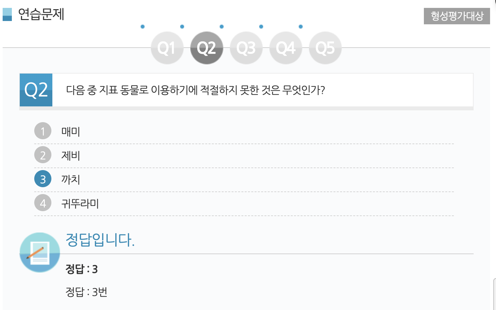
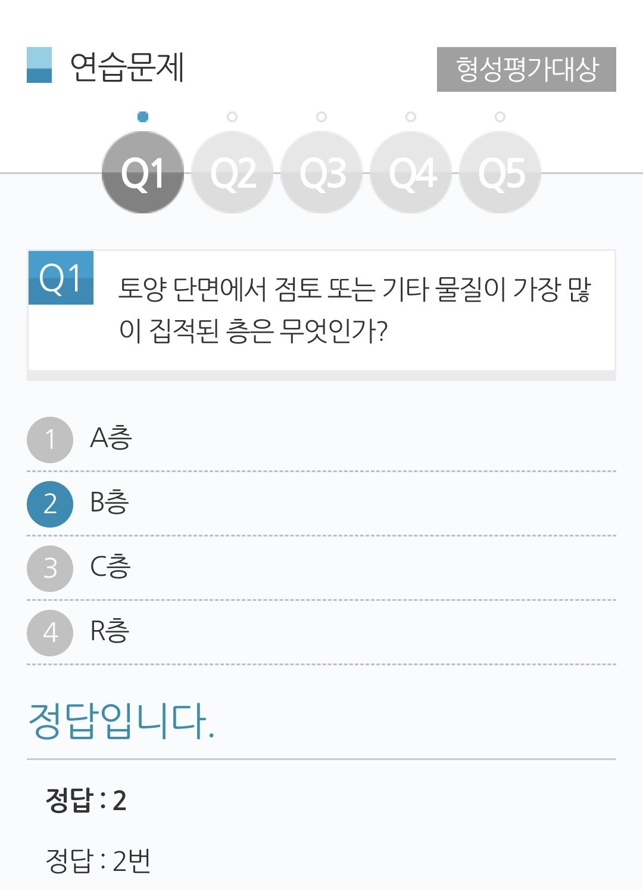
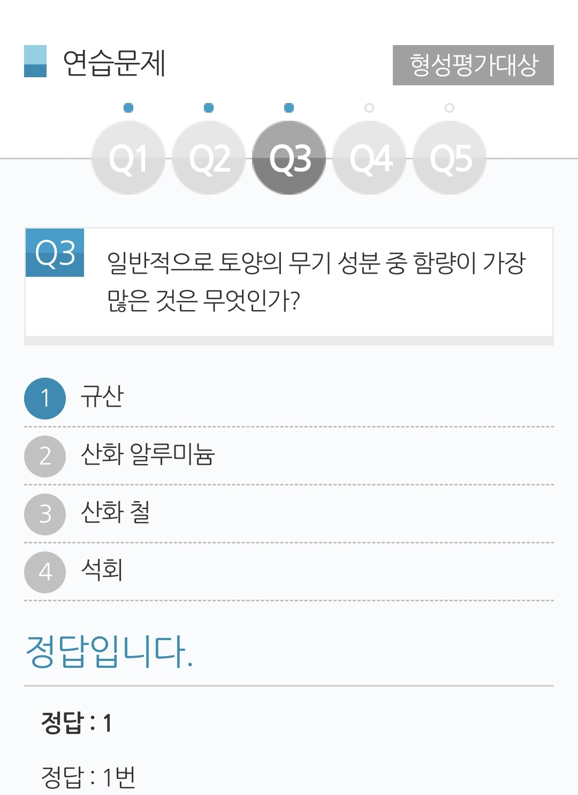
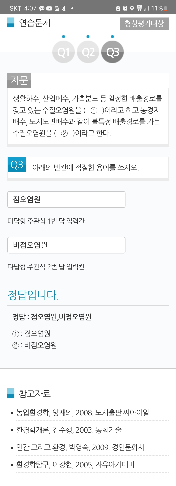

### # 1강. 농업환경
##### # 학습개요
  - 품질이 우수하고 안전한 농축산물을 효율적으로 생산하기 위해서는 농업생물체인 작물이나 가축을 둘러싸고 있는 환경과의 관계, 즉 농업 환경 이해하고 이를 바탕으로 농업 환경을 개선시키는 방안이 중요하다고 할 수 있다. 현대의 농업은 생산성 향상과 환경보전을 담보하지 못하면 지속가능한 생명산업으로 발전하는데 한계를 가지고 있다고 하겠다. 따라서 본 강에서는 일반적인 농업환경의 특성과 우리나라의 농업환경에 대한 기초 지식들에 대하여 학습하고자 한다.

##### # 학습목표
  - 환경은 구성하는 환경 요인들을 이해할 수 있다.
  - 자연과 농경지의 생물상의 차이를 설명할 수 있다.
  - 우리나라의 기후 조건을 설명할 수 있다.
  - 기상 요소와 작물의 생산 활동 간의 관계를 이해할 수 있다.
  - 기상 재해의 종류와 발생 원인을 말할 수 있다.
  - 농업의 환경보전기능과 환경저해요인들에 대하여 설명할 수 있다.

##### # 주요용어 주요용어
  - 환경 요인(Environmental factor) : 생물체를 둘러싸는 환경을 구성하는 요인으로 환경과 생물관계를 음미하는 데 있어 기상 환경, 토양 환경 및 생물 환경으로 나눌 수 있다.

  - 생물상(Biota) : 특정 생태계내에 존재하는 모든 생물적 요소

  - 물질순환(Matter cycle) : 생태계에서 생물들간 또는 생물과 비생물과의 사이에서 물질을 무한하게 이용하는 메카니즘

  - 기상 재해(Meteorological disaster) : 기상이 원인이 되어 발생되는 큰 피해

  - 산성비(Acid rain) : 산성도를 나타내는 수소이온 농도지수(pH)가 5.6미만인 비를 말하며, 대기오염물질이 대기 중의 수증기와 만나 황산이나 질산으로 변하여 비에 흡수된 것

##### # 학습정리
  - 자연 환경과 생물
    - 환경의 개념
    - 환경 요인 : 기상 환경, 토양 환경, 생물 환경
    - 물질 순환

- 농업 환경의 특성
    - 자연과 농경지의 생물상 차이
    - 농업 유형과 물질 순환

- 기후와 농업
    - 우리나라의 기후
    - 생물 계절
    - 생물 계절 지표 식물과 동물
    - 기상 요소와 작물 생산
       ① 대기물질
       ② 태양광(빛) 
       ③ 온도 
       ④ 물 
       ⑤ 이산화탄소
    - 기상 재해
      ① 온도에 의한 재해 
      ② 물에 의한 재해 
      ③ 바람에 의한 재해

  - 우리나라의 농업환경
    - 농업의 환경보전기능
    - 농업의 환경저해요인
    - 농업환경의 현황
      ① 대기질 
      ② 수질 
      ③ 토양 
      ④ 농산물 안전성
  - 농업환경의 전망

##### # 연습문제

|||
|:--:|:--:|
|문제1|문제2|
|{: width="400"}|{: width="400"}|
|문제3|문제4|
|{: width="400"}|{: width="400"}|
|문제5|-|
|{: width="400"}||

### # 2강. 농업생태계
##### # 학습개요
 - 생태계는 생물이 점거하고 살아가는 환경과 상호작용을 통해 일어나는 계층간․생물간의 체계를 말하는 것으로, 자기 보존이나 자기 조절 기능을 가지고 있다. 농업생태계는 생태계에 포함되는 하나의 개념이지만 농업생산이 이루어지고 있는 장소이자 인위적인 관리와 자원이 투입되기 때문에 자연생태계와는 다른 특성을 가지게 된다. 따라서 본 강에서는 생태계의 구조, 특성 및 작용에 대한 이해를 바탕으로 농업생태계에 대한 기초 지식들에 대하여 학습하고자 한다.

##### # 학습목표
  - 생태계의 개념과 구성요소들을 이해할 수 있다.
  - 생태계의 구조, 특성과 작용의 관계를 설명할 수 있다.
  - 자연생태계와 농업생태계의 차이를 이해할 수 있다.
  - 농업생태계에서의 물질순환(탄소, 질소 및 인)에 대하여 설명할 수 있다.

##### # 주요용어
  - 생태계(ecosystem) - 특정 지역과 공간에서의 비생물적 환경과 생물 공동체가 종합적으로 결합된 물질계 또는 기능계
  - 군집(community) - 일정한 생육조건하에서 생활하고 있는 모든 생물 개체군의 모임으로 생물군집을 이루고 있는 개체군은 먹이관계와 양분순환 등의 유기적인 관계를 가지게 된다.

  - 항상성 (Homostasis) - 생물체 또는 생태계가 내․외부의 변화에 저항하거나 대응하면서 평형상태를 유지해 나가는 경향

  - 탄소순환(carbon cycle) - 대기 중의 이산화탄소가 광합성에 의하여 유기물로 고정되고, 유기물은 먹이사슬과 호흡현상 및 미생물의 분해에 의하여 이산화탄소로 되어 무기물로 순환하는 현상

  - 질소순환(nitrogen cycle) - 생태계내에서 질소가 생물학적 과정과 비생물학적 과정을 거쳐 다양한 화학 형태로 바뀌어 생물체에 이용되거나 환경으로 전환되어 순환되는 과정

##### # 학습정리
  - 생태계외 농업환경
    - 생태계 개념
    - 생태계 구성요소 : 영양적 입장에서 구성요소, 구조적 입장에서 구성요소
    - 농업환경

  - 생태계 구조
    - 생태계의 조직화 단계
    - 군집의 구조적 특성
    - 생태계의 항상성

  - 농업생태계
    - 자연생태계의 특징
    - 관행농업생태계
    - 유기농업생태계
    - 농업생태계의 특징
      ① 에너지 흐름 
      ② 영양물질의 순환 
      ③ 개체군의 조정 
      ④ 안정성
    - 농업생태계의 에너지 이동과 물질 순환
    - 농업생태계의 지속적 특성
    - 지속가능한 농업

##### # 연습문제

|||
|:--:|:--:|
|문제1|문제2|
|{: width="300"}|{: width="300"}|
|문제3|문제4|
|{: width="300"}|{: width="300"}|

### 3강. 토양환경과 토양오염
##### # 학습개요
  - 토양은 물과 대기환경의 중간 위치에서 인간을 비롯한 모든 동식물이 생육하는 터전이며, 환경의 총체적 균형을 유지하는 완충역활을 수행하는 환경의 중요한 구성 요소이다. 작물의 생산성을 포함한 모든 농업생산성은 토양의 성질에 의해 결정되므로 건전한 토양환경을 지속적으로 유지하고 관리하는 일은 농축산물의 생산과 자연생태계의 물질순환에 있어 무엇보다 중요하겠다. 따라서 본 강에서는 토양의 특성과 기능 그리고 토양 오염에 대하여 학습하고자 한다.

##### # 학습목표
  - 토양의 단면 형태와 토양 생성 인자와의 관계를 말할 수 있다.
  - 토양환경의 구성과 기능을 이해할 수 있다.
  - 토양의 물리적․화학적․생물학적 성질을 이해할 수 있다.
  - 우리나라 토양의 특성
  - 토양오염의 특징과 오염원에 대하여 설명할 수 있다.

##### # 주요용어
  - 토양 단면(soil profile) 
    - 토양을 지표면에 대하여 수직으로 잘랐을 때 토양층들이 모두 나타나는 단면으로 이를 관찰하여 토양의 색, 성질, 구조 따위를 알 수 있다.
  - 토양 3상(Three phases of soil) 
    - 토양은 토양광물과 유기물인 고체상태의 입자인 고상과 그 사이의 공극으로 이루어져 있다. 공극에는 여러 가지 용질이 녹아 있는 액상, 수증기와 이산화탄소 등 대기 구성분이 함께 있는 기상으로 채워져 있다.
  - 토성(soil texture) 
    - 토양의 무기입자를 모래, 미사 및 점토로 구분하고 이들의 함량비에 따라 결정되는 토양의 종류
  - 양이온 교환(cation exchange) 
    - 토양콜로이드 표면에 흡착되어 있는 양이온이 용액 중의 양이온과 교환하는 현상
  - 토양오염(soil pollution) 
    - 산업활동에 의해 배출되는 유해물질이 토양에 축적되어 그 농도가 자연함유량보다 높아지고 이로 인하여 토양에 악영향을 주어 그 기능과 질이 저하되며, 토양에서 생산된 생산물에 오염물질이 축적되어 인체에 악영향을 미치는 경우
 - 비점오염원(Non-point source pollutant) 
  - 농경지, 양식장, 야적장, 도시노면배수 등과 같이 불특정하게 산발적으로 오염물질이 배출되는 오염원

##### # 학습정리
  - 토양의 생성
    - 토양의 정의
    - 토양의 생성 작용
    - 토양의 생성 인자
    - 토양의 단면

  - 토양환경의 구성과 기능
    - 토양의 구성
    - 토양의 기능

  - 토양의 물리적, 화학적, 생물학적 성질
    - 물리적 성질 : 토양의 입경, 토성, 구조, 밀도
    - 화학적 성질 : 유효태 성분, 토양 콜로이드, 양이온 교환
    - 생물학적 성질 : 미생물, 토양동물, 토양식물

  - 우리나라 토양의 특성
    - 논 토양
    - 밭 토양
    - 시설재배지 토양

  - 토양오염
    - 토양오염 정의
    - 토양오염의 특징
    - 토양오염 물질 및 오염원
    - 토양오염과 생태계

##### # 연습문제

|||
|:--:|:--:|
|문제1|문제2|
|{: width="300"}|{: width="300"}|
|문제3|문제4|
|{: width="300"}|{: width="300"}|
|문제5||
|{: width="300"}||

### 4강. 수질환경과 수질오염
##### # 학습개요
  - 물은 생물체의 물질대사에 필요한 요소일 뿐만 아니라 농축산업활동에 중요한 자원으로서 절대적인 가치를 지니고 있습니다. 농축산업용수는 수질과 환경에 많은 영향을 미치므로 농축산업용수를 올바로 관리하는 것은 안전한 농축산물을 생산하고 지속가능한 농축산업 환경을 구축함에 있어 매우 중요한 일입니다. 따라서 본 강에서는 수자원의 특성과 현황 그리고 수질의 오염에 대하여 살펴보고자 합니다.

##### # 학습목표
  - 수자원의 종류 및 특성을 설명할 수 있다.
  - 우리나라 수자원 현황 및 특성을 설명할 수 있다.
  - 수질오염의 정의 및 수질오염에 따른 영향을 설명할 수 있다.
  - 수질오염지표 및 수질환경기준에 대하여 설명할 수 있다.

##### # 주요용어
  - 하상계수(Coefficient of river regime)
  - 하천의 최대유량과 최소유량의 비

  - 부영양화(Eutrophicaiton)
    - 질소와 인 등의 영양염류 과다 유입은 조류의 이상 번식을 초래해 수중 용존산소가 줄어들게 된다. 수중 용존산소 감소는 수생식물 및 물고기에게 부적합한 환경을 조성해 수중생태계의 종 다양성이 감소된다.

  - 용존산소(Dissolved Oxygen)
    - 물속에 녹아있는 산소량을 의미한다. 용존산소량은 수온일 낮을수록, 공기와의 접촉 표면이 넓을수록, 유속이 빠를수록 증가한다.

  - 생화학적 산소요구량(Biochemical Oxygen Demand)
    - 수중의 유기물이 호기성 미생물에 의해 분해될 때 요구되는 산소량을 mg/L 또는 ppm 단위로 나나낸 것

  - 화학적 산소요구량(Chemical Oxygen Demand)
    - 수중의 유기물이 중크롬산칼륨이나 과망간산칼륨과 같은 산화제에 의해 산화될 때 소비되는 산소량을 mg/L 또는 ppm 단위로 나나낸 것

#### # 학습정리
  - 수자원의 종류 및 특성
    - 수자원 : 지구상의 물 중에서 자원으로 이용 가능한 물을 의미함
    - 지하수 및 지표수는 지구상 물의 0.76%에 불가함
    - 국민 1인당 확보된 연간 담수량으로 물기근, 물부족, 물풍요 국가를 구분함

  - 우리나라의 수자원 현황 및 특성
    - 수자원 총이용량은 부존량 대비 27%
    - 강수량 특성 :
      - 연평균 강수량은 풍부하나 1인당 연간 이용가능 강수총량은 부족함
      - 계절적, 지역적 편차가 심해 수자원 관리 및 이용에 불리한 특성이 있음
  - 지형 및 하천의 특성 :
    - 하천경사가 심해 강수의 유출시간이 짧음
    - 연간 하천유량의 변동이 심함(하상계수가 높음)
  - 수자원개발 및 관리에 매우 불리한 지형 및 유역 특성을 가지고 있음

  - 수질오염 및 수질오염의 영향
    - 수질오염의 정의
    - 수질오염원
    - 수질오염 유형
    - 수질오염이 인체에 미치는 영향
    - 수질오염이 부영양화에 미치는 영향

  - 수질오염지표 및 수질환경기준
    - 부유물질: 탁도, 부유고형물
    - 유기물: 용존산소(DO), 생화학적 산소요구량(BOD), 화학적 산소요구량(COD)
    - 하천 수질환경 기준: 이용목적에 따라 정해진 기준에 의해 5등급으로 구분

##### # 연습문제

|||
|:--:|:--:|
|문제1|문제2|
|{: width="300"}|{: width="300"}|
|문제3|문제4|
|{: width="300"}||

### 5강. 대기환경과 대기오염

##### # 학습개요
  - 지구의 주위를 대체로 일정하게 둘러싸고 있는 기체층을 대기라고 부른다. 대기는 지표로부터 대류권, 성층권, 중간권, 열권, 외기권으로 나눌 수 있다. 우리 인간과 다른 동식물이 살고 있는 곳은 대류권이다. 따라서 대류권의 공기 질의 좋고 나쁨은 바로 대류권 내의 동식물과 인간에 영향을 준다. 따라서 본 강에서는 대기환경과 대기오염에 대해 공부하고자 한다.
##### # 학습목표
  - 지구의 대기에 대해 이해할 수 있다.
  - 지구온난화에 대해 이해할 수 있다.
  - 축산과 온실가스에 대해 이해할 수 있다.

##### # 주요용어
  - 대기(大氣, atmosphere) - 천체의 주위를 대체로 일정하게 둘러싸고 있는 기체층

  - 온실가스(Greenhouse gas) - 온실효과를 일으키는 가스

  - 지구온난화지수(Global Warming Potential) - 100년간의 이산화탄소의 온실 효과를 기준으로 다른 가스들의 온실 효과를 계량화

##### # 학습정리
  - 지구의 대기
    - 지구 주위를 대체로 일정하게 둘러싸고 있는 기체층. 대류권, 성층권, 중간권, 열권, 외기권으로 나뉨

   - 지구온난화
    - 산업혁명 이후 인간의 활동으로 인해 대기에 온실가스가 증가함. 이에 따라 태양으로부터 받은 에너지의 일부분을 온실가스가 좀 더 획득하게 되어 지구 대기의 온도가 증가하는 현상임.

  - 지구온난화지수
    - 100년간의 이산화탄소의 온실 효과를 기준으로 다른 가스들의 온실 효과를 계량화한 지수. 이산화탄소 한 분자가 일으키는 온실효과를 1이라고 한다면, 메탄은 25, 아산화질소는 298임. 즉 메탄은 이산화탄소의 25배, 아산화질소는 이산화탄소 298배의 온실효과를 일으킬 수 있음.

  - 축산과 온실가스
    - 축산업에서 배출되는 온실가스는 주로 이산화탄소(CO2), 아산화질소(N2O), 메탄(CH4)임. 이산화탄소는 가축의 호흡과 화석연료의 사용에서 발생함. 아산화질소는 가축분뇨의 처리과정과 토양에서 발생함. 메탄은 가축의 장내발효, 가축분뇨의 처리과정, 그리고 토양에서 발생함.
##### # 연습문제

|||
|:--:|:--:|
|문제1|문제2|
|{: width="300"}|{: width="300"}|
|문제3|문제4|
|{: width="300"}||

### 6강. 농약
### 7강. 가축분뇨 관리 및 이용
### 8강. 악취
### 9강. 기후변화와 동물산업
### 10강. 동물산업과 신재생에너지
### 11강. 동물행동
### 12강. 동물복지
### 13강. 축산시설 및 환기
### 14강. 농축산ICT
### 15강. 스마트팜
  
  
  
  

