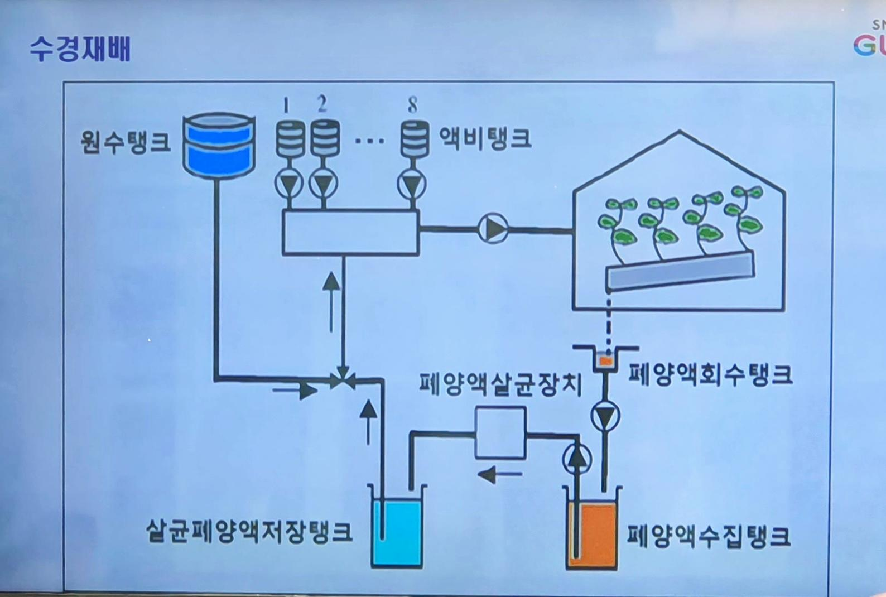
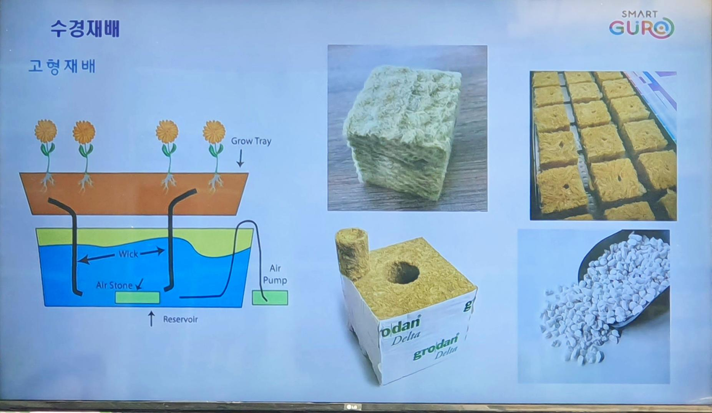

#### # 2024.07.10
##### # 수경재배
- 토양 대신에 물이나 배지에 생육에 피요한 무기양분을 녹인 녹인 배양액을 공급하면서 작물을 재배하는 방식과 이에 필요한 모든 기술
- 작물 생육에 대한 수분의 기본역할
 - 화학반응의 용매
 - 용질이동
 - 세포의 팽압유지
   - 팽압이 변화하면서 펌푸 역할을 함
     - 어떤 세포는 팽창하고 수축하면서 그 사이로 물이 이동함.
 - 촉매기능
   - 촉진시키는 매개체
     - 화약 같은 역할
 - 광합성재료
 - 증산작용

##### # 수경재배 - 장점
  - 공간활용 : 수경재배는 토양을 사용하지 않기 때문에땅이 부족한 도시 지역이나 작은 정원에서도 쉽게 식물을 재배할 수 있습니다. 수직적으로 적용이 가능하여 작은 공간에 더 맣은 작물을 생산할 수 있습니다.
  - 물절약 : 수경재매는 토양재배보다 훨씬 더 적은 양의 물을 사용합니다. 물이 영양 용액으로 순환하며 재사용 되기 때문에 친환경적인 재배 방법입니다.
    - 97% 이상 재활용
  - 수확증가 : 영양 용액을 통해 작물에 피요한 정확한 양의 영양분을 제공하기 때문에 식물의 성장과 수확이 빠르고 효율적입니다.
  - 병충해 감소 : 토양을 사용하지 않기 때문에 토양으로 인한 병충해 감소 효가 있습니다. 또한 수경재배 시스테은 외부호나경으로 부터 작물을 보호할 수 있는 장점이 있습니다.
  - 유기농 재배 가능 : 유기농 영양 용액을 사용하여 수경재배를 할 수 있으며, 화학 비료 사용을 최소화 하여 더 건강한 작물을 양산할 수 있습니다.
  - 지속가능성 : 수경재배는 토양 오염을 방지하고 농약 사용을 줄여 환경 친화적인 농업 방법으로 인식되고 있습니다.
    
##### # 수경재배 - 단점
  - 시설비가 많은게 가장 큰 단점
  - 초기비용 : 
  - 높은 진입장벽
  - 시스템 장애
  - 영양분 불균형
  - 전기 의존성
  - 작물제한

##### # 수경재배 - 고형재배 : 요즘은 고형재배 잘 사용하는 방식임
  - 고형재배

##### # 수경재배 - 고형재배
  - 순수수경과 달리 배지 내에서 통기되므로 사소 공급이 좋음
  - 뿌리로의 수분 공급을 조절할 수 있음

##### # 수경재배 - 고형재배
  - 재배후 남아 있는 뿌리의 처리가 어려움
  - 세척과 소독이 힘듦

##### # 수경재배
  - 비고형식 재배방식
    - 재배후 지지대 작업 비용이 많이 들어서 비고형식 방식으로 넘어가기가 어려움.
  - 뿌리를 지탱하지 않아도 되는 형식의 작물에 이용

##### # 수경재배 담액식
  - 담액식 장점
    - 배양액 유지
    - 온도변화가 작음
    - 안정적으로 고닐
    - 정전 또는 고장 등에 식물이 쉽게 피해가 없음
 
  - 담액식 단점
    - 양액 오염가능성 높음
    - 뿌리 산소 공급이 물에 녹아있는 산소에만 의존

##### # 산소의 이용은 뿌리의 미생물이 산소가 이용됨

##### # 수경재배 박막식

  - 담액식을 보완하여 향상시킨 방법

##### # 수경재배 박막식 - 장점
  - 양액의 사용이 훨씬 절약됨
  - 수분부족과 산소 부족을 쉽게 해결

##### # 수경재배 박막식 - 단덤
  - 온도이 변화에 매우 민감
  - 자주 배양액 관리
  - 항상 펌프가 동작해야하므로 전기의존

##### # 수경재배 분무식 - 장점
  - 생육이 빠름
  - 밀식재배 가능 : 병충해가 들어가기 어렵다
  - 뿌리 부분 산소의 부족을 극복

##### # 수경재배 분무식 - 단점
  - 뿌리가 외부 온도에 큰 영양을 받음
  - 감자같은 뿌리식물을 키움 하지만 크기가 작게 생성됨
  - 인삼도 키움 하지만 크기가 작게 생성됨
  - 양액 성분이 쌍여서 양액 분무

##### # 수경재배 점적식

##### # 수경재배 점적식 - 밀물썰물식 < 요즘 대분의 수경재배 방식에서 이용됨
  - 박막식 장단점을 보완해서 사용하는 방식
  - 단점 : 모든

##### # 아쿠아포닉스
  - 획기적이나 비용이 너무 많이 듦
  - https://m.blog.naver.com/eeyore0517/222161634643

##### # 식물_다량원소_영활_결핍증상
  
  
  

##### # 질문
  - 배지가 공중에 떠서 뿌리만 접촉하게 하는건가요?
    배지가 물과 붙는거는 아닌거죠?

  - 분무식이 뿌리 산소 공급이 좋다고 했는데 
    박막식도 공급은 비슷하거나 좋은건가요?

##### # 미생물
  - 뿌리가 미생물을 키운다
  - 산소가 중요하고
  - 광합성을 통해 내려온 당을 이용하기도한다. ATP에너지?
  
- 메주 뜰때 흰색 곰팡이가 가장좋음
  - 볏짚에 있는 곰팡이가 하얗게 핀다.
  - 곰팡이에의해서 발효된다.
  - 일본의 간장공장에는 균들이 간장맛을 좌우한다.
    - 절대로 청소를 안한다. 
    - 청소 했더니 간장맛이 바뀌더라.. 그래서 그후로 청소 안한다.
  - 균관리를 잘하는 것들이 중요하다.
  - 좋은 균들만 모아놓은게 EM이 있다.
  - EM을 배양해서 효소를 끄집어 내야한다.
    - 쌀 뜬물 탄수화물을 이용해 미생물(효모)이 당을 좋아하니까 EM이 번식 
  - 35 ~ 40도 정도에서 잘 자람
  - 100도되면 모든 미생물들 죽는다. 자외선 쬐면 죽는다
    - 효소는 살아있음
  - 누룩이 효모가되서 효소 알콜을 만들어냄
    - 효소가 당을 좋아한다.
  - 페니실린 : 푸른곰팡이의 효소
  - 끓여서 사용하는 이유는 남아있는 미생물을 죽이고 효소만 남기기위해서 

  - 효모==미생물이 당을 좋아하는데 당을 분해하는 과정에서 효소가 생성되고, 효소===무기물인데 효소 형태로 뿌리가 흡수한다.

  - 효소를 만들어내는 미생물을 효모라고한다.
    - 누룩은 효모라고한다. 알콜을 만들어낸다.
    - 곰팡이도 미생물의 일종이다.

  
  

- 근권과 공기중(잎)의 차이는 5도 정도됨

- 양액의 농도 체크
  - 양액(전기전전도도) EC / TDS( Total Dissolved Solid )

- 양액 산도 : Ph

수족관 미니 모터 : 
https://www.google.com/search?q=%EC%88%98%EC%A1%B1%EA%B4%80+%EB%AF%B8%EB%8B%88+%EB%AA%A8%ED%84%B0&rlz=1C5CHFA_enKR955KR955&oq=%EC%88%98%EC%A1%B1%EA%B4%80+%EB%AF%B8%EB%8B%88+%EB%AA%A8%ED%84%B0+&gs_lcrp=EgZjaHJvbWUyBggAEEUYOTIHCAEQIRigATIHCAIQIRigATIHCAMQIRigAdIBCDI2MjVqMGo5qAIAsAIB&sourceid=chrome&ie=UTF-8

수경재배 pvc 파이프 : 
https://www.google.com/search?q=pvc+%ED%8C%8C%EC%9D%B4%ED%94%84+%EC%88%98%EA%B2%BD%EC%9E%AC%EB%B0%B0&sca_esv=c8862ddec76544c7&rlz=1C5CHFA_enKR955KR955&sxsrf=ADLYWIJx0QMHGq9KAfHD-hOfgCOZTGbzXA%3A1720593733271&ei=RS2OZvqcEPnU1e8PtpOf4As&ved=0ahUKEwi605iS75uHAxV5avUHHbbJB7wQ4dUDCA8&uact=5&oq=pvc+%ED%8C%8C%EC%9D%B4%ED%94%84+%EC%88%98%EA%B2%BD%EC%9E%AC%EB%B0%B0&gs_lp=Egxnd3Mtd2l6LXNlcnAiGnB2YyDtjIzsnbTtlIQg7IiY6rK97J6s67CwMgUQABiABDIIEAAYgAQYogQyCBAAGIAEGKIEMggQABiABBiiBDIIEAAYgAQYogQyCBAAGIAEGKIESOS9AVCDswFY_7sBcAR4AZABApgBiQGgAfIJqgEEMC4xMLgBA8gBAPgBAZgCCaACpQXCAgoQABiwAxjWBBhHwgIKEAAYgAQYQxiKBcICChAAGIAEGBQYhwLCAgQQABgemAMAiAYBkAYKkgcDNC41oAf0JQ&sclient=gws-wiz-serp

#### # 꽃송이 버섯 베타글루칸 함량이 굉장히 높음
  - 상황버섯보다 6배 많음
  - 베타글루칸 : 항암물질에 탁월함
  