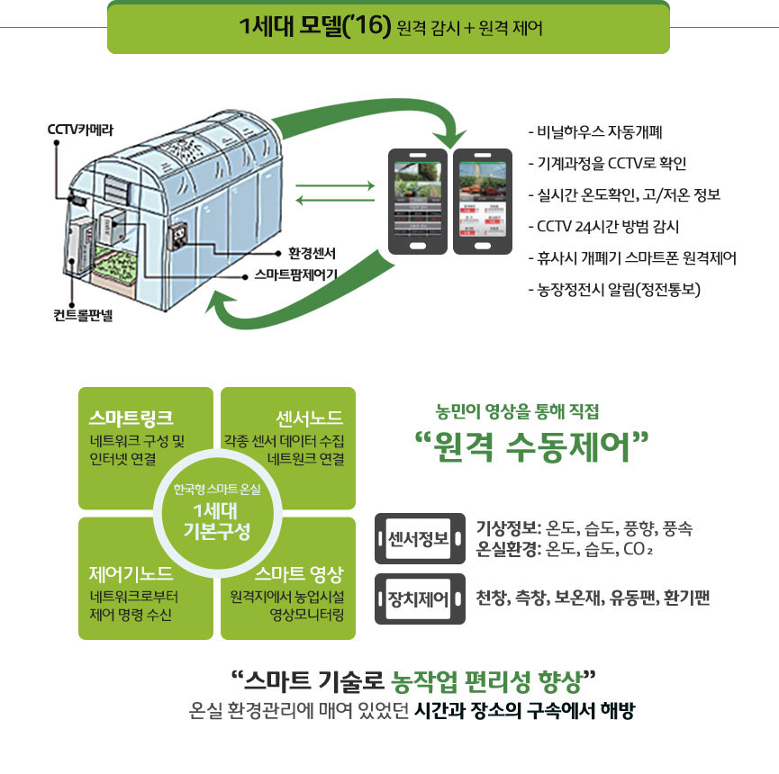
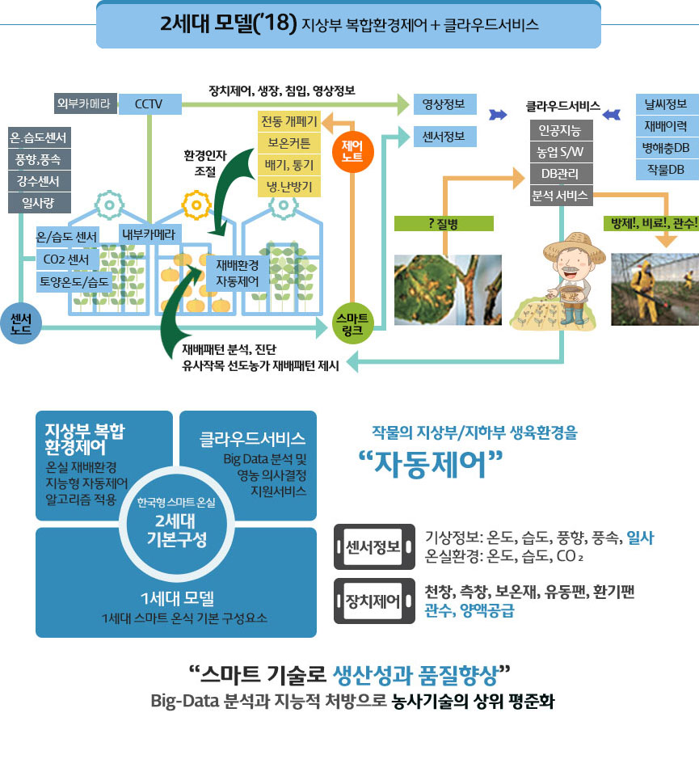
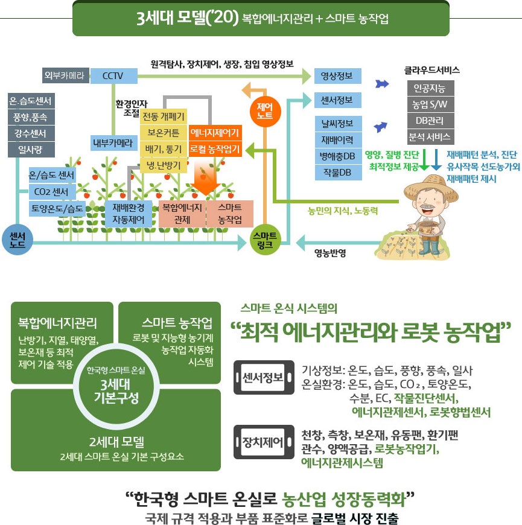

#### # 스마트팜 구성 : 2024.07.17 

##### # 스마트팜 제어 - 제어방법의 선택
  - 단순제어
  - 복합환경제어
  - 일괄제어
  - 구간제어
  - 단동분산제어

##### # 1세대 모델(`16) : 원격감시 + 원격제어
  - 비닐하우스 자동 개폐
  - 기계과정을 CCTV로 확인
  - 실시간, 온도확인, 고/저온 정보
  - CCTV 24시간 방범 감시
  - 휴사시 개폐기 스마트폰 원격제어
  - 농장정전시 알림(정전통보)

##### # 농민이 영상을 토해 직접 "원격 수동제어"
  - 스마트링크 : 네트워크 구성 및 인터넷 연결
  - 센서노드 : 각종 센서 데이터 수집 네트워크 연결
  - 제어기노드 : 네트워크로부터 제어 명령 수신
  - 스마트영상 : 원격지에서 농업싯설 영상모니터링
- 센서정보 
  - 기상정보 : 온도,습소,풍향, 푸옥
  - 온실환경: 온도 습도, CO2
- 장치제어
  - 천장, 측장, 보온재, 유동팬, 환기팬
- "스마트 기술로 농작업 편리성 향샹"
  - 온실환경관리에 매여 있었던 시간과 장소의 구속에서 해방

##### # 2세대 모델(`18) : 지상부 복합환경제어 + 클라우드서브스

##### # 3세대 모델(`20) : 복합에너지관리 + 스마트 농작업

  - 전동 개폐기
  - 보온커튼
  - 배기,통기
  - 냉,난방기

 - 인공지능
 - 농업S/W 
 - DB관리
 - 분석 서비스

##### # 우리나라 스마트팜 현재 상태
- 스마트 재배기술이 떨어지므로 재배기술 개발에 중점을 두고 있음
- 스마트 운영 관리 기술은 좋음

- https://www.rda.go.kr/middlePopOpenPopNongsaroDBView.do?no=1362&sj=%EC%9D%B8%EA%B3%B5%EC%A7%80%EB%8A%A5%EC%9D%B4

##### # 스마트팜 제어 : 온도/환기
  - 환기를 통한 온도 제어
  - 단동제어기

##### # 환기의 중요성
  - 공기순환
  - 온도습도
  - 광합성 : 바람이 환기 필요.

##### # 광합성

광주기성
광합성포화량

##### # 태양광의 스펙트럼
  - 근적외선 ~ 가시광선

##### # 스마트팜 제어 : 관수

##### # 스마트팜 주요 센서
  - https://www.youtube.com/watch?v=yT4AnjyhuA4

##### # 스마트팜 구성도
  - https://freestyleyo.tistory.com/entry/정의-및-분야별-구성사례분야별-스마트팜-구성도

##### # 잡초 제거
- 잡초 : 멀칭
- 뿌리채 뽑아서
- 제초제

- 피 : 미꾸라지, 

