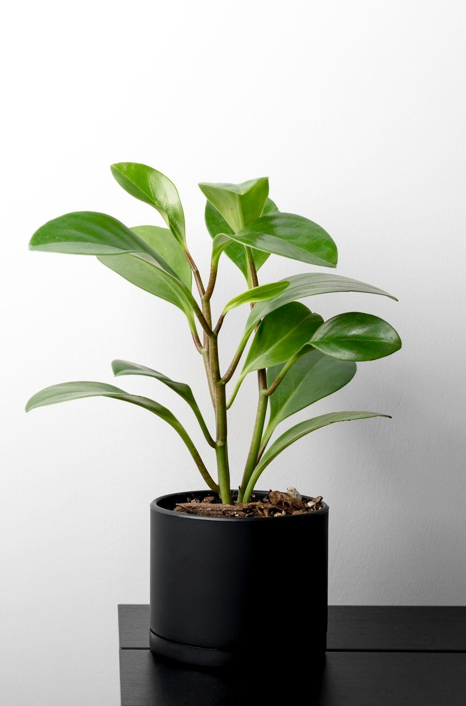

### # 페페로미아 : Peperomia spp.
  - https://post.naver.com/viewer/postView.naver?volumeNo=28998120&memberNo=2183305
  - 페페로미아는 중앙아메리카, 브라질 원산의 후추과 식물이다. 대중적인 실내식물로 약 1.000여종이 자생하고 있으며, 적립성으로 자라는 종과 덩굴성으로 자라는 종 등 약 100여 품종이 재배되고 있다. 잎이 둥글고 넓은 것부터 작고 뾰족한 것까지 잎의 형태가 다양하고 변화가 많지만, 일반적으로 잎이 두껍고 광택이 있으며 두툼한 줄기를 가진 것이 특징이다.

  

  - 속명 페페로미아는 그리스어로 '후추처럼 보인다'란 뜻으로 후추와 닮은 잎 모양에서 유래되었다. 페페로미아는 새집증후군 원인물질인 포름알데히드, 자일렌 제거효과가 우수한 공기정화 식물로, 독성이 없어 반려동물과 아이가 있는 집에서 키우기 좋다. 크기는 20~30cm정도이며, 작은 화분이나, 접시정원(Dish garden)에 식재하기 좋다. 줄기 끝에서 피는 꽃은 관상가치가 낮아 대부분 잎을 보기 위해 키운다. 원산지에서는 나무 밑이나 나무에 붙어서 사는 종으로 반그늘진 장소에서 잘 자란다. 

- 물주기 - 잎이 다육질이므로 과습에 주의해야 한다. 배수가 잘되는 토양에 식재하고 습도가 50~60%이상이 되지 않도록 관리한다. 

- 빛 -  반음지성 식물로 작사광선을 피한다. 단, 너무 어두운 곳에 두면 웃자라 수형이 엉성해질 수 있다. 

- 온도 -  생육적온은 20~25℃이다. 내한성이 약한 편으로 겨울철에 10도 이하로 떨어지지 않게 주의해주고, 관수량을 줄여 건조하게 관리한다.

>내건성이 좋은 편으로 토양표면이 말랐을 경우 흠뻑 관수한다.
2~3일에 한 번씩 넣고 광택이 도는 잎에 먼지를 털어준다.
직사광선 아래에서 잎의 광택이 죽고 색이 옅어지므로 주의한다.

.jpeg)

페페로미아 오브투시폴리아(peperomia obtusifolia)는 베네수엘라, 열대아메리카 원산의 식물이다. 국내에서는 청페페, 영명으로는 페퍼 페이스(peper face)라고 불리는 종으로 줄기가 짧고 직립성이다. 두텁고 윤기가 흐르는 원형에 가까운 잎이 살짝 안으로 말린 모양을 가지고 있다. 생장력이 좋기 때문에 줄기가 너무 길게 늘어지면 가지를 잘라 수형을 정돈해준다. 자른 가지는 물꽂이를 하여 수경재배가 가능하다. 꽃잎이 없는 수상화서[穗狀花序]로  멀리서 보면 줄기 같은 모양을 하고 있다. 

#### # 페페로미아 오브투시폴리아 바리에가타 (peperromia obtusifolia cv. Varigata)
  - 오브투시폴리아의 재배종으로 잎에 옅은 초록색과 황백색 무늬가 특징이다.

#### # 페페로미아 클루시폴리아(peperomia clusifolia)
  - 서인도제도, 배네수엘라 원산이며 성장이 느리다. 영명 레드 엣지 페페로미아(red edge peperomia)에서 알 수 있듯이 진하고 어두운 초록색 잎 가장자리에 붉은 빛이 돈다.
.jpeg)

#### # 페페로미아 산데르시이 알기레이아(peperomia sandersii var, argyreia)   
  - 동근 잎에 두껍고 진한 초록색 바탕에 회백색 세로줄 무늬가 특징으로 수박과 비슷하다고 하여 흔히 수박페페로미아라고 불린다. 선명한 무늬를 유지하려면 밝은 장소애서 키우는 것이 좋다. 

#### # 페페로미아 푸테오라타(peperomia puteolata) 
  - 수박페페로미아와 같이 어두운 초록색 바탕에 회백색 세로줄 무늬의 반엽종으로 유통명은 줄리아 페페로미아(parallel peperomia)다. 잎은 3~4개로 돌려나며 붉은 줄기가 아름답다. 

#### # 페페로미아 카페라타(peperomia caperata)
  - 키가 20cm 정도로 짧은 줄기에 진한 갈색의 잎자루와 잎이 특징이다. 잎은 어두운 초록색에 잎맥이 깊게 주름져있어 얼핏 보면 조화 같아 보이기도 한다. 관상가치가 높아 붉은색, 분홍색, 옅은 초록색 등 다양한 잎 색의 식물이 유통이 되고 있다.

#### # 페페로미아 달스테티(peperomia dahlstedti)
  - 푸테오라타에 비해 잎이 얇고 연둣빛 초록색에 매끈한 회백색 줄무늬가 특징이다.

#### # 호산나 페페로미아(peperomia clusifolia 'Jewelry')
  - 푸테오라타에 비해 잎이 얇고 연둣빛 초록색에 매끈한 회백색 줄무늬가 특징이다.

