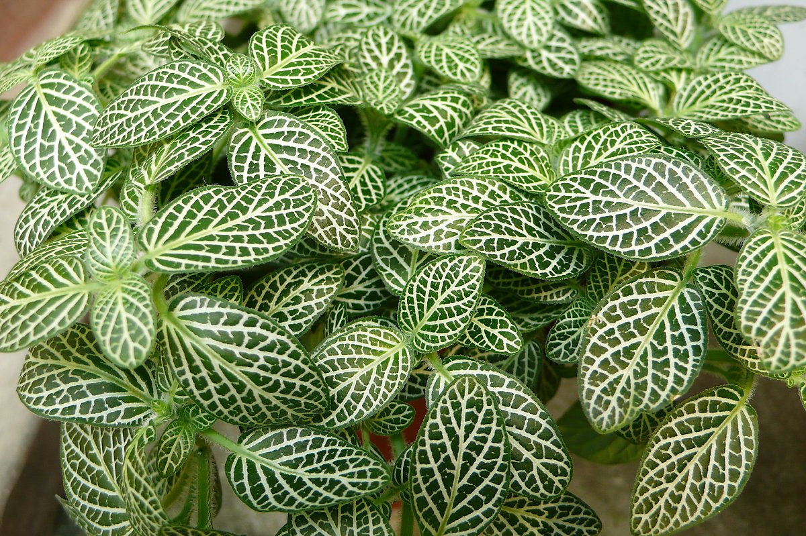
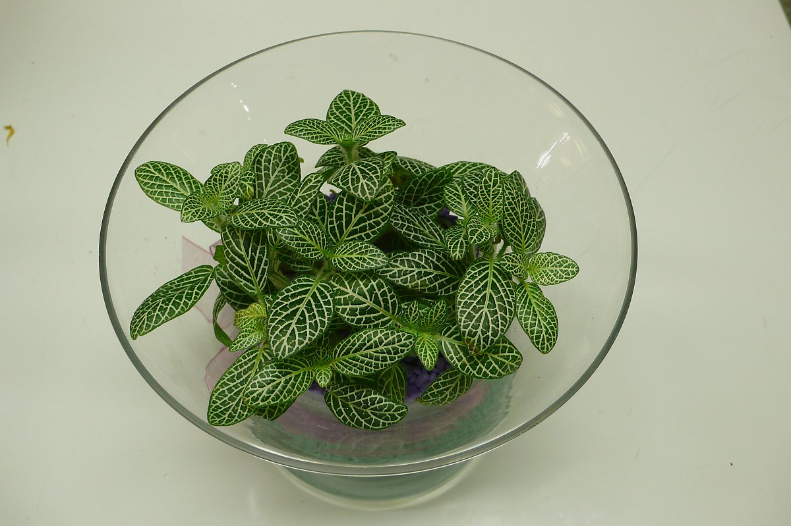
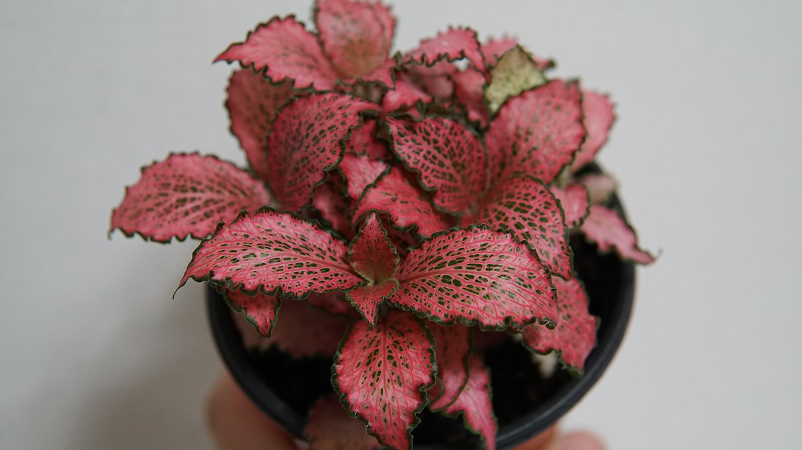
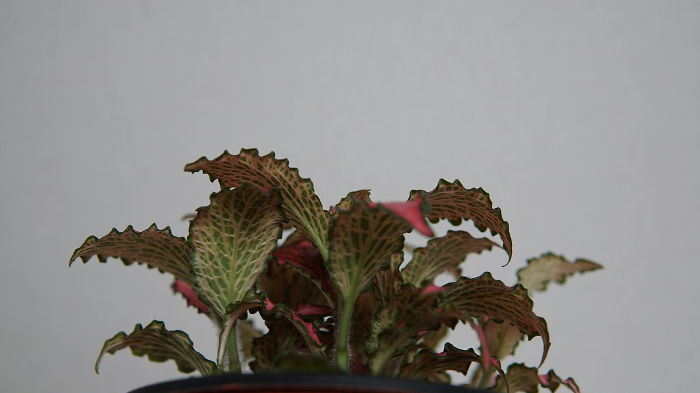
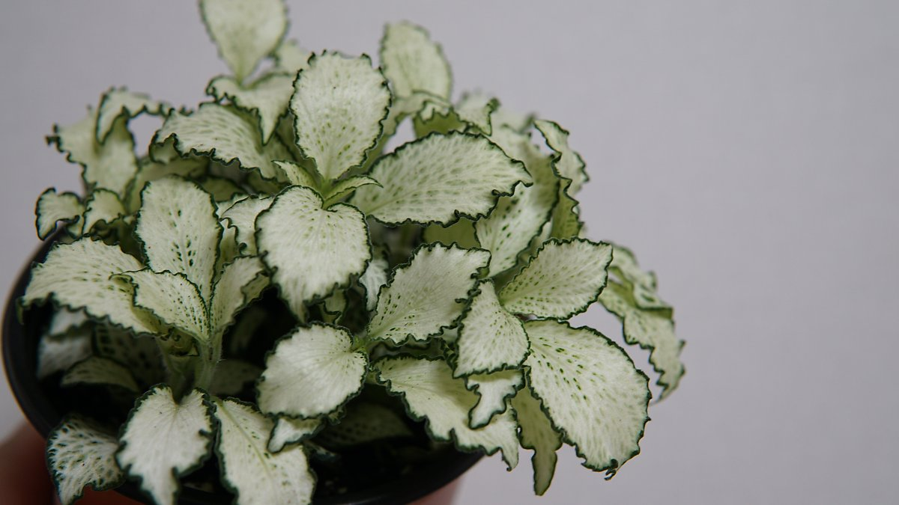
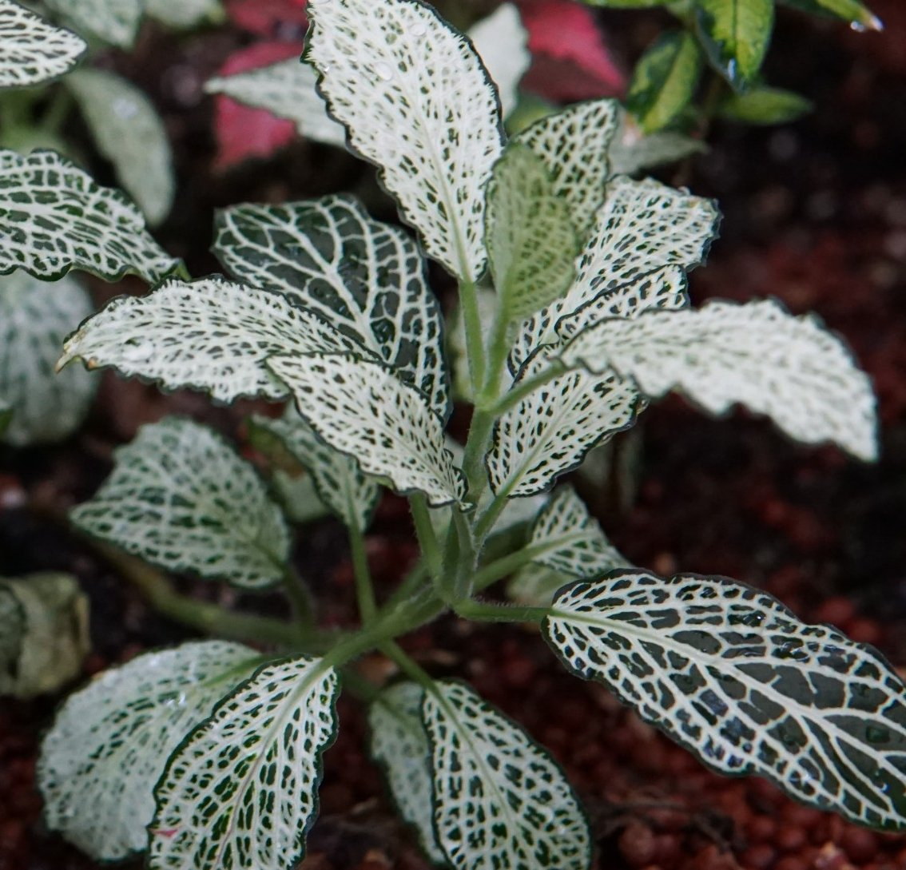
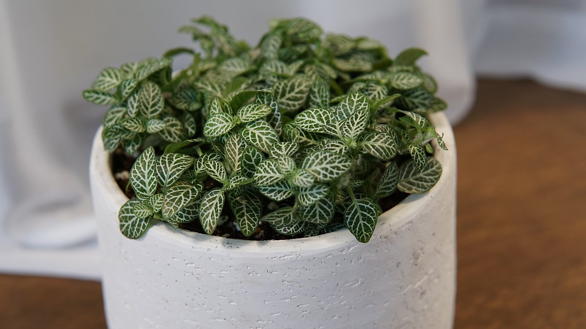
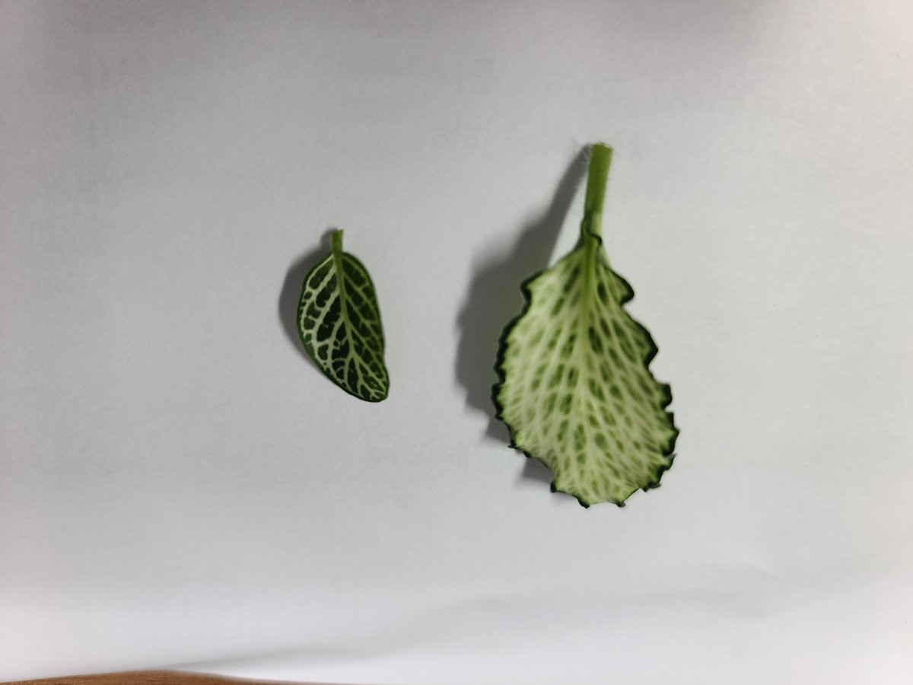
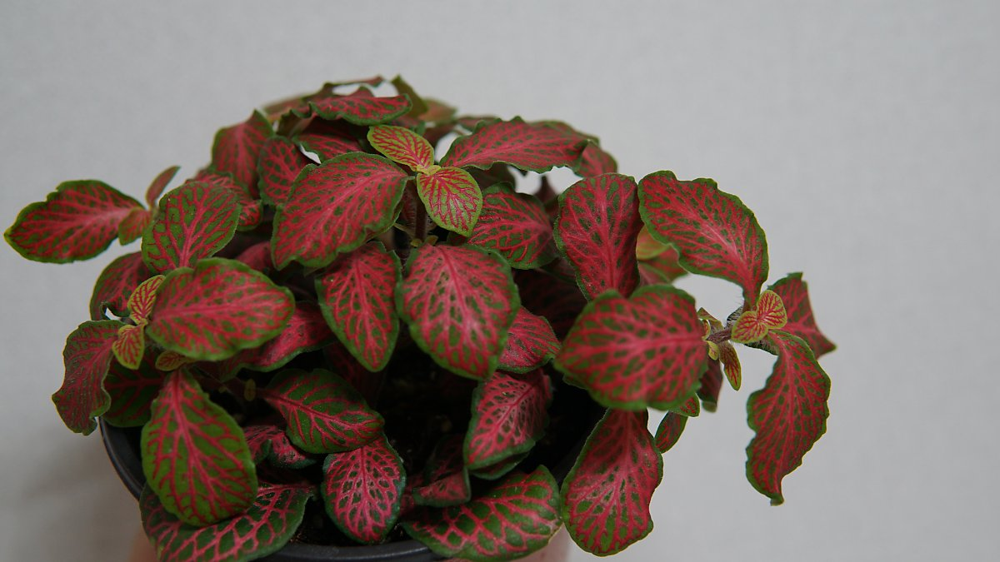
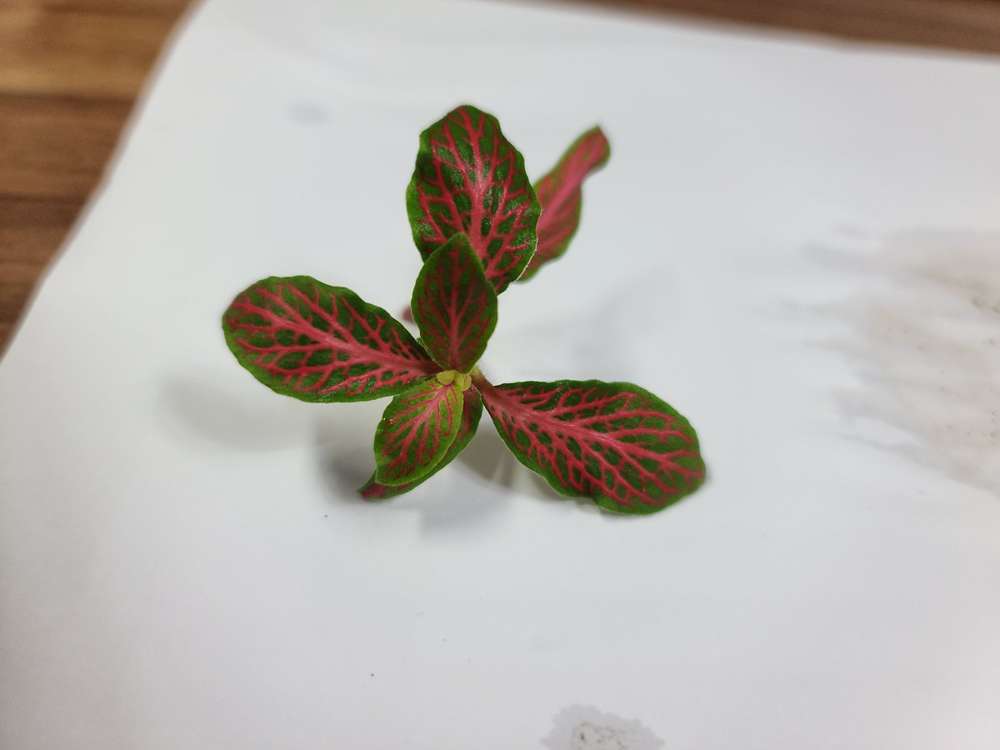

### # 피토니아
  - https://post.naver.com/viewer/postView.nhn?volumeNo=28746819&memberNo=2183305&vType=VERTICAL

- 물주기 -  흙이 마르면 쉽게 시들 수 있기 때문에 충분한 관수를 해줘야 한다. 또 높은 습도를 좋아하므로 분무기를 통해 공중습도를 높여주는 것이 좋다.

- 빛 -  반음지성 식물로 직사광선이 닿지 않는 밝은 곳에 두면 잎의 색을 아름답게 잘 유지할 수 있다.

- 온도 -  20~25℃에서 원활하게 생육할 수 있고, 겨울에는 10℃ 이하로 내려가면 월동을 하지 못할수 있으니 저온에 주의한다.

>너무 어두운 곳에 두면 줄기가 길어져 수형이 망가질 위험이 있다.
환기가 잘되는 곳에 두어 토양과습을 방지해야 한다.
저온에 약하므로 겨울철엔 실내에서 키우는 것이 좋다.

#### # 피토니아 아르지로네우라 : Fittonia verschaffeltii var. argyroneura
  - 페루 원산종의 변종으로 진한 초록색 바탕 잎에 선명한 은색 잎맥을 가지고 있다. 잎은 타원형 모양으로 원예종에 비해 둥글고 큰 편이다.

#### # 피토니아 핑크스타(Fittonia verschaffeltii 'Pink star') 
  - 짙은 분홍색 잎에 불규칙한 초록색 무늬가 아름다운 원예종이다. 잎끝이 레이스처럼 물결 모양이고, 초록색으로 띠를 두른 듯해 더욱 관상 가치가 높다. 잎 뒷면은 옅은 초록색으로 살짝 보일 때마다 더 풍부한 색을 감상할 수 있다.

#### # 피토니아 화이트스타(Fittonia verschaffeltii 'White star')
  - 핑크스타와 같은 원예종으로 잎의 색에 따라 나뉜다. 초록색 띠를 두른 하얀색의 잎은 깨끗하고 선명한 느낌을 준다.

#### # 피토니아 미니종
  - 잎의 크기가 작고 뚜렷한 흰색의 잎맥에 초록색 잎을 가지고 있다. 다른 품종에 비해 볼륨감이 적지만 잎이 촘촘하게 붙어있어 지피효과가 좋다.

#### # 피토니아 레드(Fittonia verschaffeltii 'Red') 
  - 잎이 타원형 모양으로, 붉은색과 초록색 대비가 아름다운 품종이다. 직사광선을 피해 밝은 곳에 두면 초록색이 옅어져 전체적으로 밝은색을 볼 수 있다.

