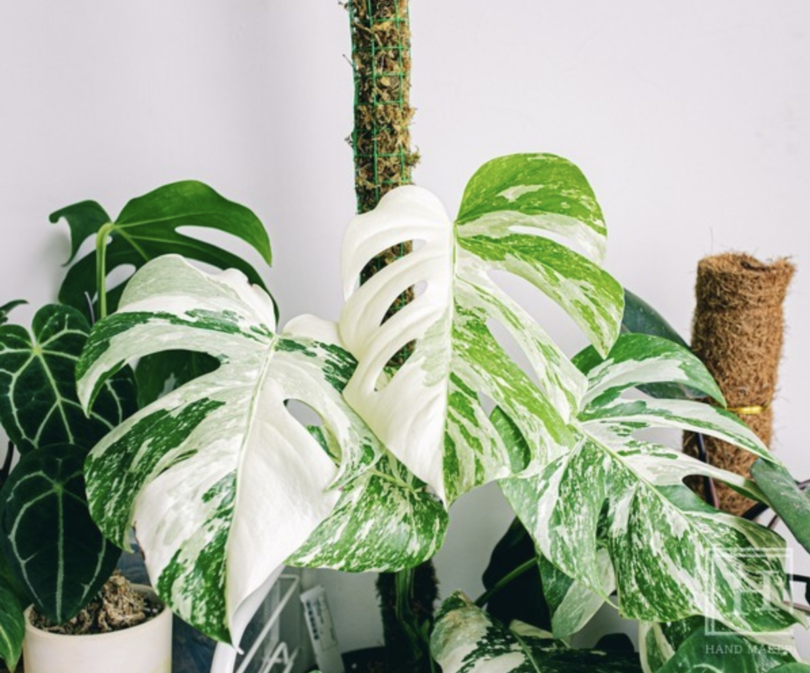

- 알보 몬스테라 (몬스테라 알보 바리에가타)
  - 알보가 흰색이라는 뜻.
  - 알보 몬스테라 (몬스테라 알보 바리에가타)

알보 몬스테라는 유전적인 변이로 인해 초록색을 띠는 엽록소가 없이 부분 부분마다 하얀 무늬가 생긴 변이종이에요. 인위적으로는 만들어 낼 수 없고, 수입도 금지되어 있어 희소성이 높아 아주 비싼 가격을 형성하고 있답니다. '식테크', '무천이(무늬천재)', '알보몬' 등의 많은 신조어를 만들어 낸 장본인인 알보 몬스테라는 흰 부분이 많을수록 햇빛을 흡수하여 필요한 양분을 만들어내는 광합성작용을 잘 하지 못하기 때문에 일반 몬스테라보다 더 많은 빛을 필요로 해요. 또한 온도와 습도에도 아주 예민한 아이라 많은 식집사들의 애간장을 태우기도 한답니다. 알보 몬스테라는 배수가 아주 잘 되는 토양에 심어주시고, 창문을 거친 밝은 간접광이 드는 따뜻한 곳에서 공기를 촉촉하게 유지해주면서 키워주셔야 한답니다. 잎 크기를 크게 키우시고 싶다면 수태봉의 도움을 받아보세요. 더 튼튼한 잎으로 성장할 수 있답니다
