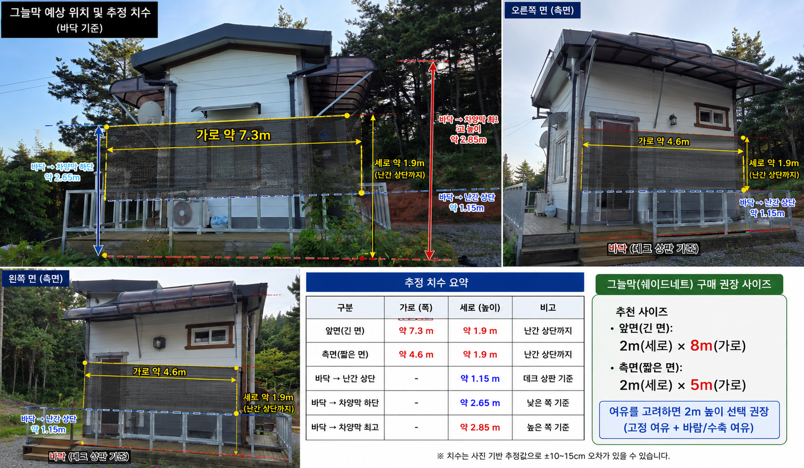
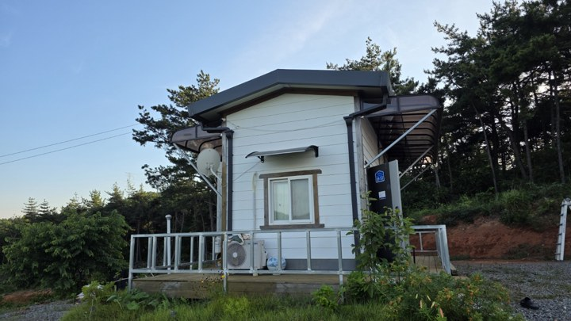
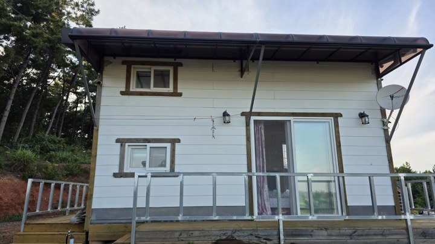
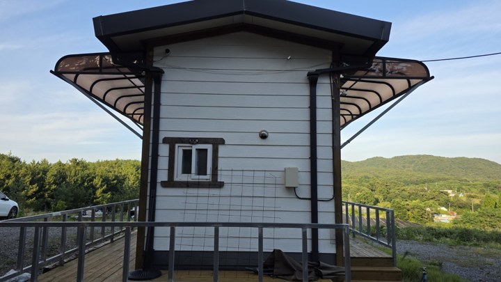
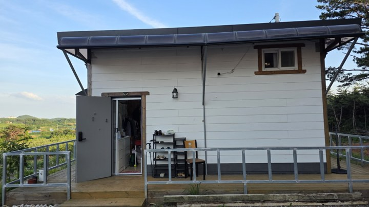
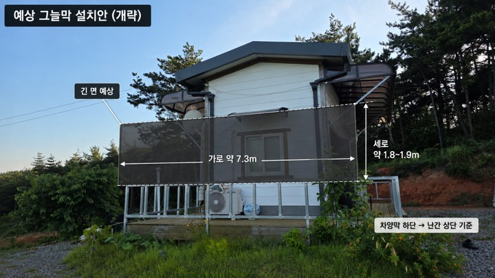
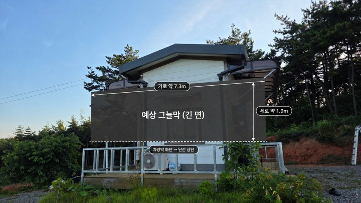
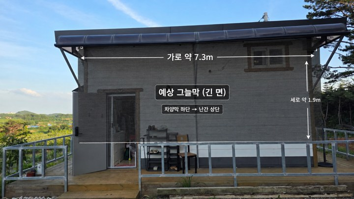
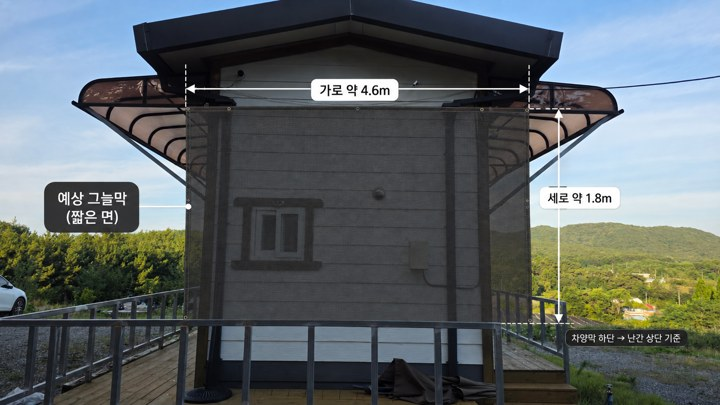
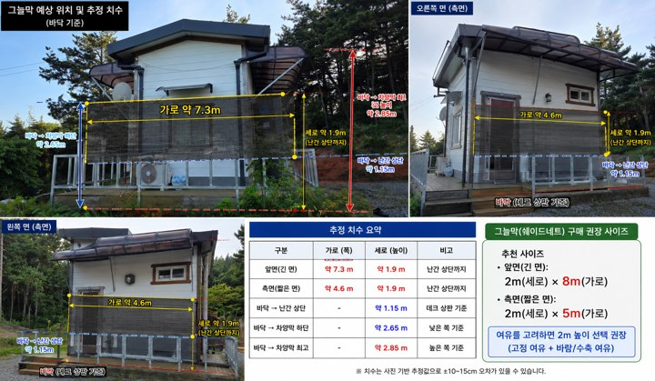

# 화곡농장 6평 농막 그늘막 예상 설치 정리

- **정리일:** 2026-08-07
- **기준:** 데크 바닥(상판)을 0 기준으로 사진 비례 추정
- **주의:** 사진 기반 개략치이므로 최종 구매·재단 전 현장 실측 필요

## 1. 핵심 추정 치수

| 항목 | 추정치 |
|---|---:|
| 긴 면 예상 가로 | **약 7.3 m** |
| 짧은 면 예상 가로 | **약 4.6 m** |
| 바닥 → 난간 상단 | **약 1.15 m** |
| 바닥 → 차양막 하단 | **약 2.65 m** |
| 바닥 → 차양막 최고 | **약 2.85 m** |
| 차양막 하단 → 난간 상단 | **약 1.8~1.9 m** |

## 2. 그늘막 권장 크기

| 설치 면 | 예상 유효 크기 | 구매 권장 |
|---|---:|---:|
| 긴 면 | 약 7.3 m × 1.8~1.9 m | **2 m × 8 m** |
| 짧은 면 | 약 4.6 m × 1.8~1.9 m | **2 m × 5 m** |

## 3. 바닥 기준 종합 치수도

## 4. 이미지 전체

  

원본 — 농막 전면 사선 | 원본 — 농막 전면 사선(2026-07-11) | 원본 — 긴 면 정면

  

원본 — 짧은 면 | 원본 — 반대쪽 긴 면 | 예상 설치도 — 긴 면 개략

  

예상 설치도 — 긴 면 치수 표시 | 예상 설치도 — 짧은 면 치수 표시 | 예상 설치도 — 추가 시안

바닥 기준 — 그늘막 예상 위치 및 추정 치수 종합도

## 5. 설치 기준

- **상단:** 기존 차양막 바깥쪽 하단 프레임
- **하단:** 기존 난간 상단 프레임
- **세로 유효 길이:** 약 1.8~1.9 m
- **풍압 대응:** 강풍 시 말아 올리거나 탈착 가능한 방식 권장

> 추정 오차는 사진 원근과 촬영각 때문에 약 ±10~15 cm 이상 생길 수 있습니다.