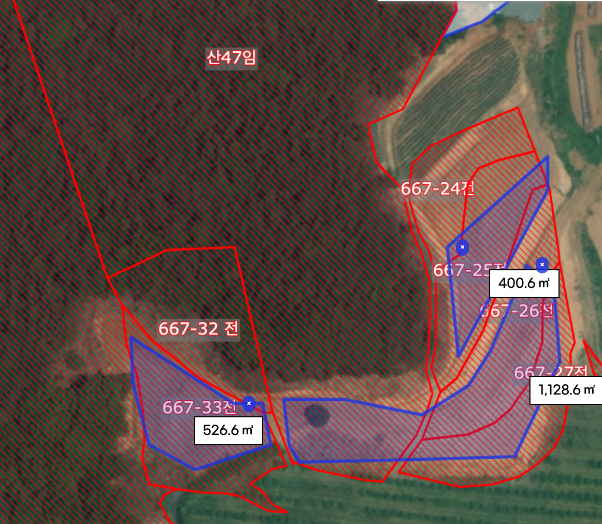
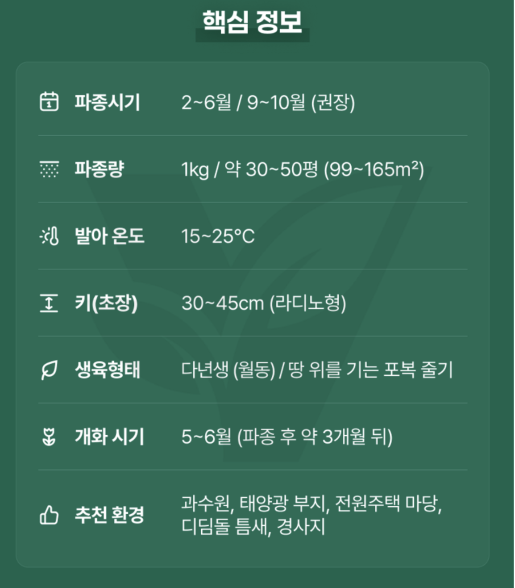
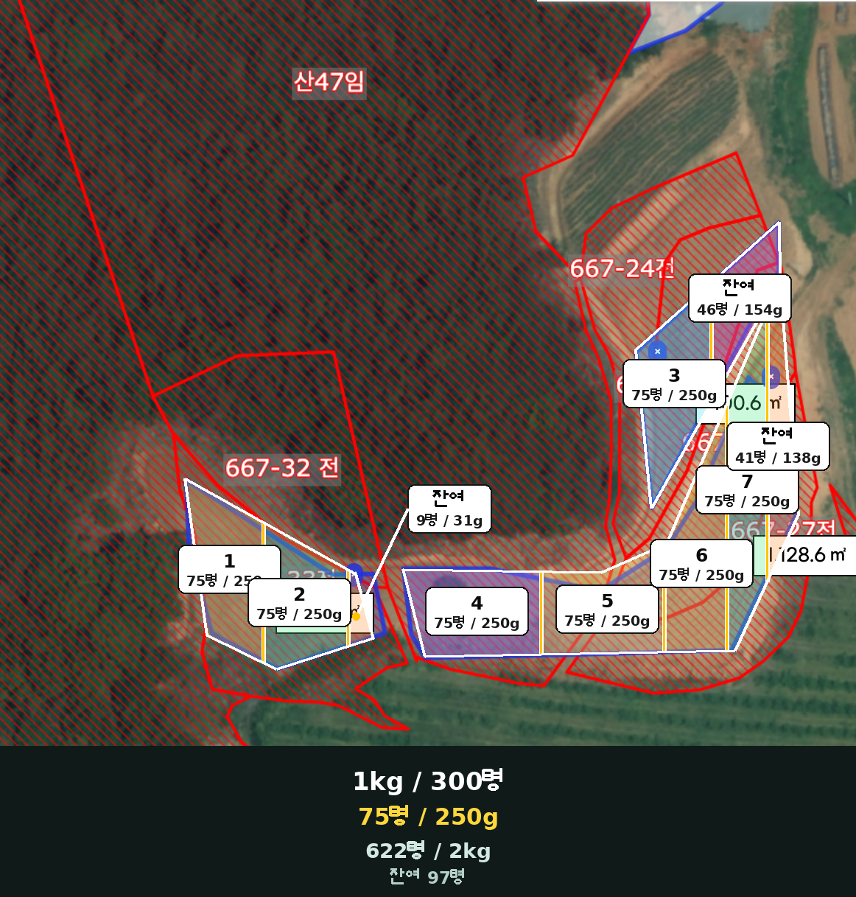

# 20260818 화곡농장 엄나무밭 화이트클로버 파종계획 및 판매자 질의답변 분석

- **작성일:** 2026-08-18
- **대상:** 지도에 파란색으로 표시한 엄나무 재배구역
- **표시 면적:** 2,055.8㎡, 약 622평
- **구매 현황:** 코팅 화이트클로버 종자 1kg 우선 구입
- **최종 준비량:** 총 2kg(현재 구입분 외 1kg 추가)
- **작업 단위:** 종자 250g당 약 75평

> **최종 실행안:** 사용자가 정한 `종자 1kg / 약 300평`의 저밀도 도입 방식으로 진행한다. 약 622평의 이론량은 2.07kg이지만, 엄나무 줄기 반경 50cm와 통로를 제외하므로 **실제 준비량 2kg**을 기준으로 한다.

---

## 1. 결론부터

1. 판매자가 반복 안내한 `1kg/30~50평`은 **빠르고 촘촘한 조경 피복 기준**이다. 2022년 다른 판매자 답변도 `촘촘하게 심는 조건에서 1kg/30평`이라고 명시했다.
2. 화곡농장의 최종 실행량은 **2kg/약 600~622평**이다. 1kg/300평(약 1g/㎡)의 저밀도 도입 방식이므로 첫해가 듬성듬성하거나 잡초 억제가 약할 수 있다는 점은 감수한다.
3. 빈 곳은 발아 상태를 확인한 뒤 보충 파종하고, 포복경과 자연결실을 이용해 장기적으로 퍼지게 한다. 이 계획을 판매자 표시량과 같은 조밀 피복으로 오해하지 않는다.
4. 코팅종자이므로 **물에 불리지 않는다.** 완전히 마른 살포 보조재와 파종 직전에 섞는다.
5. 씨앗은 빛을 받아 발아하는 성질이 있으므로 깊게 묻지 않는다. 맨흙에 닿게 뿌린 뒤 밟거나 눌러 밀착하고, 흙을 덮더라도 **0~5mm의 아주 얇은 수준**으로 한다.
6. 이미 제초제로 잡초가 말랐다면 뿌리를 전부 캐는 것보다 **마른 지상부를 낮게 자르고 걷어내어 씨앗이 흙에 닿게 하는 것**이 600평 현장에서는 현실적이다. 단, 사용 제초제 라벨의 재파종 가능 기간은 반드시 지킨다.

---

## 2. 면적과 종자량

| 구분 | 표시 면적 | 환산 평수 | 2kg 비례 배정 |
|---|---:|---:|---:|
| 왼쪽 파란 구역 | 526.6㎡ | 약 159평 | 약 510g |
| 오른쪽 상단 파란 구역 | 400.6㎡ | 약 121평 | 약 390g |
| 오른쪽 하단 파란 구역 | 1,128.6㎡ | 약 341평 | 약 1,100g |
| **합계** | **2,055.8㎡** | **약 622평** | **2,000g** |

### 밀도 비교

| 계획 | 총 필요량(약 622평) | 밀도 | 예상 용도·결과 |
|---|---:|---:|---|
| 판매자 조밀 기준 1kg/30~50평 | 12.4~20.7kg | 약 6.1~10.1g/㎡ | 빠른 완전피복, 비용·경쟁 증가 |
| 빠른 피복안 1kg/100평 | 약 6.2kg | 약 3.0g/㎡ | 첫해 피복을 더 중시 |
| 중간 밀도안 1kg/150평 | 약 4.15kg | 약 2.0g/㎡ | 비용과 초기 정착의 절충 |
| **화곡농장 실행안 1kg/300평** | **약 2.07kg** | **약 1.0g/㎡** | **2kg으로 시작, 빈 곳은 보충** |

`2,000g ÷ 2,055.8㎡ = 약 0.97g/㎡`이다. 줄기 주변과 통로를 제외하면 실제 파종 면적의 밀도는 약간 올라간다.

---

## 3. 75평 살포구역 사용법

| 작업 단위 | 종자량 | 담당 면적 |
|---|---:|---:|
| 1회분 | 250g | 약 75평 |
| 4회분 | 1kg | 약 300평 |
| 8회분 | 2kg | 약 600평 |

- 1~7번 구역: 각각 75평, 이론 배정량 250g
- 왼쪽 잔여: 약 9평, 이론 배정량 31g
- 상단 잔여: 약 46평, 이론 배정량 154g
- 오른쪽 하단 잔여: 약 41평, 이론 배정량 138g
- 위 이론량 합계는 약 2.07kg이다. 실제 2kg 작업에서는 엄나무 반경 50cm와 통로를 먼저 제외하고, 잔여구역 배정량을 조금 줄여 총량을 맞춘다.
- 구역 경계는 지도 화면 면적비에 따른 **근사선**이므로 엄나무 열, 작업로, 지형 경계를 기준으로 현장에서 조정한다.

---

## 4. 판매자 질의답변에서 확인한 좋은 정보

| 날짜 | 질문 주제 | 쓸 만한 정보 | 화곡농장 적용·주의 |
|---|---|---|---|
| 2026-06-04 | 제초 후 마른 잡초 위 파종 | 잔재물을 치우고 씨앗이 맨흙에 닿아야 발아에 유리, 제초제 재파종 간격 확인 | 뿌리 전부 굴취보다 예초·긁어내기·토양 노출이 현실적. 다시 돋는 다년생 잡초는 별도 관리 |
| 2026-04-01 | 경사지 표면살포 | 광발아 종자라 표면파종 가능, 뿌린 뒤 발이나 도구로 밀착, 폭우 직전 회피 | 핵심은 깊이보다 토양 접촉과 유실 방지. 라이그라스 혼파는 가장 가파른 곳의 선택안일 뿐 기본안에는 제외 |
| 2025-12-28 | 자연번식 | 다년생이며 꽃이 씨를 맺고, 포복줄기로 옆으로 퍼짐 | 일부 구역은 꽃이 진 뒤 씨가 여물 때까지 예초를 늦추면 자연확산에 도움 |
| 2025-09-27 | 품종·F1 여부 | 판매자는 F1이 아닌 조경·녹비용 종자라고 답변 | `원종·토종 계통`은 판매자 표현. 실제 품종은 포장지 종자보증표시가 우선이며 상품 이미지는 라디노형으로 표시 |
| 2025-08-02~06 | 코팅·초장 | 코팅종자, 초장 30~45cm | 불리지 말고 직파. 엄나무 줄기 반경 50cm를 비우고 필요 시 예초 |
| 2025-08-05 | 모종판 재배 | 노지 직파용 벌크종자로 모종 재배 비추천 | 이번 계획처럼 직접 흩어뿌리기가 적합 |
| 2023-12-26 | 파종량·발아율 | 판매자는 1kg/30평, 발아율 약 80%라고 안내 | 80%는 판매자 제시값이며 포장지 검사값·보관상태 확인 필요. 현장 정착률은 토양 접촉·수분·유실 때문에 더 낮을 수 있음 |
| 2023-12-26 | 경주 겨울 파종 | 12~3월 문의에 3월 파종 권장 | 서산도 겨울 즉시 발아보다 봄 또는 9~10월의 적온 파종이 관리하기 쉬움 |
| 2023-09-25 | 과수원 대면적 | 판매자는 1kg/30평을 반복 안내 | 빠른 조밀 피복 기준으로 보고 본 보고서의 2kg 저밀도 실행안과 구분 |
| 2023-03-06 | 코팅종자 물 불림 | 물에 불릴 필요 없이 바로 파종, 젖은 종자는 물기를 빼고 즉시 흙과 섞어 파종 | 코팅이 녹아 죽처럼 될 수 있으므로 불림 금지. 젖었다면 저장하지 말고 즉시 파종 |
| 2022-11-28~10-18 | 늦가을·겨울 파종 | 추울 때 바로 발아하지 않아도 월동 후 이른 봄 출현 가능 | 전면 비닐 피복은 600평에 비현실적이고 과열·관리 문제가 있어 채택하지 않음 |
| 2022-04-01 | 1kg당 면적 | 다른 판매자가 `촘촘하게 심는 조건에서 1kg/30평`, 넓게 뿌리면 더 넓게 가능하다고 명시 | 1kg/30평이 절대 최소량이 아니라 목표 피복밀도에 따른 값임을 확인 |
| 전화상담만 표기 | 2025-03-07, 2023-07-08 | 공개 답변 내용 없음 | 보고서 판단 근거로 사용하지 않음 |

---

## 5. 서로 다른 판매자 답변 정리

| 서로 달라 보이는 답변 | 최종 해석 |
|---|---|
| `광발아라 표면에 뿌린다` vs `흙을 잘 덮는다` | 표면에 뿌리고 눌러 밀착한다. 흙은 씨가 안 보일 정도로 두껍게 덮지 말고 0~5mm만 아주 얇게 뿌린다. |
| `뿌리까지 제거` vs 대면적 현실 | 완전 제거가 가장 깔끔하지만 600평에서는 죽은 지상부와 두꺼운 잔재물 제거, 표면 긁기, 재발생 잡초 관리가 현실적이다. 제초제 잔효 확인이 더 중요하다. |
| `발아율 80% 이상` | 실내 검사 또는 좋은 조건의 종자 발아율과 밭에서 살아남아 피복하는 비율은 다르다. 현장 결과를 80%로 보장하지 않는다. |
| `땅속줄기로 퍼짐` | 화이트클로버는 주로 땅 위를 기는 포복경이 마디에서 뿌리내리며 퍼진다. |
| `1kg/30~50평` | 조밀·빠른 피복 기준. 넓게 파종할 수 있으나 첫해 피복은 느리고 빈 곳이 생길 수 있다. |
| `아침저녁 비닐 덮기` | 10평 같은 소면적에는 가능하지만 600평에는 비현실적이므로 적용하지 않는다. |

---

## 6. 황토 단독 배합

화곡농장은 **종자 1kg당 마른 황토 20kg**을 사용하는 것으로 확정한다. 황토는 비료나 복토용이 아니라 작은 코팅종자를 **균일하게 손 살포하기 위한 부피재**다. 완전히 말린 뒤 체에 걸러 쓴다.

| 선택 | 종자 1kg 기준 | 종자 250g·75평 기준 | 평가 |
|---|---:|---:|---|
| 마른 고운 모래만 | 15~20kg | 4~5kg | 흐름성이 좋아 가장 균일, 바닷모래 금지 |
| **확정: 마른 고운 황토만** | **20kg** | **5kg** | 화곡농장 적용안, 덩어리·먼지·습기 주의 |
| 마른 상토만 | 50~70L | 12~18L | 가벼워 바람에 날리고 부피가 커 차선책 |
| 모래＋황토 대안 | 모래 10kg＋황토 10kg | 모래 2.5kg＋황토 2.5kg | 황토 단독 살포가 불균일할 때만 고려 |

### 황토만 써도 되는가

가능하다. 본 계획은 황토만 사용한다. 다만 젖은 황토나 찰흙성 덩어리는 씨앗과 함께 뭉쳐 한곳에 떨어지므로 **바싹 말리고 체로 거른 고운 황토**를 사용한다. 황토가 잘 흩어지지 않으면 덩어리를 다시 체로 거르고, 작업 중 통 바닥까지 자주 뒤집어 섞는다.

### 상토는 어떤가

사용할 수 있지만 가벼워 바람에 날리고 젖으면 뭉치기 쉽다. 바람 없는 날 마른 상토를 쓰고, 부피가 너무 크면 모래를 일부 섞는다. 비료가 많이 들어간 상토를 씨앗과 오래 접촉시키지 않는다.

### 쓰지 않을 재료

- 젖은 모래·황토·상토
- 염분이 있는 바닷모래
- 제초제·농약·고농도 비료가 섞인 흙
- 큰 돌, 풀뿌리, 흙덩이가 섞인 재료

---

## 7. 250g 한 묶음 혼합법

한 번에 2kg 전체를 섞지 말고 **종자 250g씩 8묶음**으로 작업한다.

1. 저울로 코팅종자 250g을 재어 별도 봉투나 통에 담는다.
2. 체로 거른 마른 황토 5kg을 준비한다.
3. 배합재 약 1/4을 큰 통에 넣고 종자 일부를 넓게 흩어 넣는다.
4. 아래에서 위로 뒤집듯 섞는다. 비비거나 짓누르지 않는다.
5. 종자와 배합재를 3~4번에 나누어 넣으며 반복한다.
6. 완성 혼합물 약 5.25kg을 정확히 절반으로 나눈다.
7. 절반은 75평 구역을 한 방향으로, 나머지는 직각 방향으로 교차 살포한다.
8. 무거운 종자와 가벼운 흙이 분리될 수 있으므로 살포 중 수시로 바닥까지 다시 섞는다.

> **핵심:** 한 움큼이 몇 g인지 맞추는 방식보다 `250g 종자 한 묶음을 지정된 75평에서 고르게 소진`하는 방식이 정확하다.

---

## 8. 손 살포·움큼·우유갑

### 손으로 뿌리는 자세

1. 혼합물을 반 움큼씩 느슨하게 잡는다.
2. 허리 높이에서 손목을 좌우로 움직여 부채꼴로 조금씩 턴다.
3. 살포 폭은 약 1.5~2m, 보행 속도와 간격은 일정하게 유지한다.
4. 한 움큼을 한 번에 던지지 말고 3~4번으로 나눠 턴다.
5. 준비량의 절반으로 가로 방향, 나머지 절반으로 세로 방향을 돈다.

### 한 움큼은 몇 g인가

- 코팅종자만: 대략 30~60g 범위가 흔하지만 손 크기와 코팅 상태에 따라 크게 달라진다.
- 종자·황토 혼합물: 대략 100~180g 정도일 수 있으나 수분과 입도에 따라 달라진다.
- 정확히 하려면 평소처럼 5~10번 움켜 쥔 총무게를 저울로 재고 횟수로 나눠 평균을 낸다.

### 250mL 우유갑은 250g인가

아니다. `mL`는 부피, `g`은 무게다. 특히 이 제품은 코팅종자라 코팅량과 충전 상태에 따라 부피당 무게가 달라진다. **250mL를 250g으로 간주하지 않는다.** 처음 한 번 저울로 실제 종자 250g을 담아 용기 높이를 표시하고, 이후 같은 제품을 계량할 때만 그 표시를 사용한다.

---

## 9. 제초 후 밭 만들기

1. 사용한 제초제의 제품명·성분·라벨에서 `파종/재식 가능 기간`을 확인한다. 잔효형 토양처리 제초제라면 기다려야 한다.
2. 완전히 마른 잡초를 낮게 예초한다.
3. 두꺼운 마른 풀, 낙엽, 덩굴을 갈퀴로 걷어내 씨앗이 흙에 직접 닿게 한다.
4. 흙 표면을 갈퀴로 얕게 긁어 굳은 껍질만 깬다. 깊게 경운해 새 잡초씨를 올릴 필요는 없다.
5. 살아 있는 다년생 잡초나 다시 돋는 뿌리는 가능한 만큼 제거한다.
6. 엄나무 줄기 중심 반경 50cm와 작업통로는 미파종 구역으로 표시한다.

뿌리를 모두 캐지 못해도 씨앗이 맨흙에 닿고 기존 잡초가 확실히 죽었다면 파종할 수 있다. 그러나 마른 풀 더미 위에 씨앗이 얹히면 비·바람에 유실되고 발아가 고르지 않다.

---

## 10. 파종 시기와 파종 후 관리

### 시기

- 상품 권장: 2~6월 또는 9~10월, 발아 적온 15~25℃
- 서산 지역 실무 권장: **9월~10월 초**, 폭우가 아닌 약한 비 전후
- 늦가을에 뿌려 월동 후 봄 발아를 기대할 수 있지만, 새·유실·부패 위험과 결과 변동이 커진다.
- 강풍·집중호우 직전과 한낮의 건조한 때는 피한다.

### 파종 직후

1. 표면에 고르게 뿌린다.
2. 발로 밟거나 롤러·넓은 판으로 눌러 흙과 밀착시킨다.
3. 필요하면 고운 흙을 0~5mm만 얇게 뿌린다. 깊이 묻지 않는다.
4. 발아기에는 표면이 완전히 마르지 않도록 약하게 관수하되 물줄기로 씨앗을 쓸어내리지 않는다.
5. 폭우 유실이 우려되는 급경사지는 등고선 방향으로 나누어 뿌리고 더 꼼꼼히 눌러준다.

### 이후

- 2~4주 동안 발아와 유실, 잡초 재발생을 확인한다.
- 빈 곳은 같은 방식으로 보충 파종한다.
- 초장이 높아 엄나무 하부와 통행을 방해하면 예초한다.
- 자연번식을 원하면 일부 꽃을 씨가 익을 때까지 남긴 뒤 예초한다.
- 포복경은 땅 위를 기며 마디에서 뿌리내리므로 시간이 지나면 빈 곳으로 확산한다.

---

## 11. 작업 당일 체크리스트

- [ ] 코팅 화이트클로버 종자 총 2kg
- [ ] 저울, 250g 분할용 봉투·통 8개
- [ ] 종자 1kg당 마른 황토 20kg(250g 작업분당 5kg)
- [ ] 큰 혼합통, 바가지, 양동이
- [ ] 갈퀴, 예초도구, 압착용 롤러 또는 넓은 판
- [ ] 장갑, 황토 먼지용 마스크
- [ ] 75평 구역 표시용 말뚝·끈
- [ ] 사용 제초제 라벨과 재파종 가능일 확인
- [ ] 일기예보에서 강풍·집중호우 여부 확인
- [ ] 필요 시 약한 관수 준비

---

## 12. 이미지 자료

<table>
<tr>
<td align="center"> ① 파란 살포 대상구역</td>
<td align="center"> ② 상품페이지 파종정보</td>
<td align="center"> ③ 75평 단위 살포구역도</td>
</tr>
</table>

---

## 13. 근거와 한계

- 구매 상품: [쿠팡 화이트클로버 코팅종자 1kg](https://www.coupang.com/vp/products/5172687209?vendorItemId=83179248538)
- 상품 이미지 표시: 1kg/30~50평, 2~6월·9~10월, 발아 적온 15~25℃, 라디노형 30~45cm
- 판매자 질의답변: 사용자가 제공한 2022~2026년 공개 답변을 날짜별로 검토함
- 판매자 답변은 재배 참고정보이며 공인 시험성적서나 해당 밭의 발아 보증이 아니다.
- 코팅 중 실제 종자 비율, 품종명, 종자검사일은 제공 자료에서 확인되지 않았다. 포장지의 종자보증표시가 있으면 그것을 우선한다.
- 75평 구역도는 위성사진의 파란 도형 면적을 기준으로 나눈 작업용 근사도다.

---

## 최종 실행안

> **종자 1kg 한 포대당 체로 거른 마른 황토 20kg을 사용한다. 종자 250g＋황토 5kg씩 4묶음으로 나누고, 1묶음을 약 75평에 가로·세로 두 방향으로 손 살포한다. 전체 종자 2kg에는 황토 총 40kg이 필요하다. 코팅종자는 물에 불리지 않는다. 마른 잡초 잔재물을 치우고 맨흙에 닿게 뿌린 뒤 눌러 밀착하며, 흙은 0~5mm만 얇게 덮는다.**
