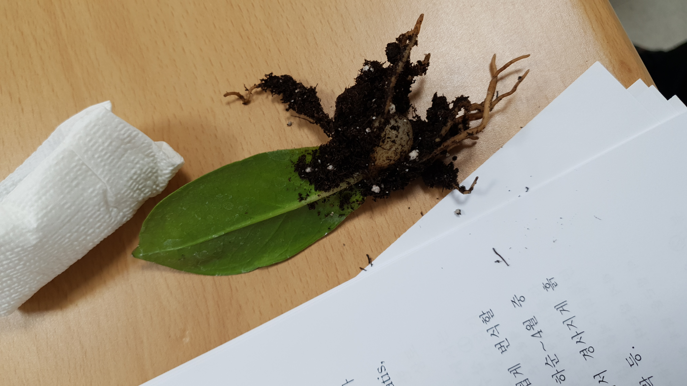

##### 강사님
  - 이문원 박사님
  - 010-6396-8460
  - https://www.youtube.com/@user-nz9xs3dg4x
  - 대림대학교 조경가든 과정 강의하신다고함 봄에 신청할 수 있음.
  - 
#### # 농장 주소 
  - 평택시 유천동 660번지 영광교회 앞

##### # 원예식물의 번식.
  - 삽목
  - 칼랑코에 .관엽식물
    - 겨울에도 오래 꽃을 볼 수 있음.
    - 삽목하면 화다네 심으면 좋음.
    - 봄부터 가을까지 오래감.
  - 콩고 : 공기정화식물 상위권
  
  - 드레곤 알로카시아
  - 채소,화훼, 조경
  - 베란다가 텃밭이다

  - GNP가 높을 수록 꽃소비량이 높아짐.
    - 1안당 만불만 넘어도 10만원 넘음
  - 꽃문화는 2만원밖에 안됨.
  - 전정가위 : 누무도 자르고 고무나무도 잘라야햠.
    - 만원정도 투자해서 하나 사라. 전정가위
  - 포도 불루베리 삽목된다.
  - 꽃이고 뭐고 다 채울 수 있다.
  - 저는 항시 강조하는 하는게 주고 살고 베풀고 살아라.
  - 50개 다쓰는거 아니라.
  - 홍콩야자.
  - 주고 살고 베풀고 살아라.
  - 행복은 스스로 찾는거다.
  - 행복은 긴게 아니다. 순간이다.
  - 돈많다고 오래사는거 아니다.
  - 가난하다고 수명이 짥은건 아니다.
  - 항상 감사하며 살아라, 고맙다고해라. 
  - 사랑한다고 해라.

##### # 책 소개  : 이문원 박사님 저서.
  - "실내식물이 사람을 살린다."
  - "식물의 정신세계"
    - 식물은 기억한다.
    - 알아듯는다.
    - 감정이있다
    - 보기도한다.
    - 물을 줄때도 마음에따라 파동이 달라지고 물을 주는 파동도 달라진다.
    - 뱅갈고무나무 전정하려 갖는데 막 떨고 있었다. 내가 널위해서 가지만 정리할께 하니 요동을 멈췄다.
  - "물은 답을 알고 있다"
    - 물을 얼려서 사진을 찍으니 6각형.
    - 얼린 물이 글씨를 알아본다.
    - 좋은 음악(베토벤,바하)를 틀어주면 풀어진형태의 결정이 됐다.
  - "녹색 의학" : 허브
    - 한국에 코로나가 들 된게, 음식문화 양념에서 부터 나온 효소.
    - 의성(마늘주산지) 사람들이 장수한다.
    - 마늘이 정력제이다.
    - 고추가루
      - 고추장에다 고추찍어 먹는 민족 대단하다.우리 한국

    - 한국사람들은 향을 싫어한다.
    - 동양의학은 한의인데
    - 서양의학은 백색의약이다.

##### # 실내식물
  - 실내에 유해화학물질이 300백종이 있다.
  - 78프로 질소, 23프로 산소
  - 실내에서 사람이 있으면 산소가 부족해진다.
  - 식물이 영양물을 만들려면
    - 이산화탄소, 물, 햇빛(674kcal)
    - Co2 + H2O + 햇빛 + 엽록소 -> O2(산소)
- 아궁이세대, 우물물세대
- 부엌이 다 실내에 있는데.
- 아궁이에 불을 때서 온돌에 쓰고 넣고 다 한다. 한국사람만이 불을 갖고 노는 민족이다.
- 실내에서 가스레인지 틀면 이산화탄소 생김.
- 부엌에 식물이 있다.
  - 스킨다비스 << 얘는 이산화탄소 먹고 산소 만듬.

##### # 실내 공기정화식물의 조건
  - 잎이 많을것
  - 잎이 엷을것
  - 수분을 좋아애야함.

##### # 콩고 : 재배쉽고, 공기정화 잘되는 식물.
##### # 실내 식물
  - 공기를 정화한다.
  - 가습 ㅣ 기공이나 뿌리를 통해서 증산작용 가습
  - 식물의 비중 : 실내면적에 5%~10% << 대략 1평정도
  - 가정을 위해서 1년에 10만원만 투자해라.
    - 화분사라.
  - 식물이 죽으면 말라죽는게 많다.
    - 물을 안주면 맨 아랫잎부터 누렇게 되고 떨어진다.
    - 내가 미안해 바뻐서 물을 못줬네 하면서 물을 준다.
    - 마음에따라 파동이 달라지고 물을 주는 파동도 달라진다.
    - 
##### # 식물의 분갈이는 언제한다
  - 화분에 뿌리가 보일때 >> 화분에 뿌리가 꽉찼을때한다.

##### # 분갈이
  - 분갈이를 정기적으로 해야함.
  - 화분안에 뿌리만 있음.
  - 뿌리만 있으면 썩음.

  - 가정을 위해서 1년에 10만원만 투자해라.
    - 화분사라.

#### # 식물은 일년초

채소 번식은 종자로'
꽃은 종자로 하는데,. 1년생
종자로한다.
천일홍 : 차로 만든다.

#### # 천일홍

  - 드라이플라워의 대표자 천일홍
  - 드라이플라워의 요건
    - 잘라도 모양이 그대로
    - 잘라도 색이 그대로.
  - 꽃을 잘라도 흐트러지지 않는 꽃
  - 천일홍도 큰게 있고 작은게 있음.
  - 씨를 받을때는 반이상 색깔이 하얗게 변하면 그때 씨를 받는다.

##### # 새싹채소
  - 무순
  - 샐러드
  - 키친타올 깔아서 종자 올리고, 분무기 뿌린다.
  - 영양가가 높다.
  - 새삭채소
  - 우리나라 종묘사가 다 외국으로 팔림.

##### # 시금치 : 월동

##### # 영양적으로 옛날 당근하나가 지금 당근 16와 같다.
  - 진정한 유기농은 없다.
  - 밀폐된 하우스안에 산소가 없는데.. 
  - 햇빛이 제대로 안든다.

##### # 잎으로 먹고 싸고 다시 뿌리고 순환.
  - 옛날 농사는 똥농사.
  - 진정한 농사 중국 일본 한국 똥농사를 지었음
  - 인분농사가 없어짐.
  - 요강 오줌받아서 주면 잎이 파래짐.
  - 뒷간옆에 잿간 (짚태우서 재를 쓰고)

##### # 피부좋은 민족
  - 밥통열면 수증기
  - 국통 수증기

#### # 종자
  - 광발화 종자
  - 암발화 종자

##### # 콩나물
  - 물을 계속 주면 자란다.
  - 미국에서 콩나물 대가리 자르고 꽁지 잘라서 팔았어.

##### # 메리골드
   - 꽃차
   - 파종기를 다르게 3월 4월 5월 7월에 뿌려도 제구실을 한다. 한계가 없다.

##### # 일년초
  - 번식은 종자로한다.

#### # 다년초

#### # 구근식물 알뿌리 식물
  - 구근식물은 모두가 다년생이다.
  - 뿌리를 쪼개서 심는다.
  - 꽃지고 나서 꽃대자르지말고 그대로 놔두어야한다. 구근이 유지된다.
  - 춘식구근 : 칸나,다알리아, 그라디아스 : 춘식 구근 식물은 여러해 살이 식물중에서 뿌리모양이 일정한 형태를 이루기 때문에
    - 봄에 심는다.
    - 가을에 구근을 캐서 얼지 않는 상태로 보관 : 왕겨 톱밥.
     
  - 추식구근 : 튜립,프리지아,아네모네,시아신스, 백합
    - 가을에 심는다.
    - 마늘캘때 캐고, 마늘심을때 심어라. 
    - 6월에캐서 양파망에 보관해서 그늘에 뒀다가 10얼달에 심는다. 
    - 안캐도 상관없음.
    
  백합,수선
  튜립, 카나

#### # 아마리스, 백합, 군자난 ( 개화형태가 동일 )
   - 암수술이 위쪽으로 되어있어서 수정이 잘안되므로
   - 오전 10시쯤에 손을 뭍혀준다.

#### # 수박, 참외
  - 암꽃 숫꽃이 다르게 달림.
  - 호박이 남쪽에서 나왔음.
  - 숫꽃을 찾는다.
  - 구별을 어떻게 해요.
  - 벌나비가 겨울 하우스에는 못들어오니가 내가해야해.

##### # 옥수수
  - 숫꽃 맨 꼭대기에 있다.
  - 4월 6월 7월까지 종자 뿌릴 수 있다.
  - 종자 심을때 3개.
    - 하나는 내가
    - 하나는 새가
    - 하나는 하늘이.

#### # 향나무
  - 종자로 번식
  - 인목종자.
    - 쥐동나무
    - 회향목
    - 측백나무

#### # 좀묘사
  - 미림
  - 대림

#### # 삽목
  - 봄삽목
  - 여름삽목
  - 원예용토 상토 무른흙
  - 선인장 다엽식물은 너무 깊게 꽂으면 안됨.
  - 물삽은 하지말아라.
  - 원예토에 삽해라.
  - 옛날에는 모래나 상토에 했음.
  - 잎이있는것은 그늘에
  - 투명 비늘을 흙위에 덮어라. : 수분 증발도 막는다.
  - 뿌리 내릴때 발근할때 온도가 높아야함.
  %20삽수의%20속도,%20삽목의%20적기,%20삽목%20장소에%20대한%20일람표.jpeg)

##### # 엽삽
  - 엽을 번식재료로 쓴다.

##### # 금전수 : 뿌리가 감자처럼 생김
  - 엽삽 가능
  - 봄에 해야함.
  

#### # 제비꽃 바울네시아
  - 입자루 삽입 ( 줄기삽 : 경삽)
  - 바이올렛
  - 물에는 꼿지 말자
  - 꽃지고 난다음에 잎이 쭉나오면 가생이것을 잘라서 원얘용통 꽂는다.
  - 삮나올때까지 2달 걸림.

#### # 개발 선인장
   - 10월부터 ~ 1~2월까지 꽃핌.

##### # 분갈이
  - 분갈이를 정기적으로 해야함.
  - 화분안에 뿌리만 있음.
  - 뿌리만 많아지면 썩음.

##### # 홍콩야자.

#### # 삼색버드나무
  - 봄에는 하얗게
  - 스탠드식으로 해서 우산처럼 기르면 재밌는 식물
  - 모래 삽목.

##### # 사철나무
  - 금사철
  - 은사철
  - 보통사철

##### 국화 삽목
  - 초번 : 새끼손가락 : > 반정도 흙에 삽목
  - 두번째부터는 : 한뼘. :> 3분의1정도 흙에 삽목.

#### # 능수화 삽목
  - 봄삽목이 좋음.
  - 마디마디 잘라서..
  - 씨도 가능
  - 삽목도 가능

#### # 배롱나무

#### # 캠벨 : 포토
  - 삽목 가능.
  - 투명 비늘을 흙위에 덮어라.
  - 뿌리 내릴때 발근할때 온도가 높아야함.

#### # 칼랑코에

##### # 얘들에게는 꿈을 키워줘라.
  - 꿈을 키울 필요가 있다.
  - 자식은 꼭 부모를 배우는거다.

##### # 사괴대추, 복조대추, 보은대추

##### # 샤인머스킷

##### # 취목
  - 줄기를 1.5Cm로 돌깍기 위아래
  - 바이오드 이끼로.. 싼고,
    - 투명비닐로 싼다.
    - 뿌리 내리면 곳 아래로 잘라서 심고
  - 잘린 윗둥도 싹 나온다.

 #### 춘봉 선인장.

