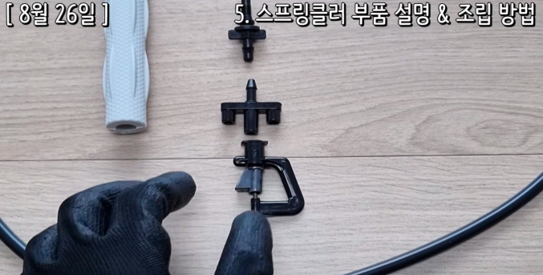
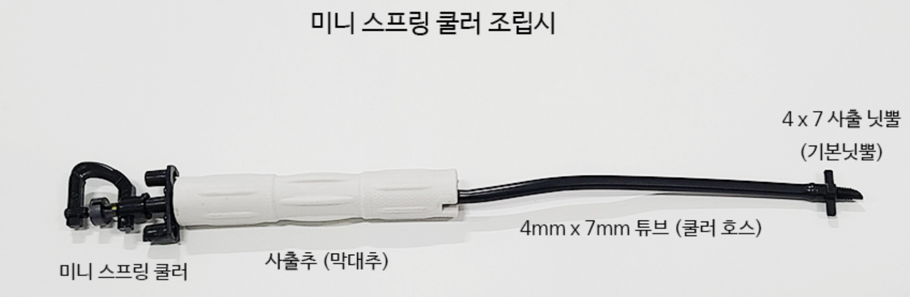
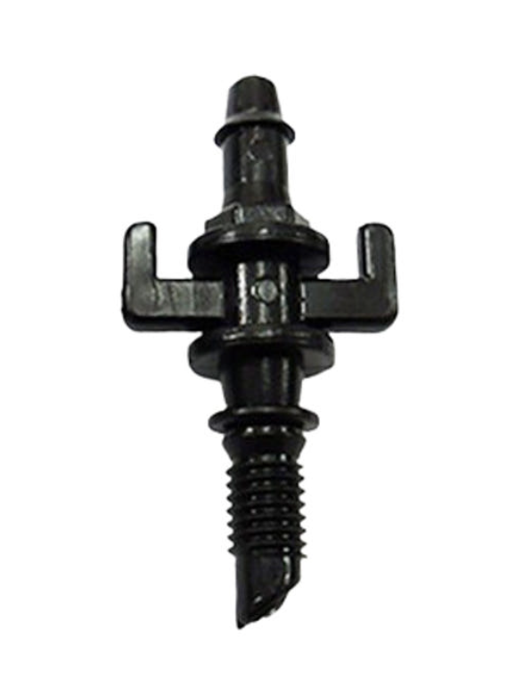
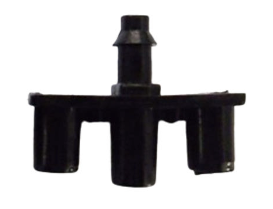
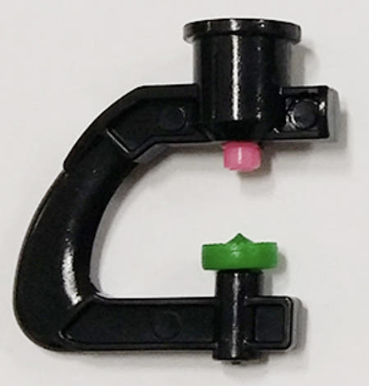
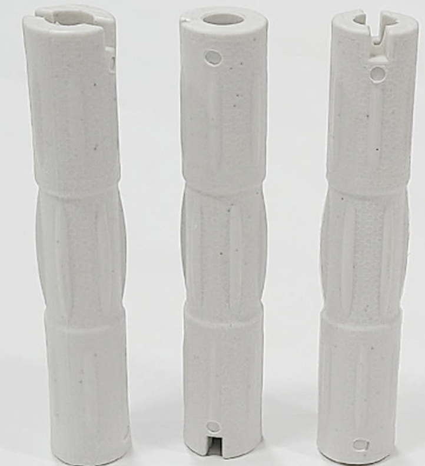
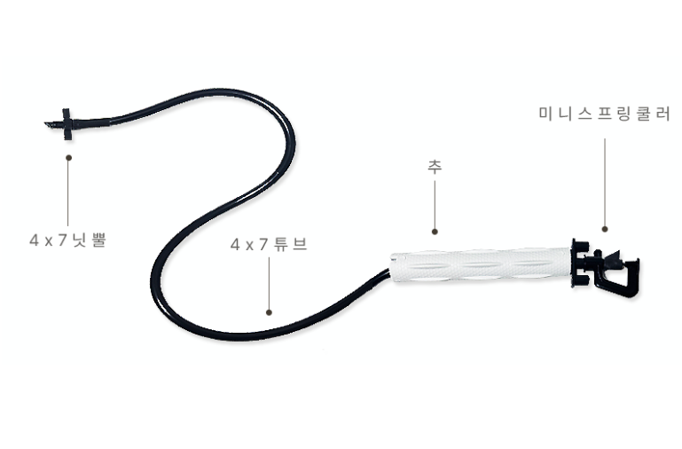

### # 구성도
{width=1024px}
- 구성도
수도꼭지
↓
원터치 수도꼭지 연결구
↓
20mm 원터치 숫나사 연결구
↓
워터타이머 수동
↓
원터치 수도호스 연결구
↓
수도호스
↓
원터치 수도호스 연결밸브 ( or 원터치 수도호스 커넥터)
↓
원터치 LD호스 연결구
↓
13mm 연질관
↓
송곳으로 구멍뚫기
↓
조립세트 미스트 40L 100cm 설치
↓
점적테이프 앤드 고리식 (13mm 연질관 마감용)
---

- [원터치 수도꼭지 연결구](https://smartstore.naver.com/goldentree/products/8044757783)
- [20mm 원터치 숫나사 연결구](https://smartstore.naver.com/goldentree/products/8044734571)
- [워터타이머 수동](https://smartstore.naver.com/goldentree/products/7784604432)
- [디지털 워터타이머 관수타이머 HCT-322](https://smartstore.naver.com/goldentree/products/7862346080)
- [원터치 수도호스 연결구](https://smartstore.naver.com/goldentree/products/8044752786)
- [원터치 수도호스 커넥터](https://smartstore.naver.com/goldentree/products/8714015088)
- [원터치 LD호스 연결구](https://smartstore.naver.com/goldentree/products/13009950826)
- [13mm 연질관](https://smartstore.naver.com/goldentree/products/6099739243)
- [조립세트 미스트 40L 100cm 설치](https://smartstore.naver.com/goldentree/products/9904044931)

- [엘디엘보 13mm](https://smartstore.naver.com/goldentree/products/9871173045)

- 디지털 워터타이머 관수타이머 HCT-322 : 
  - https://ko.aliexpress.com/item/1005007047043341.html?spm=a2g0o.order_list.order_list_main.11.5aa7140fZQANQv&gatewayAdapt=glo2kor

#### # 결제 
- https://www.aliexpress.com/p/order/index.html?spm=a2g0o.order_list
  

### # 스프링쿨러 부품 구성

  - 나사식닛뿔 
    - https://smartstore.naver.com/goldentree/products/11190949674
    - {width=100px}
  - 버터플라이
    - https://smartstore.naver.com/goldentree/products/7895921020
    - {width=100px}
  - 스프링쿨러헤드 :  170원
    - https://smartstore.naver.com/goldentree/products/7895631259
    - {width=100px}
  - 무게추 : 무게 : 약 40g ~ 50g
    - https://smartstore.naver.com/goldentree/products/7893468356
    - {width=100px}
  - {width=100px}

### # 참고 유튜브
 - [초보자를 위한] 비닐하우스 미니 스프링클러 설치 방법 (설치 비용/간격/높이/규격/조립 방법/양수기 마력) - 소농 농사일기
   - https://www.youtube.com/watch?v=H_4K3byxaiM

