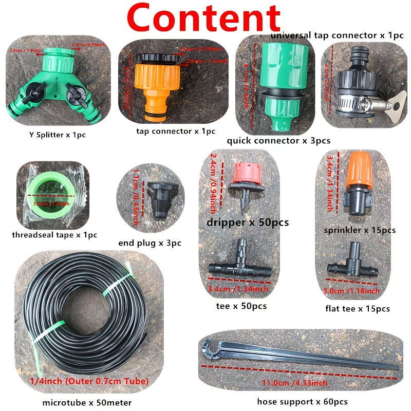
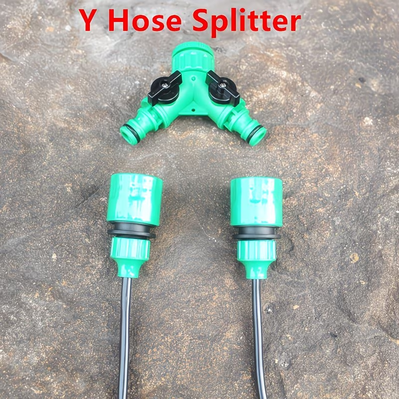
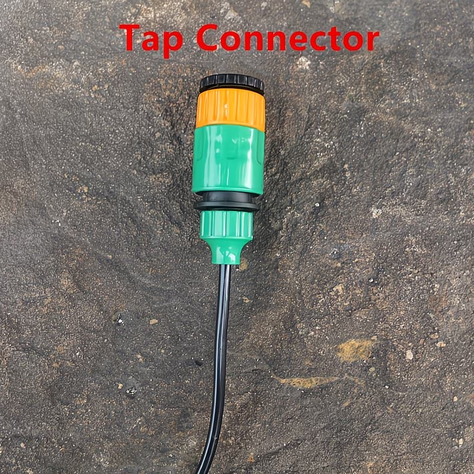
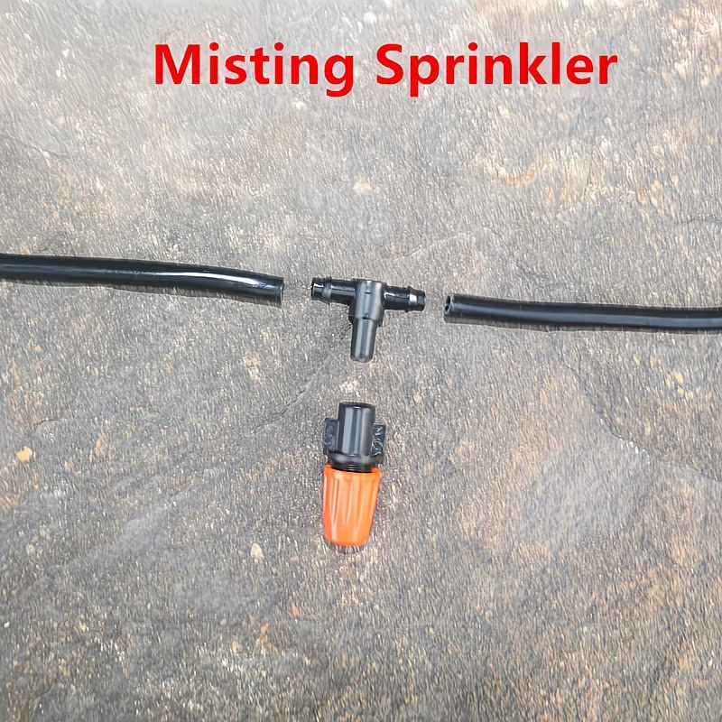
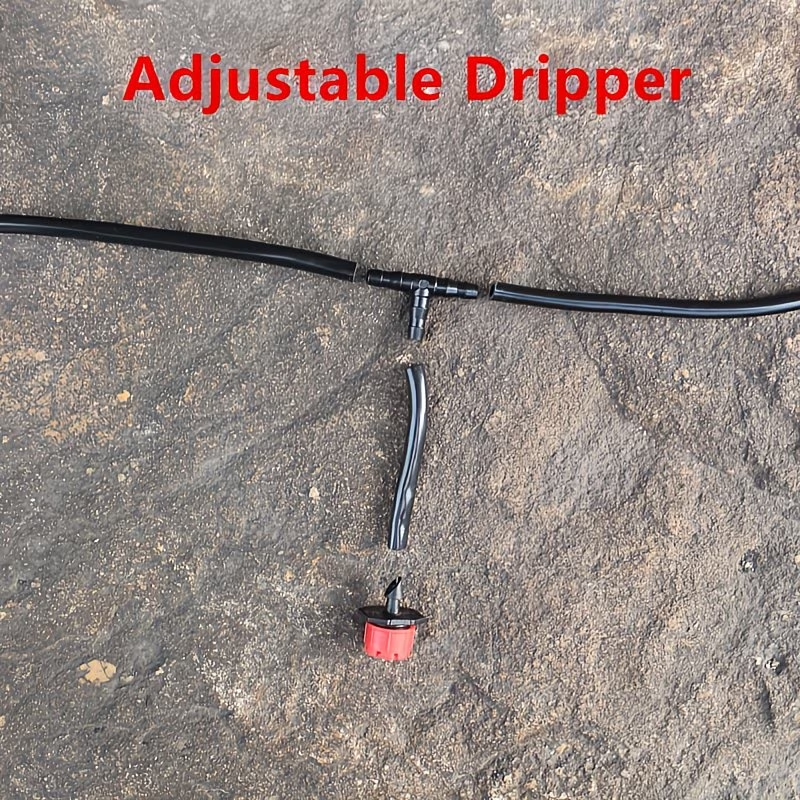
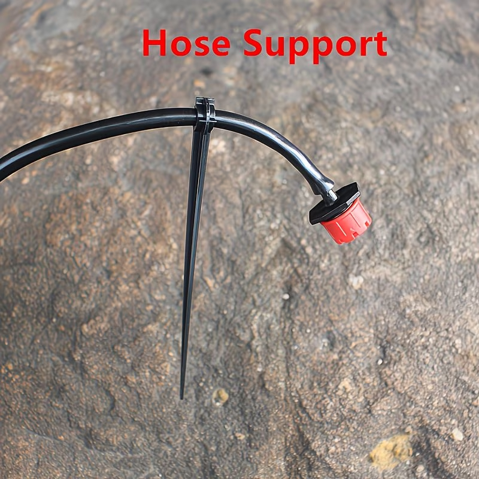
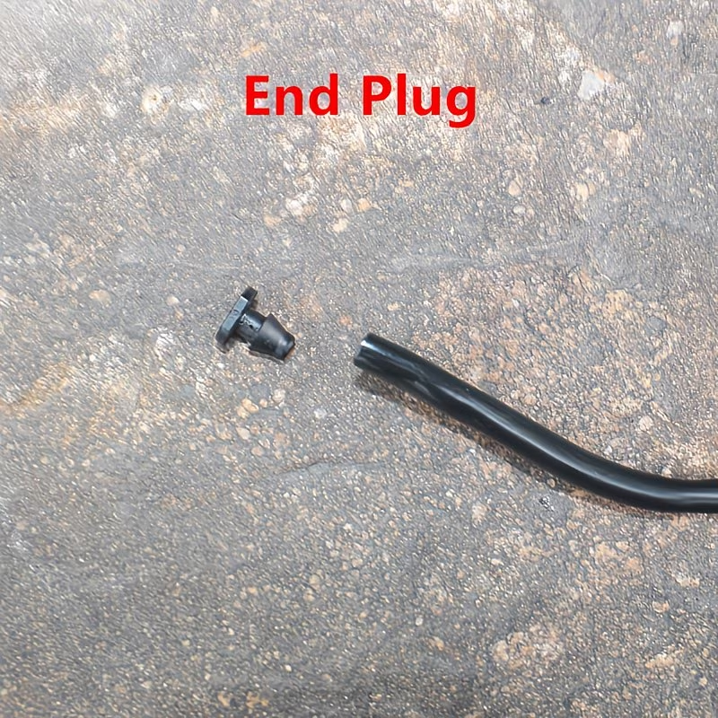

1/4인치는 6.35mm인데 왜 4/7 mm 야?
그 이유는 측정 기준의 차이와 미터법 변환 과정에서 생긴 통칭 때문입니다.
외경(OD)의 기준: 1/4인치는 소수점으로 6.35mm가 맞습니다. 하지만 드립 호스 업계에서는 이를 소수점 없이 올림하여 부르거나, 호스 두께를 포함한 최대 외경을 7mm로 통칭하여 부릅니다.
내경(ID)의 기준: 이 호스에 연결하는 커넥터(피팅)의 삽입부 두께가 보통 4mm 내외입니다. 그래서 실제 물이 흐르는 안쪽 지름인 4mm를 함께 표기하는 것입니다.
마케팅적 표기: 해외(특히 중국) 제조사들이 미터법을 사용하는 국가에 수출할 때, '1/4인치 규격과 호환되는 호스'라는 의미로 가장 근접한 정수인 4/7mm라는 명칭을 브랜드처럼 사용하게 되었습니다.
정리하자면, 1/4인치, 6.35mm, 7mm(외경)는 모두 같은 규격의 호스를 지칭하는 표현이라고 이해하시면 됩니다.
현재 가지고 계신 연결 부속품(커넥터)이 4/7mm용인가요? 아니면 1/4인치용인가요? 규격이 같아 서로 호환될 확률이 높습니다.
AI 대답에는 오류가 있을 수 있습니다. 자세히 알아보기

https://www.temu.com/kr/50m-%ED%98%B8%EC%8A%A4-%EC%A0%95%EC%9B%90-%EB%B0%8F-%EB%B0%9C%EC%BD%94%EB%8B%88%EC%9A%A9-%EB%AC%BC%EB%BF%8C%EB%A6%AC%EA%B8%B0-%ED%82%A4%ED%8A%B8-%EB%AF%B8%EC%8A%A4%ED%8A%B8-%EB%93%9C%EB%A6%BD-%EA%B4%80%EC%88%98-%EB%8F%84%EA%B5%AC-%ED%8F%AC%ED%95%A8-50m-%ED%98%B8%EC%8A%A4-50%EA%B0%9C-%EB%93%9C%EB%A6%AC%ED%8D%BC-15%EA%B0%9C-%EB%AF%B8%EC%8A%A4%ED%8A%B8-%EB%85%B8%EC%A6%90-%EB%93%B1-g-601099833937274.html?_oak_mp_inf=EPqazrCn1ogBGhZnb29kc19laGF1d21fcmVjb21tZW5kIJTq8NPbMw%3D%3D&top_gallery_url=https%3A%2F%2Fimg.kwcdn.com%2Fproduct%2Ffancy%2Fa2f36fb8-c31a-42a1-ad78-5220adf22ac2.jpg&spec_gallery_id=572543&refer_page_sn=10032&freesia_scene=11&_oak_freesia_scene=11&_oak_rec_ext_1=MTIyNTA&_oak_gallery_order=82697122%2C333009998%2C829148845%2C780652252%2C203227284&refer_page_el_sn=200444&operate_cart_extend_map=%7B%22add_cart_use_layer%22%3A1%7D&ab_scene=1&enable_vqr=1&_x_sessn_id=aehr0yrv6m&refer_page_name=goods&refer_page_id=10032_1776950194740_uhor88mamx

