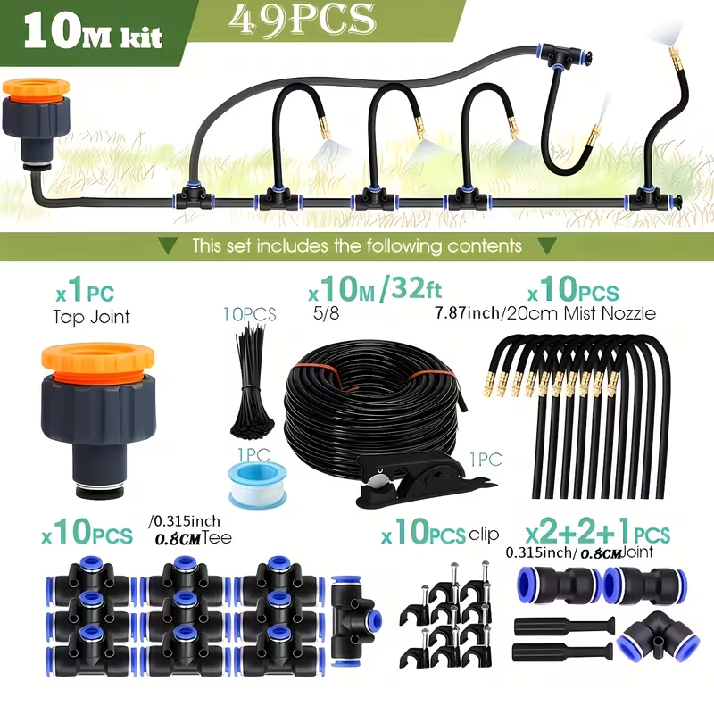
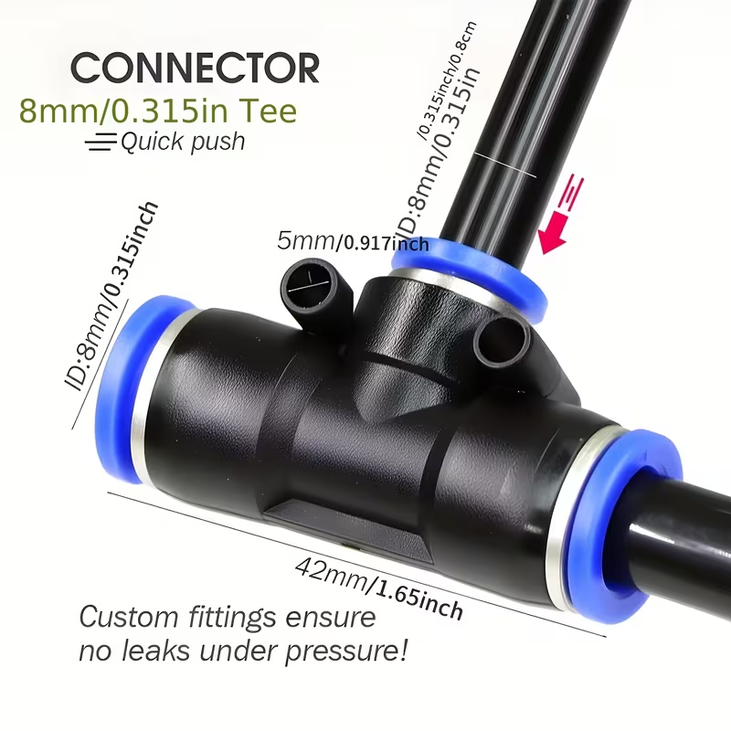
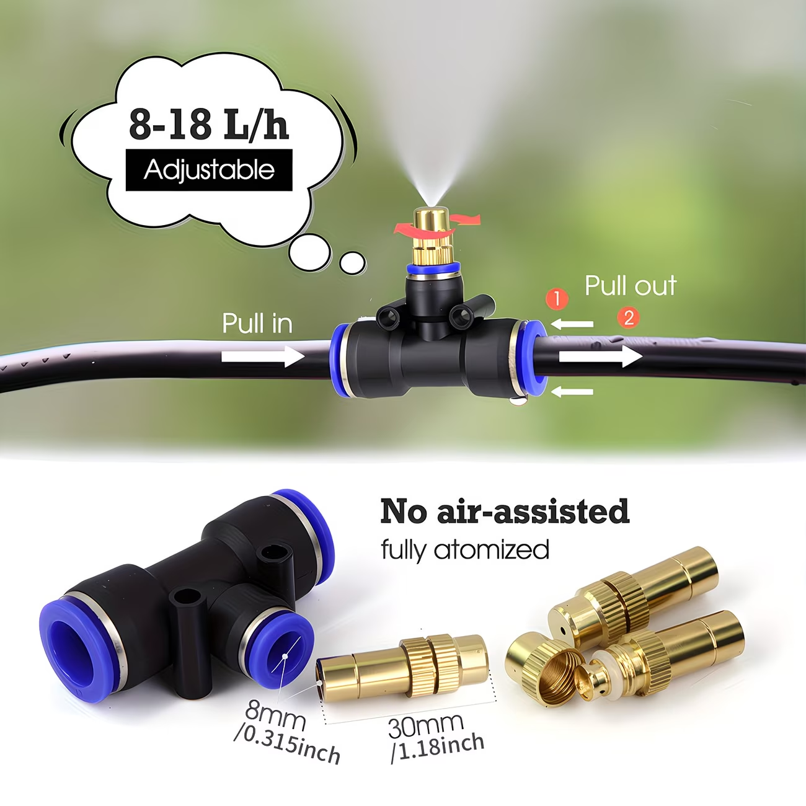
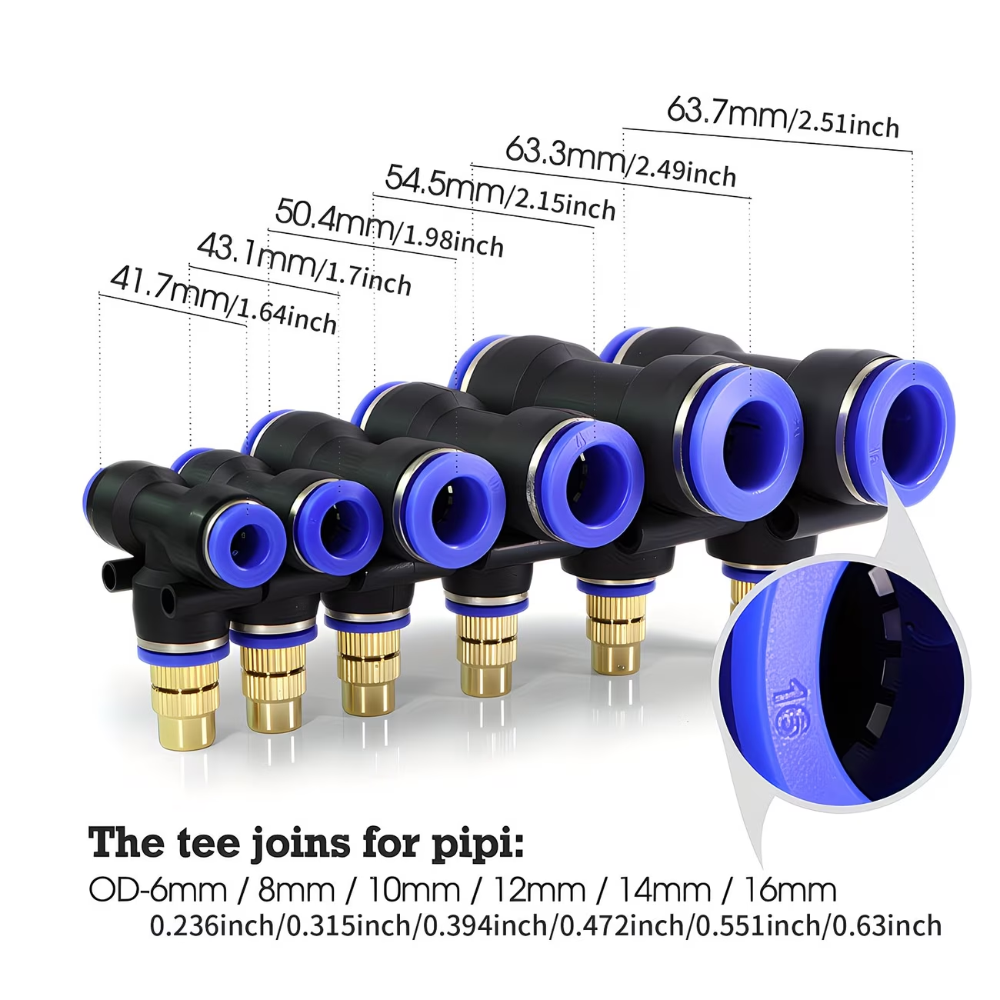
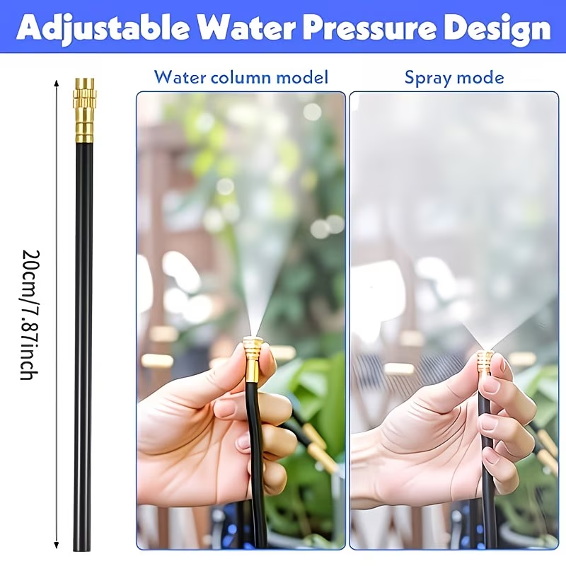
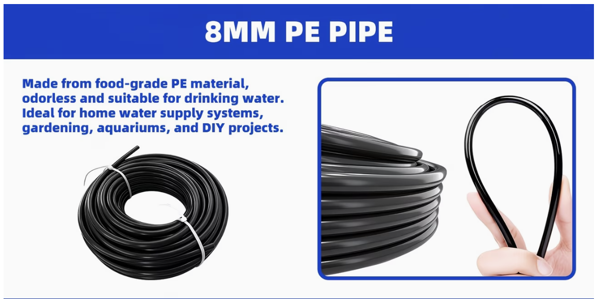
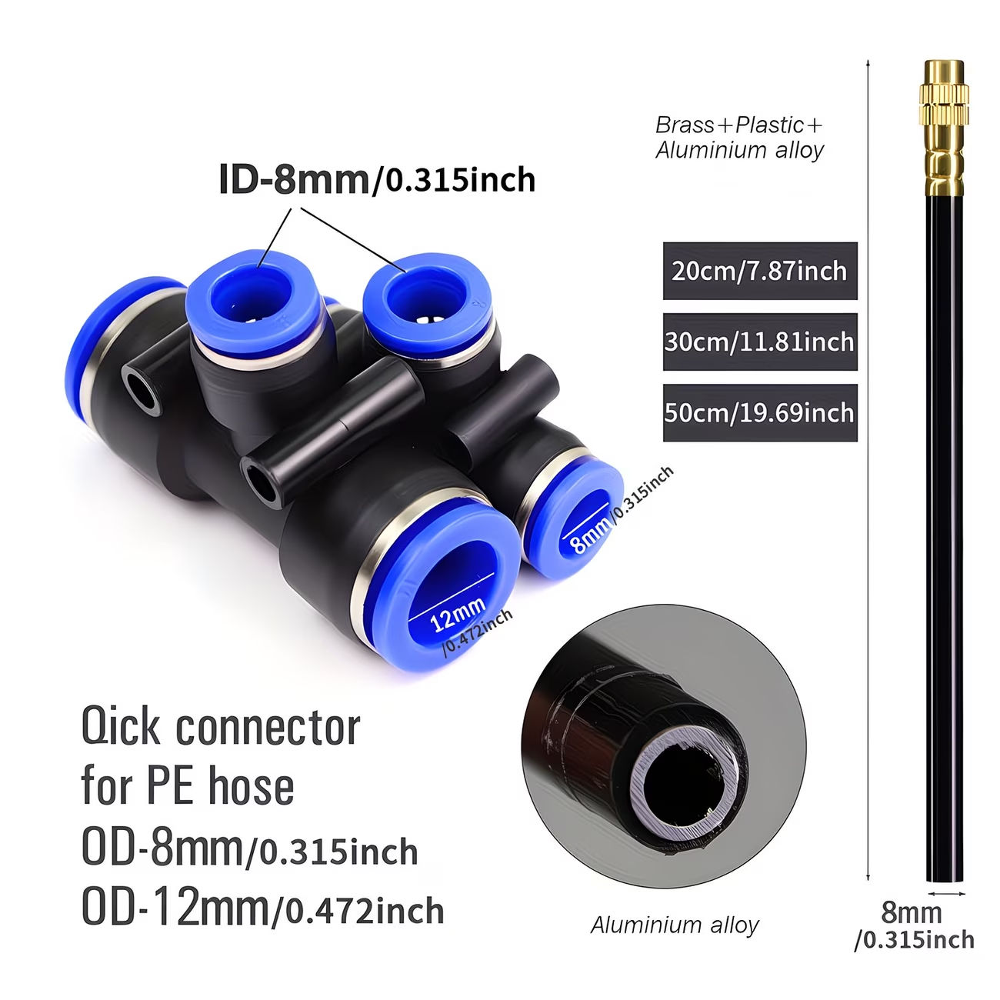
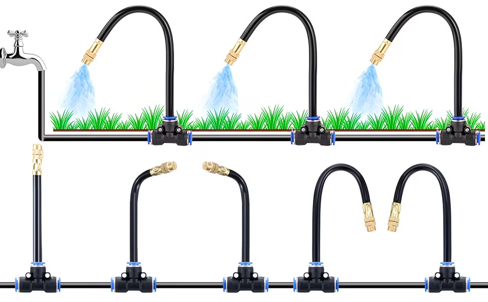
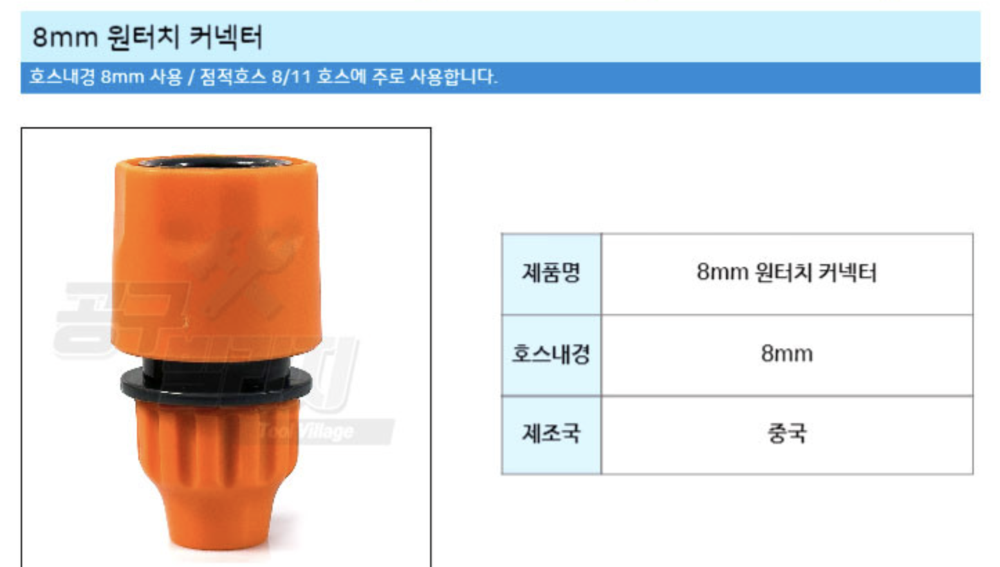
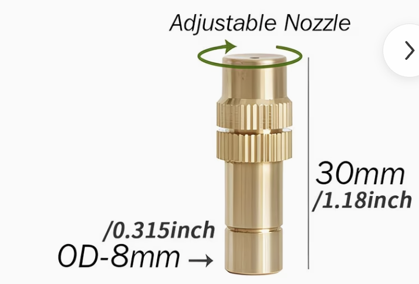

### # 호스
- PE : 연질 약갼딱딱
- PVC : 튜브 처럼 말랑

{width="500px"}

{width="400px"}

{width="400px"}

{width="400px"}

- 8mm 수도커플링
{width="100px"}
{width="100px"}

https://smartstore.naver.com/09box5164/products/9182821848?nl-query=%ED%98%B8%EC%8A%A4%EC%97%B0%EA%B2%B0%EC%BB%A4%EB%84%A5%ED%84%B0+8mm&nl-ts-pid=jPF7Xsqps2wssRtulJN-213062&NaPm=ct%3Dmob62ymo%7Cci%3D85e3d8cebe4873070d1d0043c5538ab07342a7d5%7Ctr%3Dsls%7Csn%3D9063384%7Chk%3Deacd858a26c8a5b4a2f39820fc694bf8a5a75cb4

{width="500px"}

### 용어 검색어
- 자바라 분무노즐
- 미스트 분무노즐 호스
- 미스트 노즐 호스
- 신형 360° 자유 구부림 미스트 20cm 노즐
- 퀵 커넥터 원예 정원 9mm
- pe 9/12mm
- PE 호스용 T자형 엘보우
- 자바라 분무노즐 12mm
- 조절식 황동 미스트 노즐 12mm
- 황동 미스트 노즐 티 어댑터
- 조절식 황동 미스트 노즐 12mm

- 드리퍼 커넥터 - 4/7mm 튜브
- OD 뜻 : 👉 OD = Outer Diameter (외경)
- {width="200px"}