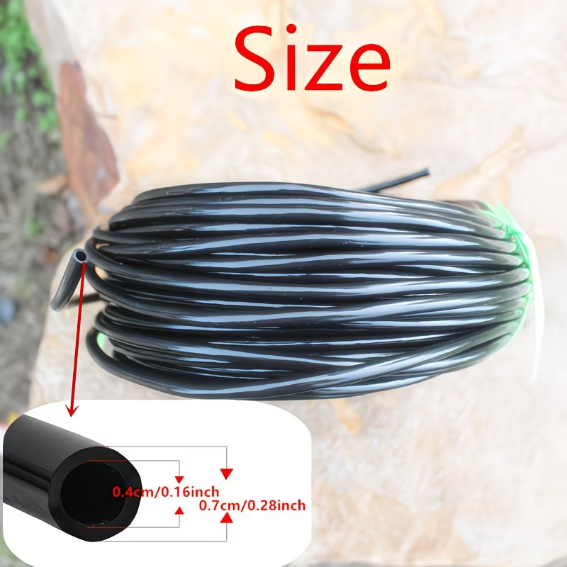
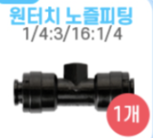
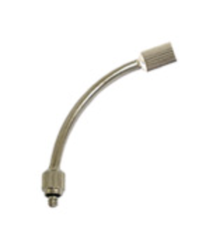
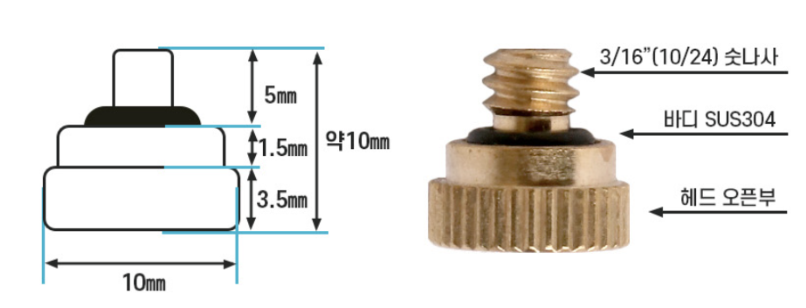
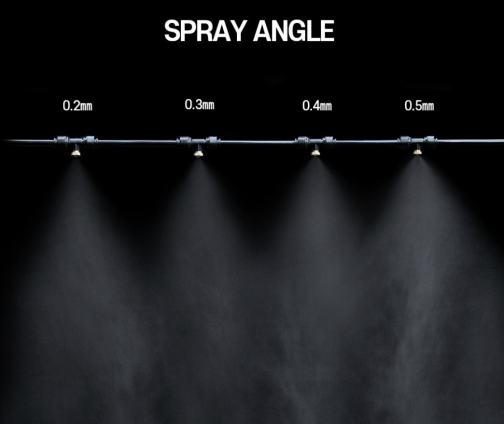
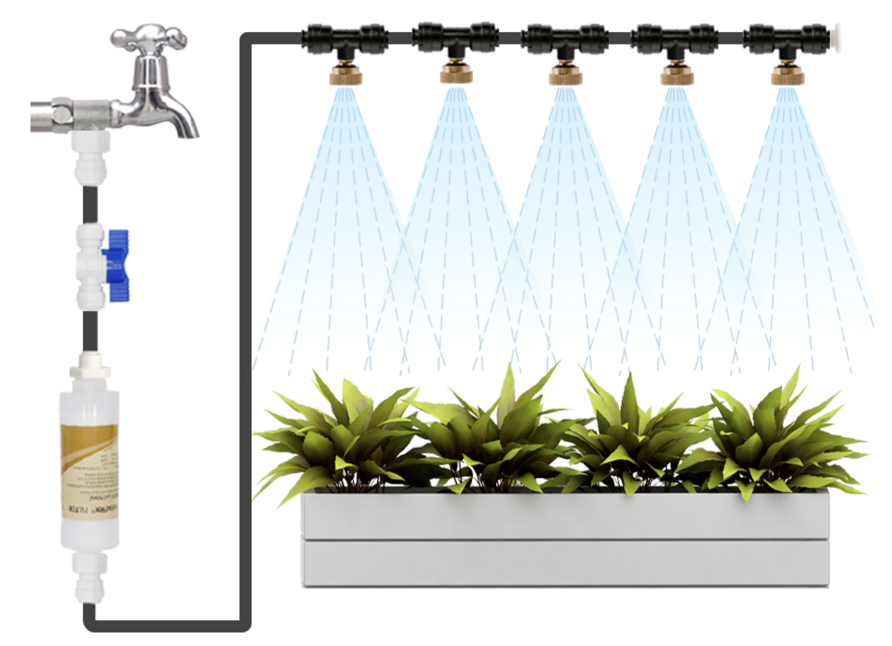
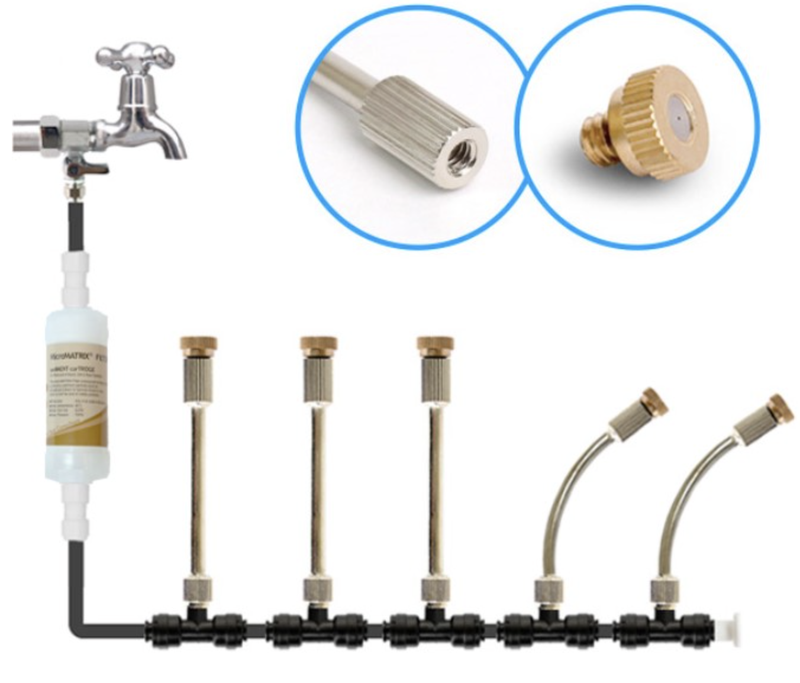

### # 개념
- 1/4인치는 6.35mm인데 왜 4/7 mm 야?
그 이유는 측정 기준의 차이와 미터법 변환 과정에서 생긴 통칭 때문입니다.
외경(OD)의 기준: 1/4인치는 소수점으로 6.35mm가 맞습니다. 하지만 드립 호스 업계에서는 이를 소수점 없이 올림하여 부르거나, 호스 두께를 포함한 최대 외경을 7mm로 통칭하여 부릅니다.
내경(ID)의 기준: 이 호스에 연결하는 커넥터(피팅)의 삽입부 두께가 보통 4mm 내외입니다. 그래서 실제 물이 흐르는 안쪽 지름인 4mm를 함께 표기하는 것입니다.
마케팅적 표기: 해외(특히 중국) 제조사들이 미터법을 사용하는 국가에 수출할 때, '1/4인치 규격과 호환되는 호스'라는 의미로 가장 근접한 정수인 4/7mm라는 명칭을 브랜드처럼 사용하게 되었습니다.
정리하자면, 1/4인치, 6.35mm, 7mm(외경)는 모두 같은 규격의 호스를 지칭하는 표현이라고 이해하시면 됩니다.
현재 가지고 계신 연결 부속품(커넥터)이 4/7mm용인가요? 아니면 1/4인치용인가요? 규격이 같아 서로 호환될 확률이 높습니다.

### # 개념
- 원터치 노즐 피팅의 중앙 홀에 분무노즐 OR 노즐연장 커넥터를 연결하고
  -> 4/7mm 튜브로 원터치 노즐 피팅의 양쪽을 연결
- 4/7mm 튜브 (1/4")
  - {width="200px"}
    - 4/7mm 튜브 관 : 아마도 PVC 관
- 원터치 노즐 피팅
  - {width="100px"}
    - 양쪽 끝 : 1/4" ( 7mm 튜브 연결)
    - 중앙 암나사 홀 : 분무노즐 또는 노즐연장 커넥터 ( 3/16" )

- 노즐연장 커넷터
  - {width="100px"}

- 분무노즐 (0.2~0.5 mm)
  - {width="400px"}
    - 노즐 나사 규격 : 3/16"
- 

### # 구성도

