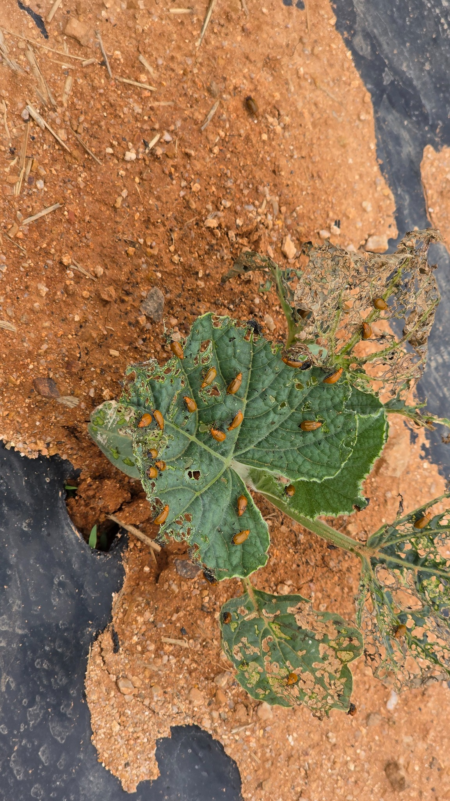
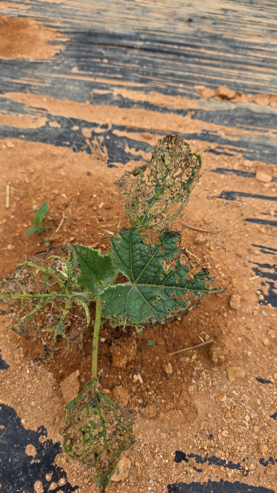
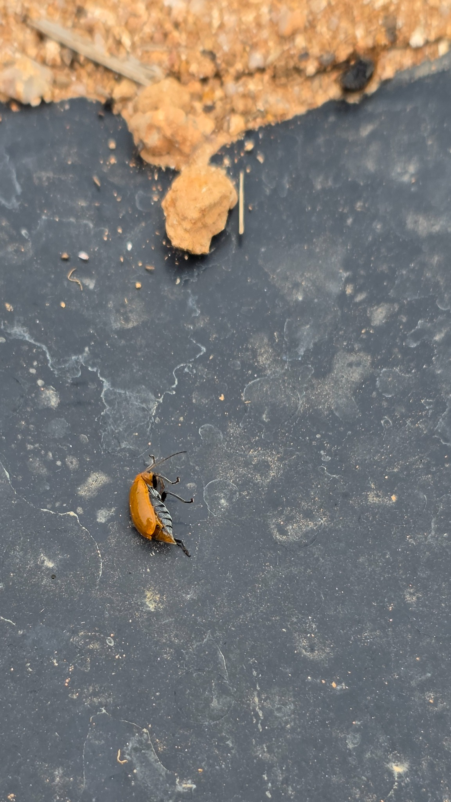
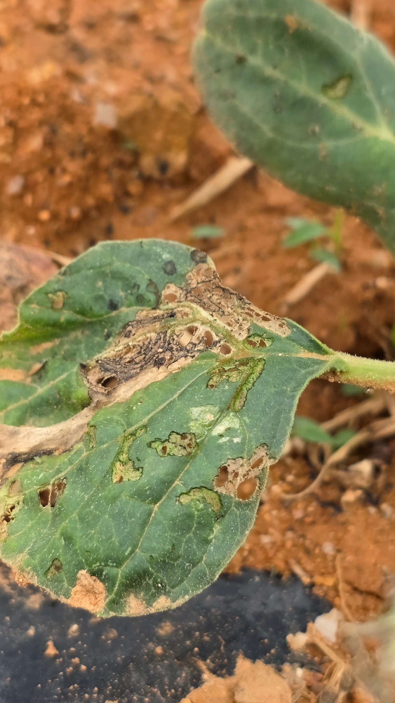
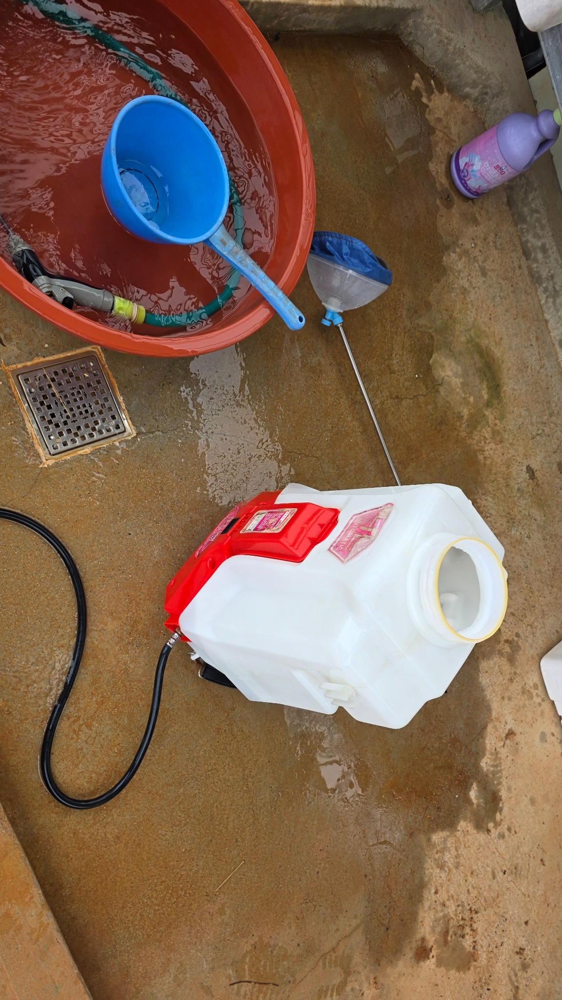
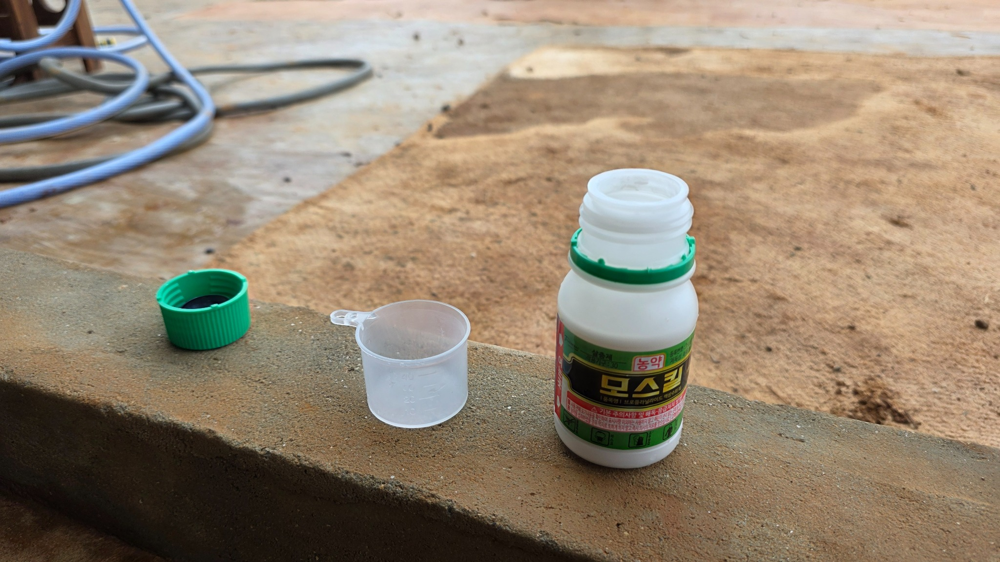
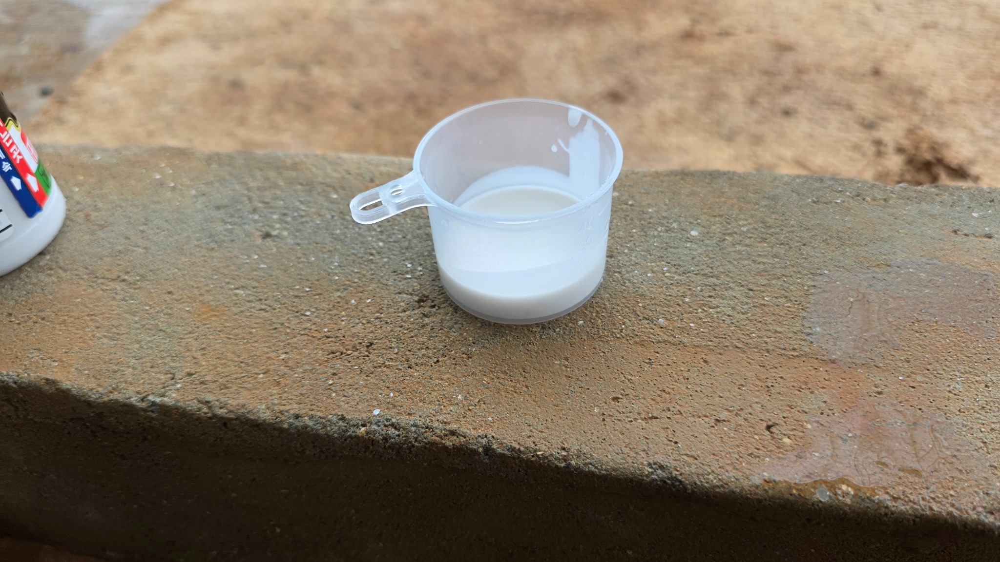
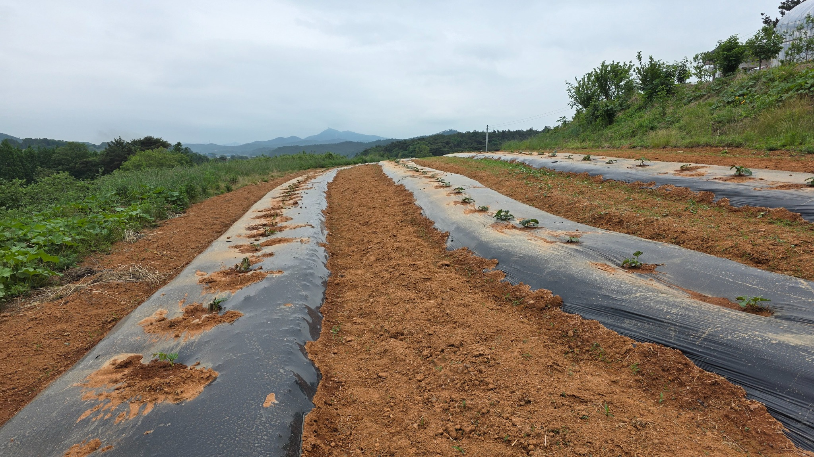

# 모스킬 방제 기록
## 방제 정보
|항목|내용|
|---|---|
|방제일|2026-05-27|
|약제|모스킬(브로플라닐라이드 액상수화제)|
|구매처|대산읍 한국농자재마트|
|구매가격|13,000원|
|살포시각|14:30|
|강우시작|18:00경(약 3시간 30분 후)|
|살포량|20L 분무기 × 2.5회 (약 50L)|
|방제구역|3개 두둑|

## 현장 관찰
- 오이잎벌레류 대량 발생.
- 살포 후 개체가 비틀거리며 비행능력 저하.
- 약효가 나타난 개체 약 100마리 직접 제거.
- 비가 왔지만 약효는 상당 부분 발현된 것으로 판단.

## 사진
<table>
<tr>
<td align="center"> img_01.jpg</td>
<td align="center"> img_02.jpg</td>
<td align="center"> img_03.jpg</td>
</tr>
<tr>
<td align="center"> img_04.jpg</td>
<td align="center"> img_05.jpg</td>
<td align="center"> img_06.jpg</td>
</tr>
<tr>
<td align="center"> img_07.jpg</td>
<td align="center"> img_08.jpg</td>
<td align="center"> img_09.jpg</td>
</tr>
<tr>
<td align="center"> img_10.jpg</td>
</tr>
</table>
