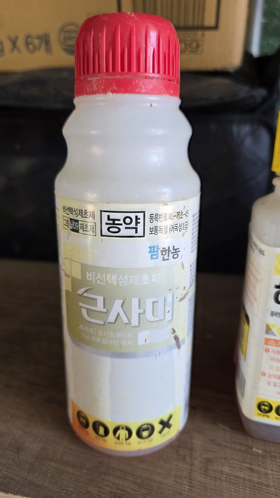
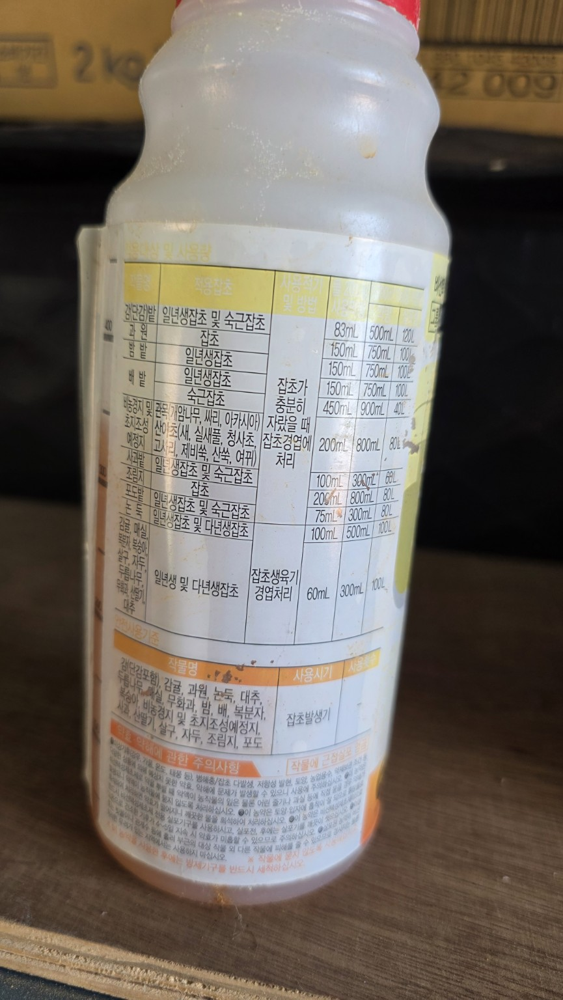
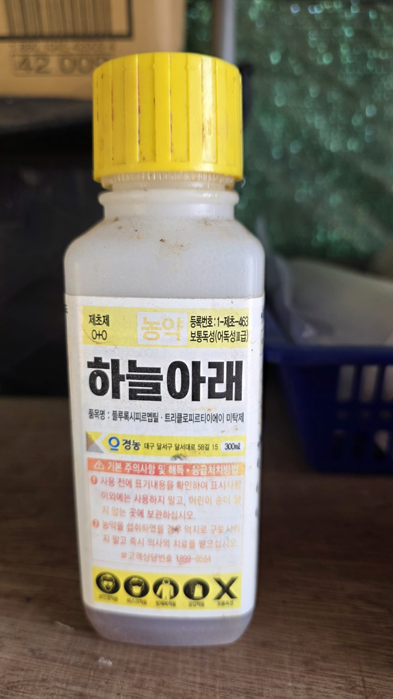
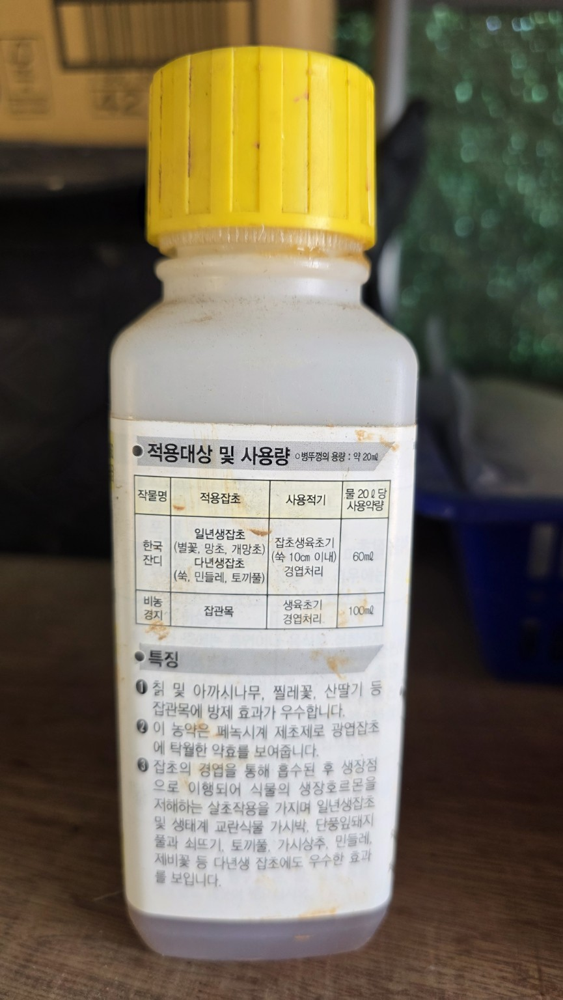
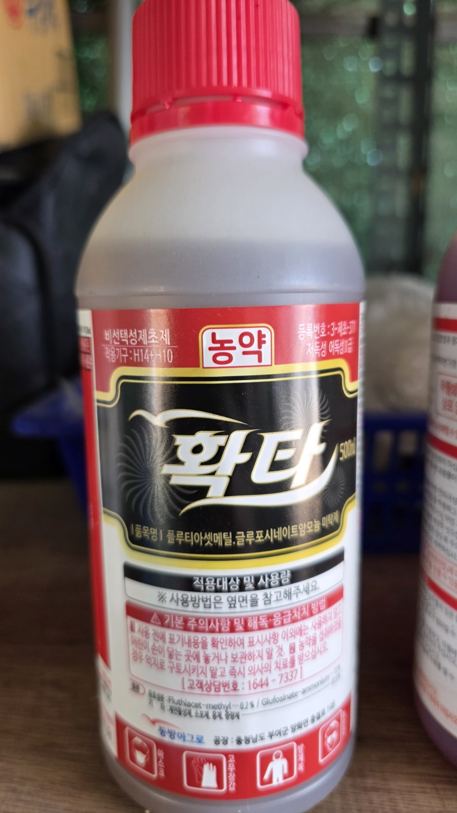
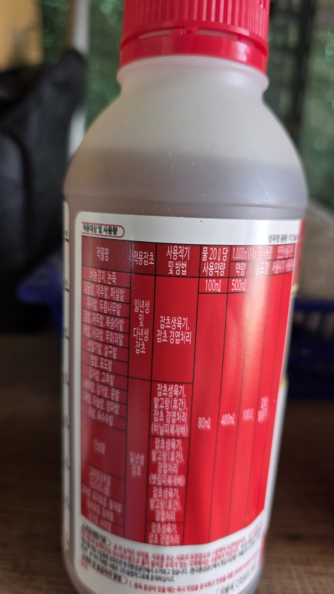
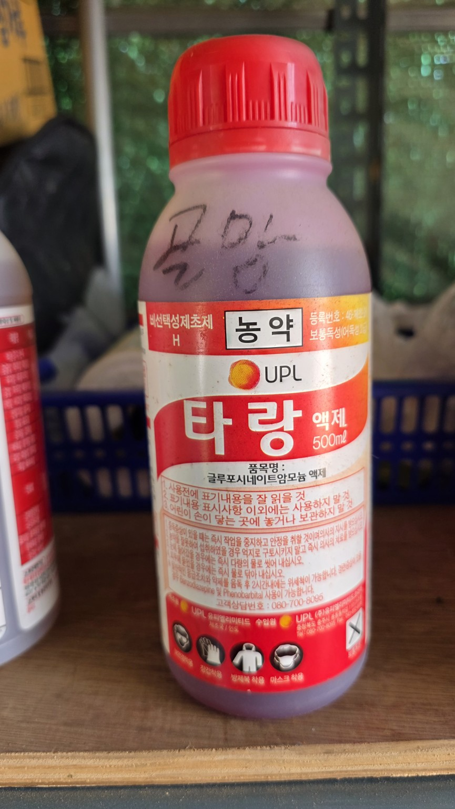
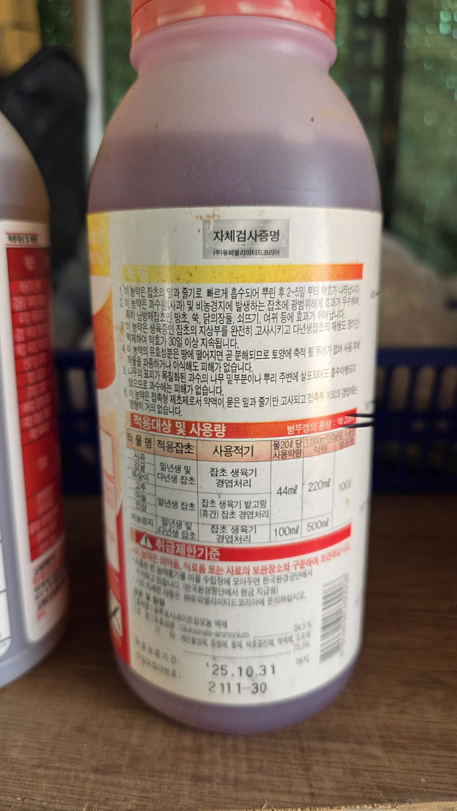

# 보유 농약 정리

> 작은 이미지를 누르면 원본 크기로 열립니다. 같은 농약의 앞면·뒷면 사진을 한 줄에 배치했습니다.

| 제품명 | 분류 | 유효성분 | 특징 | 제품 사진 |
|---|---|---|---|---|
| **큰사미** | 비선택성·이행성 제초제 | 글리포세이트 이소프로필아민염 | 잎과 줄기로 흡수되어 식물체 안에서 이동하며 다년생 잡초의 지하부까지 방제하는 용도 |   |
| **하늘아래** | 선택성·이행성 제초제 | 플루록시피르멥틸·트리클로피르트리에틸아민 | 칡, 찔레, 산딸기 등 광엽잡초와 잡관목 방제용. 광엽 작물에 비산하지 않도록 주의 |   |
| **확타** | 비선택성 제초제 | 플루티아세트메틸·글루포시네이트암모늄 | 잡초 생육기에 경엽 처리하며, 작물의 녹색 부위에 닿으면 약해가 날 수 있음 |   |
| **타랑** | 비선택성 제초제 | 글루포시네이트암모늄 | 잡초 생육기에 경엽 처리. 접촉 작용이 강하므로 작물 잎·어린 줄기에 묻지 않게 사용 |   |

## 용어 정리

| 용어 | 뜻 |
|---|---|
| 비선택성 | 잡초와 작물을 가리지 않고 녹색 식물에 닿으면 피해를 줄 수 있는 제초제 |
| 선택성 | 특정 잡초군을 주로 방제하는 제초제. 등록되지 않은 작물에는 안전을 보장하지 않음 |
| 이행성 | 잎이나 줄기로 흡수된 약제가 식물체 내부에서 다른 부위로 이동하는 성질 |
| 접촉 작용 | 약액이 닿은 부위를 중심으로 빠르게 작용하는 성질 |

## 사용 시 공통 주의사항

- 실제 사용 가능 장소, 대상 잡초, 희석량과 사용 시기는 반드시 제품 라벨의 등록 내용을 우선합니다.
- 비선택성 제초제는 감자, 들깨, 엄나무 등 재배작물의 잎과 어린 줄기에 묻지 않도록 차폐판을 사용하고 바람 없는 날 살포합니다.
- 예초 직후보다 잡초가 다시 잎을 충분히 낸 뒤 경엽 처리해야 약액을 흡수할 면적이 확보됩니다.
- 서로 다른 제초제를 임의로 혼용하지 않습니다.
