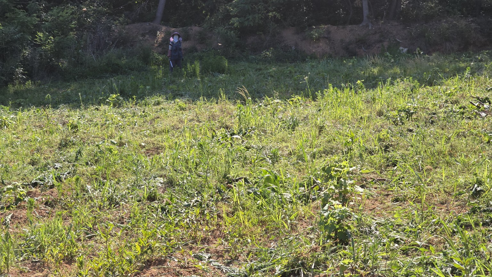
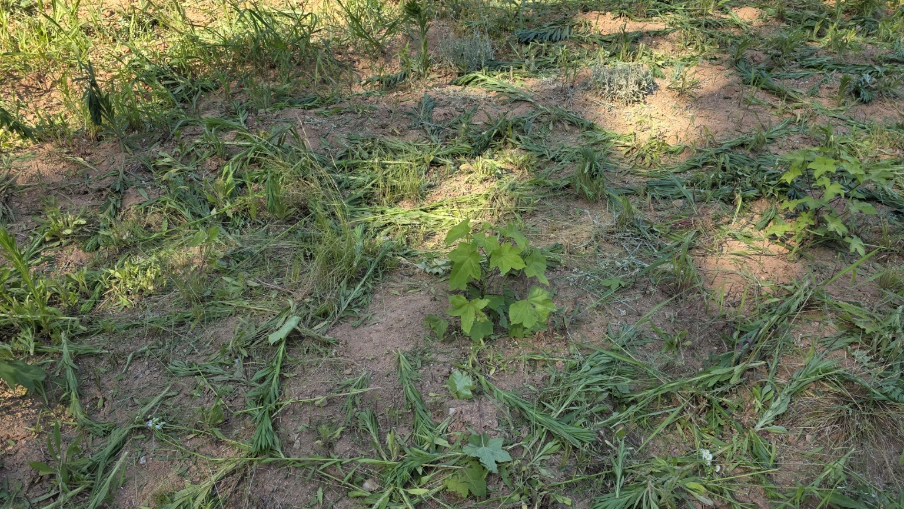
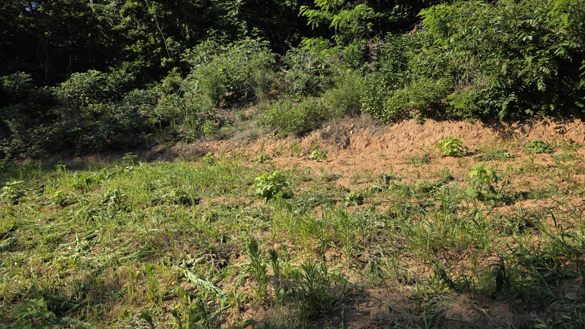
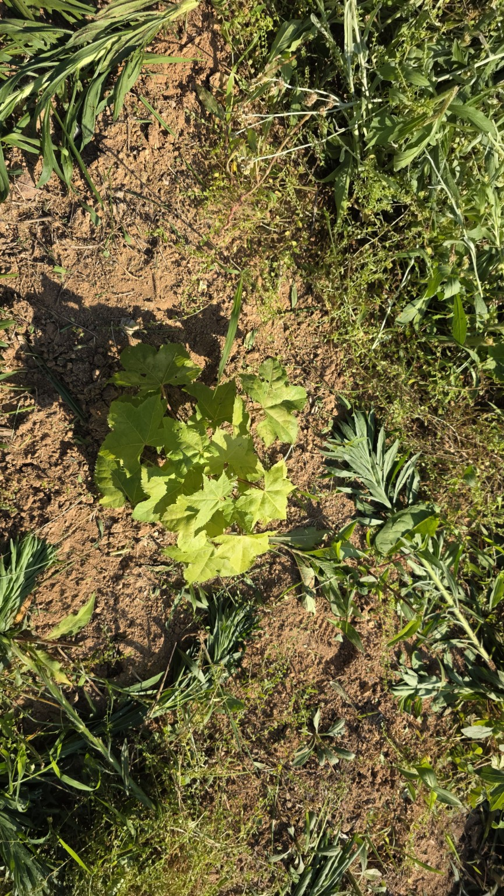
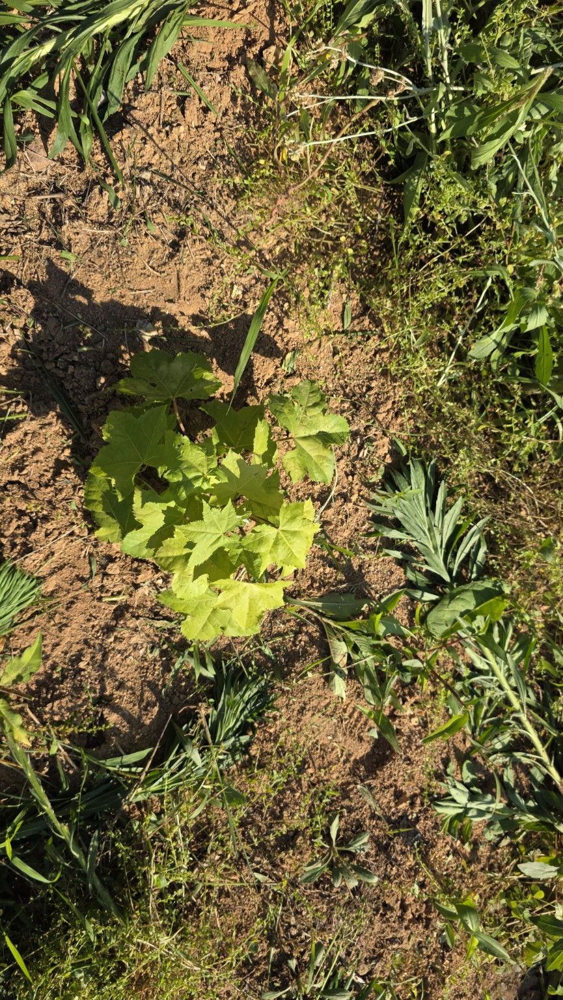
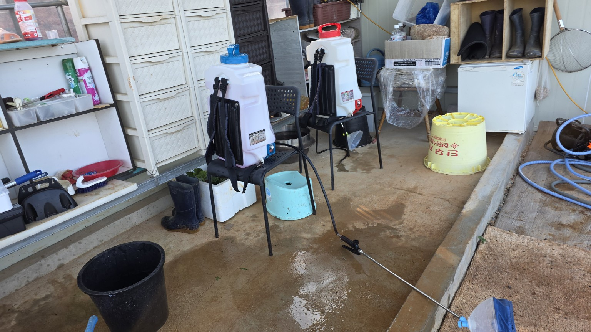
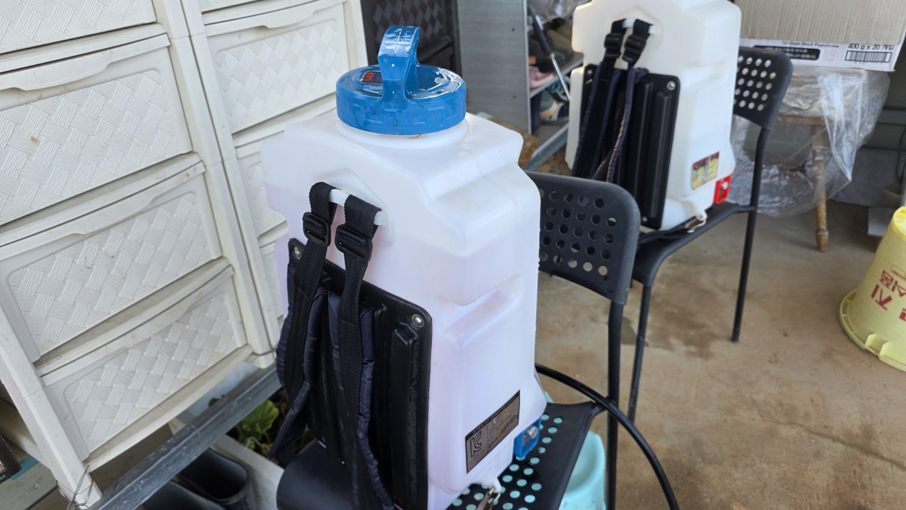
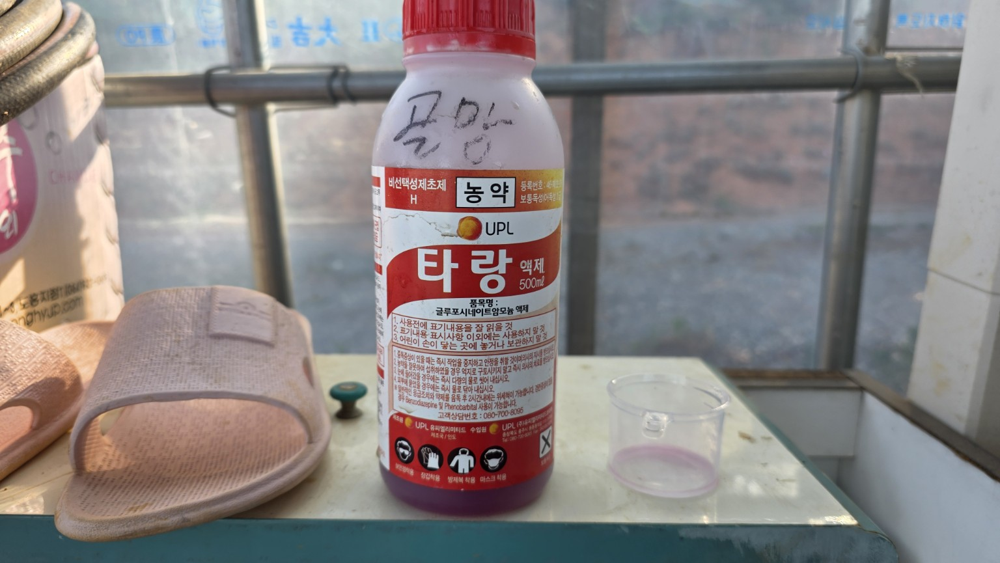
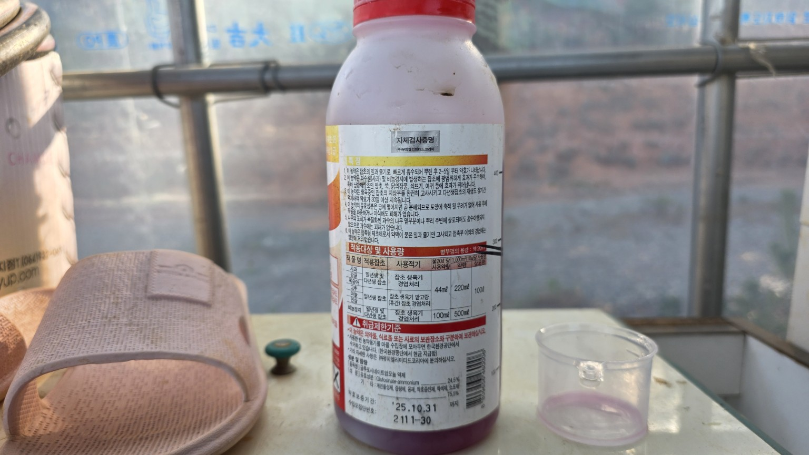

# 20260605 서산 화곡농장 엄나무밭 예초기 작업 및 타랑 제초제 살포

## 작업 정보

|항목|내용|
|---|---|
|작업일|2026-06-05|
|장소|서산 화곡농장 엄나무밭|
|작업|예초기 작업 후 타랑 제초제 살포|
|제초제|타랑 액제 (글루포시네이트암모늄 24.5%)|
|장비|전동 배부식 분무기|

## 작업 내용

- 예초기로 큰 잡초 제거
- 타랑 제초제를 잡초 잎에 충분히 살포
- 어린 나무 주변은 직접 살포를 피하면서 작업
- 향후 7~14일 후 방제효과 확인 예정

## 현장 사진

 |  | 

 |  | 

 |  | 

## 작업 평가

- 예초 후 살포하여 재생 억제 효과 기대
- 비선택성 제초제이므로 작물 접촉 금지
- 필요 시 남은 잡초만 부분 재살포 권장

## 첨부

- 작업 동영상: images/20260605_164352.mp4
