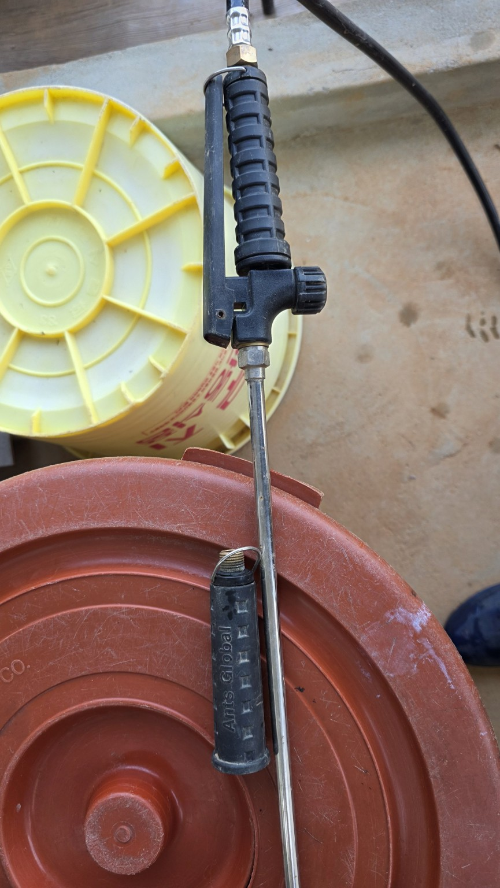
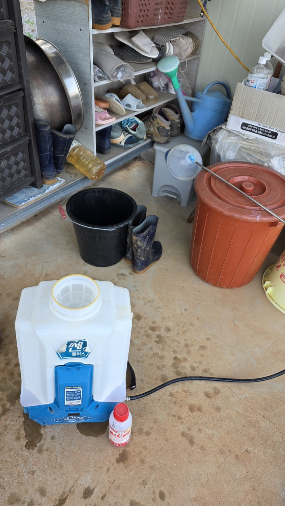

# 20260701 서산 화곡농장 감자밭 가생이 카랑 제초제 살포
## 작업 개요
- **일자**: 2026-07-01
- **장소**: 서산 화곡농장
- **작업**: 감자밭 가장자리 잡초 카랑 제초제 경엽살포
- **장비**: ANTS GLOBAL TS-1100N 20L 전동분무기
- **노즐**: 직사 노즐
- **약제**: 카랑 액제(비선택성·이행성 제초제)
- **희석비율**: 물 20L당 44mL

## 작업 사진
<table>
<tr>
<td align="center"> 20260701_181530.jpg</td>
<td align="center"> 20260701_181531.jpg</td>
<td align="center"> 20260701_182431.jpg</td>
</tr>
<tr>
<td align="center"> 20260701_182436.jpg</td>
<td align="center"> 20260701_182447.jpg</td>
<td align="center"> 20260701_182452.jpg</td>
</tr>
</table>

## 작업 메모
- 감자밭 가장자리 잡초 대상으로 살포.
- 감자 잎 및 줄기에 약제가 묻지 않도록 주의.
- 살포 후 비가 오지 않는 시간 확보가 약효에 유리.
- 약효는 일반적으로 2~5일 후부터 나타남.
