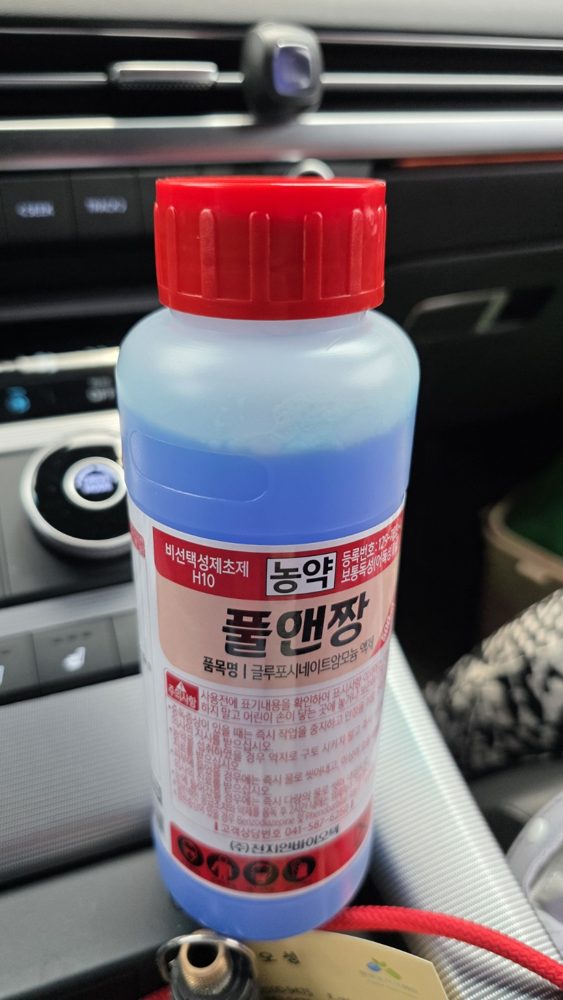
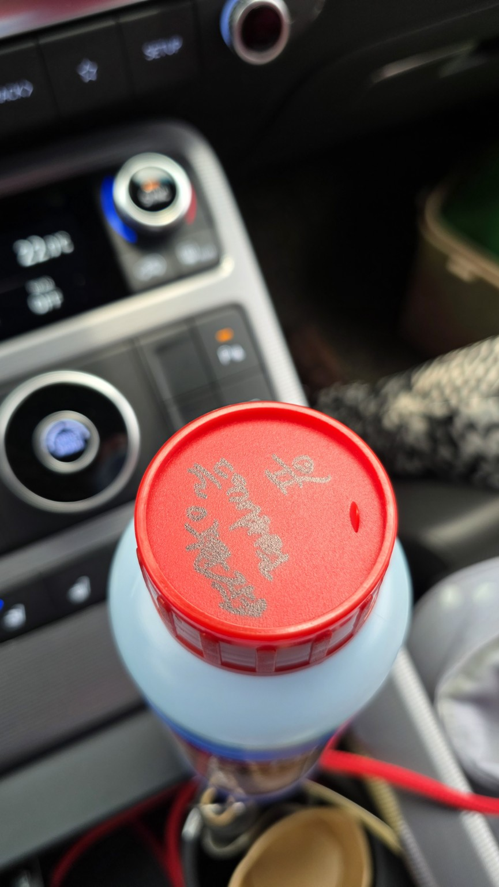
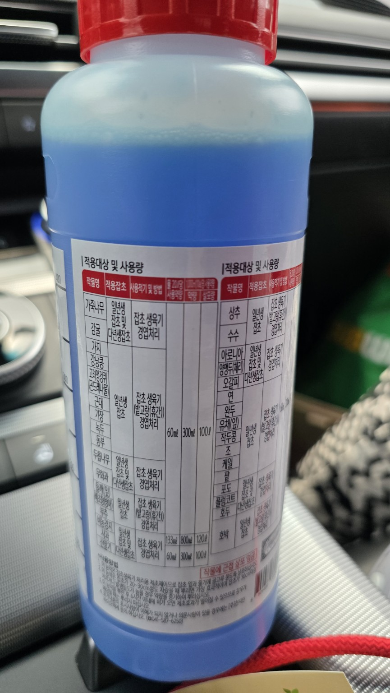
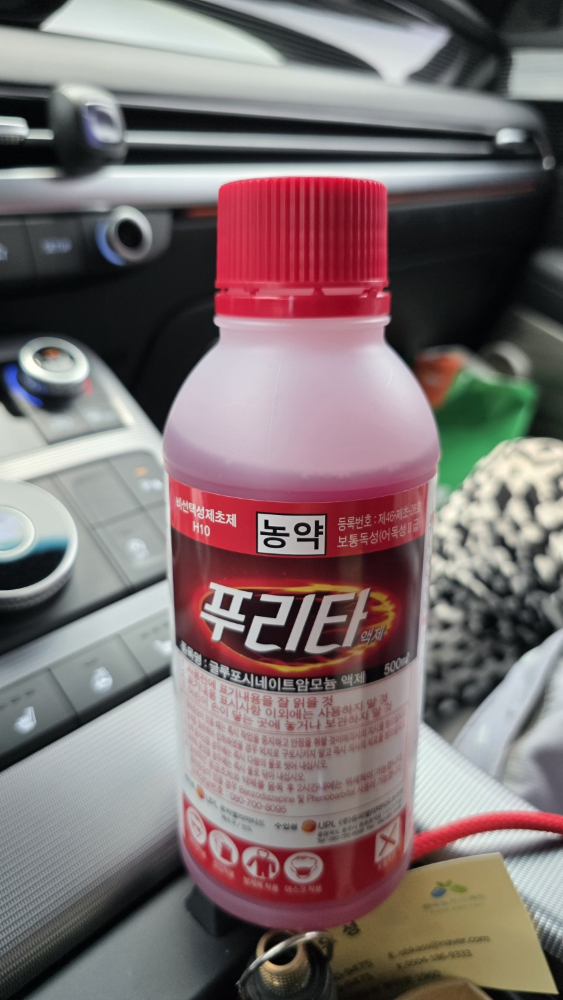
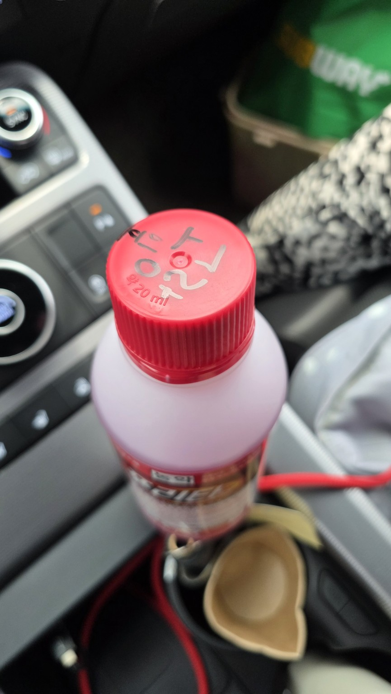
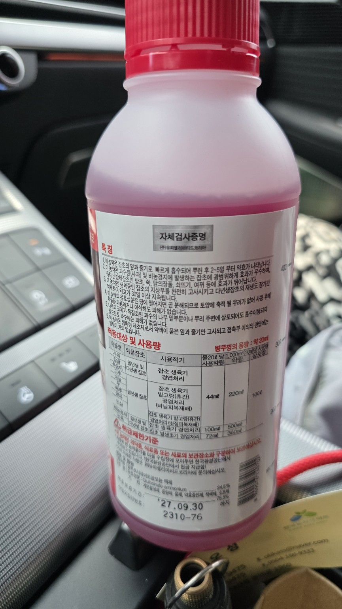
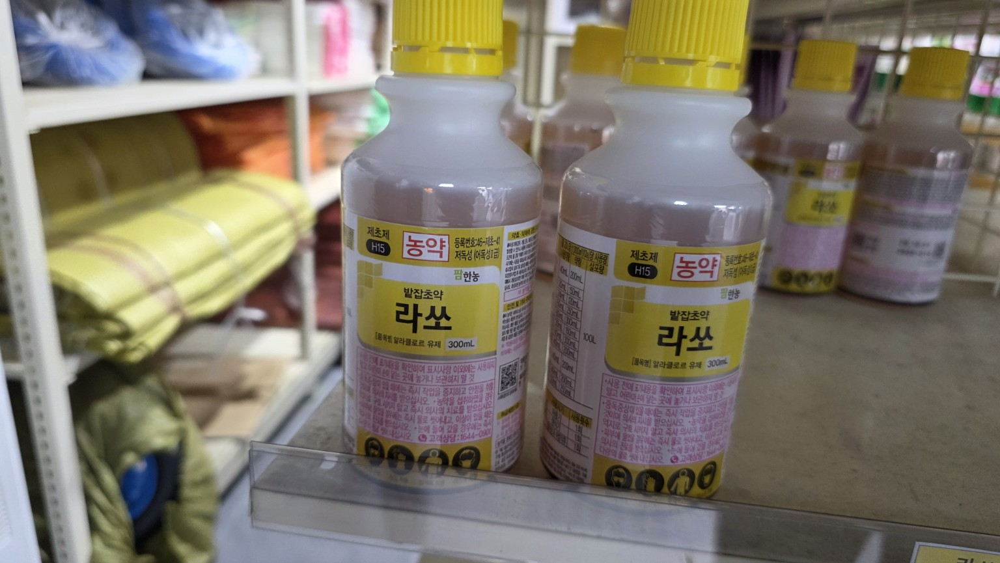
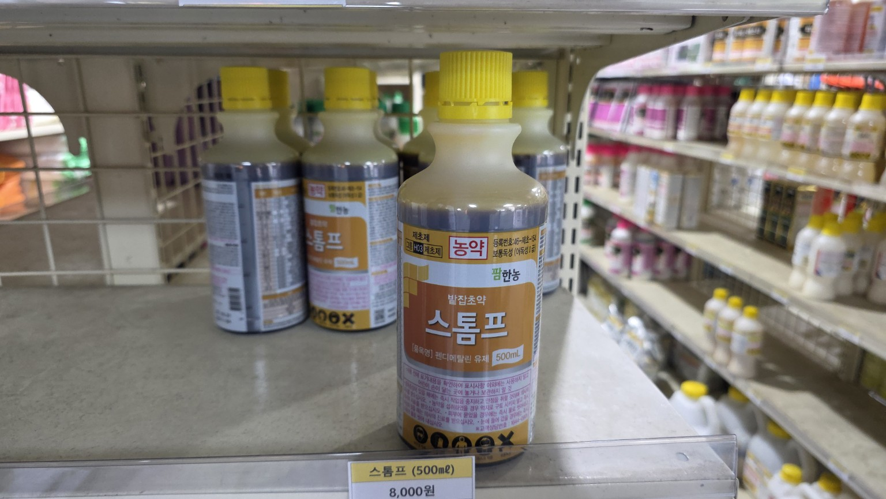
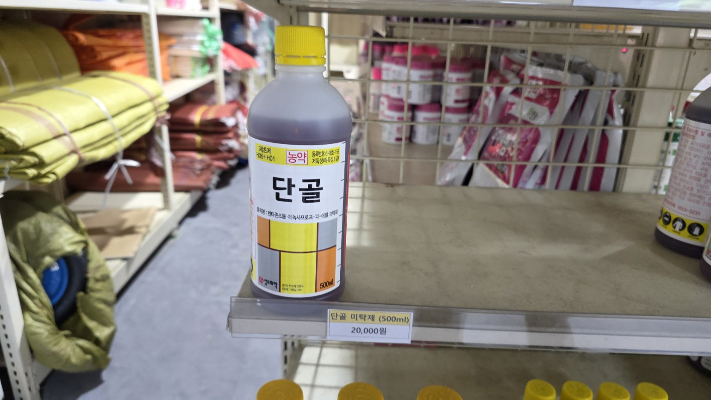

### 제초제 
#### # 풀앤짱 vs 푸리타
- 풀앤짱은 들깨 처럼 약한 작물에 사용
- 둘다 비선택성 제초제 잎에 흡수 : 푸리타가 좀 더 강함
  - 풀앤짱: 물 20L당 약 60mL
  - 푸리타: 물 20L당 약 44mL

| 제품      | 성분               | 용도    | 특징                |
| ------- | ---------------- | ----- | ----------------- |
| **풀앤짱** | 글루포시네이트암모늄       | 잡초 제거 | 일반 비선택성 제초제       |
| **푸리타** | 글루포시네이트암모늄 24.5% | 잡초 제거 | 흡수력과 약효 지속성이 좋은 편 |

#### # 풀앤짱 vs 푸리타
| 제품      | 성분               | 용도    | 특징                |
| ------- | ---------------- | ----- | ----------------- |
| **풀앤짱** | {: width="100px"}       | {: width="100px"} | {: width="100px"} |
| **푸리타** | {: width="100px"} | {: width="100px"} | {: width="100px"} |

---
|라쏘|스톰프|단골|
| ------ | ------ | ------ | 
|{: width="150px"}|{: width="150px"}|{: width="150px"}|

1. **라쏘 (Alachlor)**
* **발아전 토양처리 제초제**입니다.
* 씨를 뿌린 직후~잡초가 나오기 전에 사용합니다.
* 잡초가 이미 자란 후에는 효과가 거의 없습니다.
* 들깨, 콩, 옥수수 등에서 많이 사용하는 제품입니다.

2. **스톰프 (Pendimethalin)**

* 역시 **발아전 토양처리 제초제**입니다.
* 잡초 발생을 예방하는 용도입니다.
* 일년생 화본과·광엽잡초 예방 효과가 좋습니다.
* 들깨 재배에서도 등록되어 있는 제품이 있습니다.

3. **단골**

* 병에 적힌 성분을 보면 **벤타존 + 비스피리박소듐 + MCPA** 혼합제입니다.
* **이미 나온 잡초를 선택적으로 제거하는 밭작물용 제초제**입니다.
* 비선택성인 글루포시네이트(풀앤짱)와는 달리 등록된 작물에서는 작물 피해를 줄이면서 잡초를 제거하는 제품입니다.

### 지훈님 들깨밭이라면

현재 상황에 맞춰 선택하면 다음과 같습니다.

* **파종 직후, 아직 잡초가 안 나왔으면** → **라쏘 또는 스톰프**
* **잡초가 이미 많이 자랐으면** → **풀앤짱(고랑만) 또는 단골(등록 작물·잡초에 맞게)**

### 추천

들깨 재배에서는 **스톰프가 가장 많이 사용하는 발아전 제초제**이고, **풀앤짱은 고랑 제초용**으로 많이 사용합니다.

혹시 **들깨를 이미 파종했는지**, 아니면 **아직 로터리만 끝난 상태인지** 알려주시면 지금 단계에서 가장 적합한 제초제를 골라드리겠습니다.
