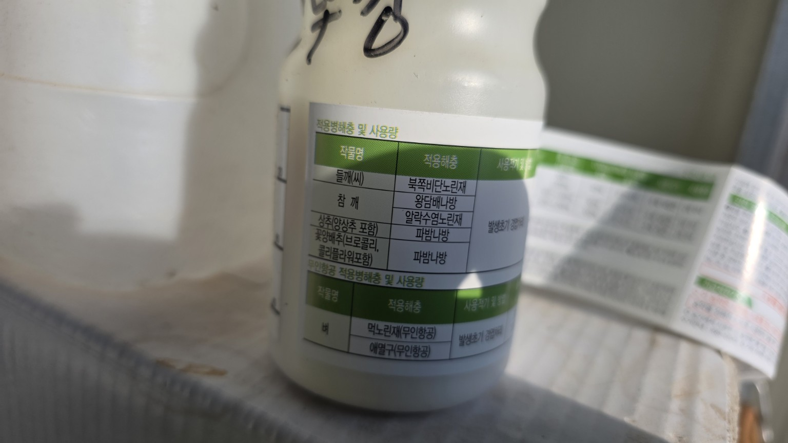
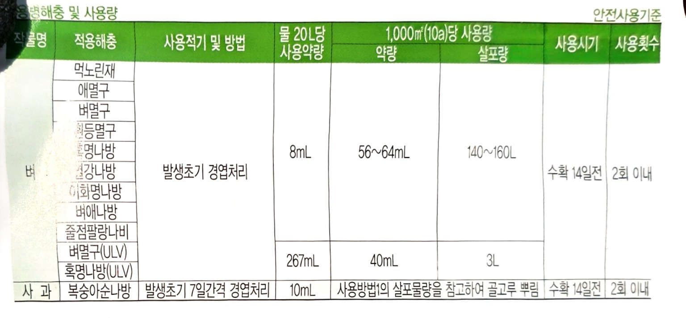
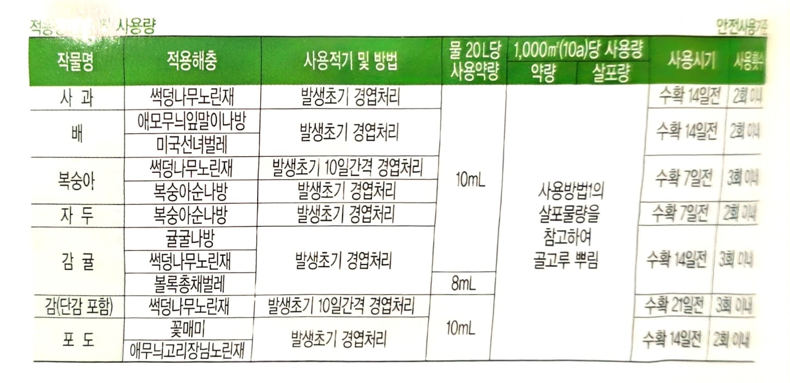
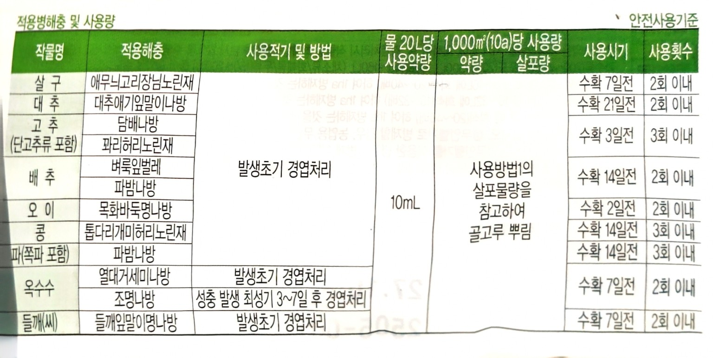
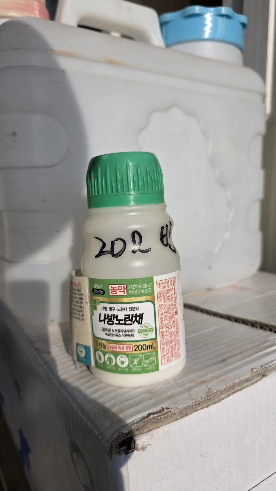

# 2026년 8월 13일 화곡농장 농약 살포 기록

## 작업 개요

| 구분 | 내용 |
|---|---|
| 작업 일시 | 2026년 8월 13일 오전 7시 |
| 작업 장소 | 화곡농장 농막 아랫밭 |
| 재배 작물 | 들깨 |
| 사용 약제 | 나방노린채 액상수화제 |
| 희석 기준 | 물 20L당 약제 10mL |
| 살포량 | 20L × 2통 = 총 40L |
| 사용 약제량 | 총 20mL |

## 작업 내용

- 농막 아래쪽 들깨밭에 살충제를 살포했다.
- 오전 7시에 살포하여 한낮의 고온 시간을 피했다.
- 20L 분무기 2통을 사용했으며 총 살포액은 약 40L이다.
- 약제 사용량은 물 20L당 10mL로, 2통에 총 20mL이다.

## 첨부 사진

아래 사진은 작은 크기로 표시되며, 사진을 누르면 원본을 볼 수 있다.

### 약제 및 살포 준비

<table><tr>
<td width="33%" align="center"> 약제 및 살포 준비 1</td>
<td width="33%" align="center"> 약제 및 살포 준비 2</td>
<td width="33%"></td>
</tr></table>

### 농막 아랫밭 및 살포 현황

<table><tr>
<td width="33%" align="center"> 농막 아랫밭 1</td>
<td width="33%" align="center"> 농막 아랫밭 2</td>
<td width="33%" align="center"> 농막 아랫밭 3</td>
</tr></table>

## 관리 메모

- 다음 살포 전에는 약제 라벨의 대상 해충, 작물별 희석배수, 사용 시기 및 수확 전 안전사용기준을 다시 확인한다.
- 살포 후 강우 여부, 방제 효과, 약해 유무를 함께 기록하면 다음 방제 판단에 도움이 된다.
