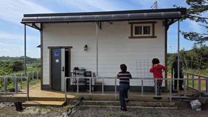
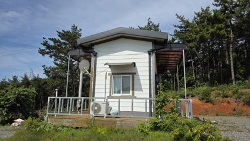
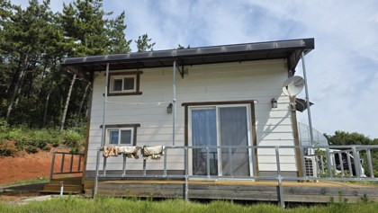
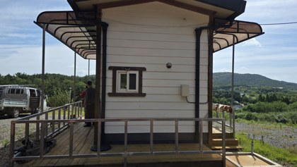
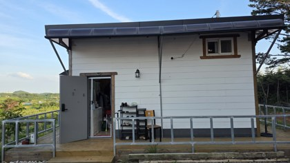
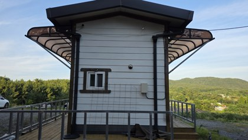
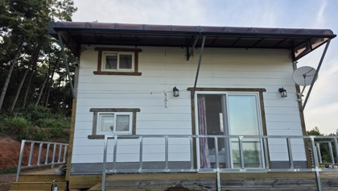
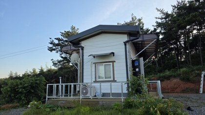

# 20260711 화곡농장 농막 차양막 거치대 대각선 보강 시정조치

## 작업 개요

- **작업일:** 2026-07-11
- **장소:** 화곡농장 농막
- **작업 구분:** 가설건축물 존치기간 만료예고문 관련 시정조치
- **작업 내용:** 차양막 기둥을 지면에 직접 거치한 구조에서, 농막 벽체·골조에 대각선 방향으로 고정하는 구조로 변경

## 수리 및 시정조치 목적

농막에 설치된 기존 차양막의 수직 기둥이 지면까지 내려와 독립적으로 거치되어 있으면, 해당 차양 공간이 농막 면적에 포함되어 산정될 수 있다는 지적을 받았다.

이 경우 농막 설치기준인 **6평을 초과한 것으로 판단될 수 있어**, 다음 중 하나의 조치가 요구되었다.

1. 기존 차양막 구조 철거
2. 지면에 내려온 수직 기둥을 없애고, 차양막 거치대를 농막 본체에 대각선 방향으로 고정하도록 구조 변경

이에 따라 기존 지면 거치형 수직 기둥 구조를 수정하고, 차양막 거치대를 농막 구조체에 대각선 보강대로 연결·고정하는 방식으로 재시공하였다.

## 조치 전 상태

- 차양막 양측 지지기둥이 지면 및 데크까지 내려와 있었다.
- 차양 구조가 농막 본체와 별도의 독립된 공간처럼 보일 수 있었다.
- 행정상 면적 산정 시 차양 부분이 농막 면적에 포함될 가능성이 있었다.

| 사진 1 | 사진 2 | 사진 3 |
|---|---|---|
|  |  |  |
|  |  |  |

## 시정 작업 내용

- 지면까지 내려온 기존 수직 지지기둥 일부 철거 또는 구조 변경
- 차양막 외곽 프레임과 농막 본체를 대각선 보강대로 연결
- 대각선 보강재를 통해 차양 하중을 농막 골조로 전달하도록 수정
- 차양 아래 공간이 독립된 기둥 구조로 보이지 않도록 개선
- 기존 차양막 기능은 유지하면서 행정상 지적사항을 반영

## 조치 후 상태

- 차양막 지지구조가 지면 독립 거치형에서 농막 본체 부착형으로 변경되었다.
- 대각선 보강대를 설치하여 구조적 흔들림과 처짐을 줄였다.
- 농막 외부 차양 공간이 별도의 건축면적으로 오인될 가능성을 낮추는 방향으로 시정하였다.

| 사진 1 | 사진 2 | 사진 3 |
|---|---|---|
|  |  |  |
|  |  |  |

## 작업 결과

- **가설건축물 존치기간 만료예고문 관련 지적사항에 대한 시정조치 완료**
- 기존 차양막의 지면 거치형 수직기둥 구조 개선
- 차양막을 농막 본체에 대각선 방향으로 부착
- 차양 기능 유지
- 구조 안정성 및 행정상 적합성 개선

## 참고

본 문서는 2026-07-11 현장 작업 전·후 사진과 작업 목적을 기록하기 위한 자료이다. 최종 적합 여부는 관할 행정기관의 현장 확인 및 판단에 따른다.
