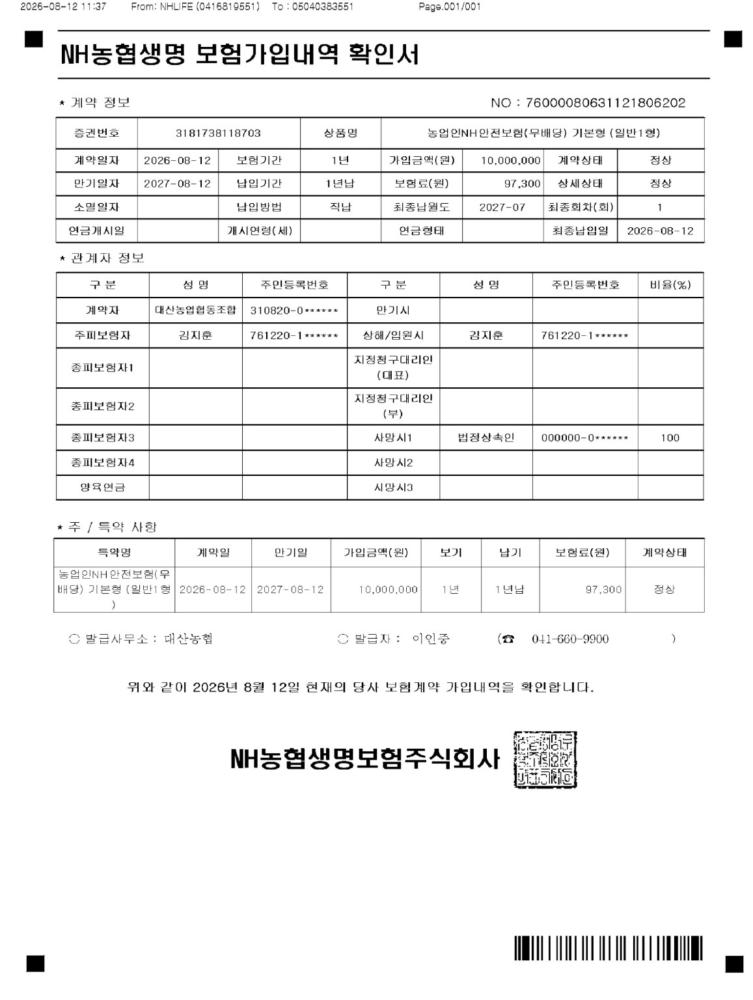
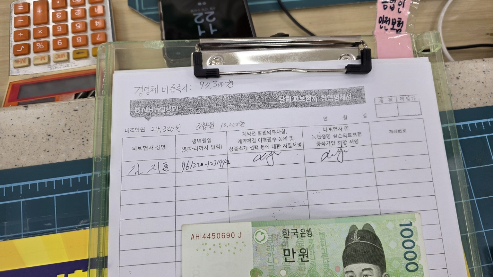
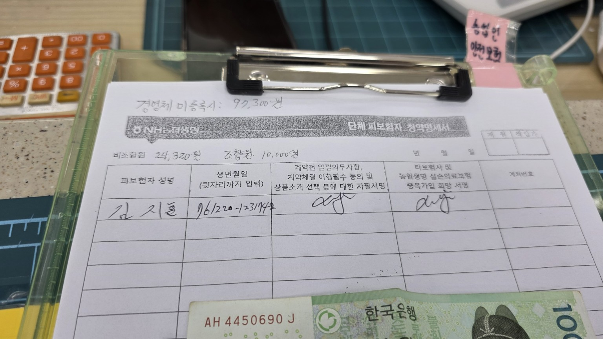
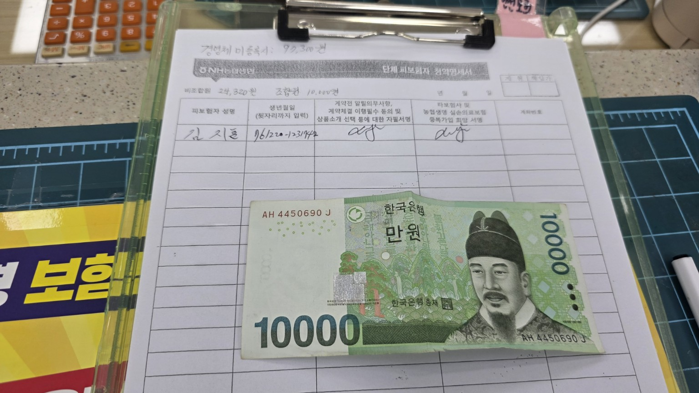

# 2026-08-12 농업인NH안전보험 가입 기록

## 1. 기록 개요

2026년 8월 12일 대산농협을 통해 **농업인NH안전보험(무배당) 기본형(일반1형)**에 가입한 기록이다.  
보험가입내역 확인서와 단체피보험자 청약명세서 사진을 함께 보관한다.

## 2. 보험 가입 내용

| 항목 | 내용 |
|---|---|
| 보험회사 | NH농협생명보험 |
| 상품명 | 농업인NH안전보험(무배당) 기본형(일반1형) |
| 계약자 | 대산농업협동조합 |
| 주피보험자 | 김지훈 |
| 상해·입원 시 피보험자 | 김지훈 |
| 계약일 | 2026-08-12 |
| 보험기간 | 1년 |
| 만기일 | 2027-08-12 |
| 가입금액 | 10,000,000원 |
| 총 보험료 | 97,300원 |
| 납입기간 | 1년납 |
| 납입방법 | 직납 |
| 최종납입월 | 2027-07 |
| 계약상태 | 정상 |
| 사망보험금 수익자 | 법정상속인 100% |
| 발급사무소 | 대산농협 |
| 확인서 발급일 | 2026-08-12 |

> **주의:** 가입금액 1,000만원은 모든 사고에 일률적으로 1,000만원이 지급된다는 뜻이 아니다. 실제 보험금은 사고 종류, 보장항목, 장해 정도 및 약관의 지급기준에 따라 달라질 수 있다.

## 3. 사진에 적힌 보험료 부담 안내

단체피보험자 청약명세서 상단의 수기 메모에는 다음과 같이 기재되어 있다.

| 구분 | 기재 금액 |
|---|---:|
| 경영체 미등록 시 | 97,300원 |
| 비조합원 | 24,320원 |
| 조합원 | 10,000원 |

사진에는 **조합원 10,000원**이라는 메모와 함께 만원권이 촬영되어 있다.  
따라서 이번 기록에서는 **조합원 본인 부담금 10,000원 납부 기록**으로 정리한다.

### 금액 비교

- 총 보험료: **97,300원**
- 조합원 부담금: **10,000원**
- 총 보험료 대비 실제 부담률: 약 **10.3%**
- 총 보험료와 조합원 부담금 차액: **87,300원**

※ 비조합원 24,320원 및 조합원 10,000원은 사진 속 수기 안내를 기준으로 정리한 값이다. 지원 주체별 정확한 분담액은 농협 또는 해당 연도 지원기준 확인이 필요하다.

## 4. 가입 관계

이번 가입확인서상 계약자는 **대산농업협동조합**, 주피보험자는 **김지훈**으로 표시되어 있다.  
즉 농협이 계약자이고 김지훈이 보험의 보장을 받는 피보험자로 등록된 형태이다.

## 5. 보관 시 참고사항

- 농작업 중 사고가 발생하면 사고 일시·장소·작업내용을 가능한 한 구체적으로 기록한다.
- 진료 시 농작업 중 발생한 사고라면 그 사실을 의료진에게 정확히 설명하고 진료기록에 남겨 두는 것이 좋다.
- 보험금 청구가 필요한 경우 가입확인서, 진료기록, 영수증 및 사고 관련 자료를 함께 확인한다.
- 세부 보장금액과 지급조건은 가입 당시 약관 또는 NH농협생명 확인이 필요하다.

## 6. 첨부 이미지

### 1. NH농협생명 보험가입내역 확인서

### 2. 단체피보험자 청약명세서 및 납부기록 사진 1

### 3. 단체피보험자 청약명세서 및 납부기록 사진 2

### 4. 단체피보험자 청약명세서 및 납부기록 사진 3

## 7. 기록 요약

**2026-08-12 / 대산농협 / 농업인NH안전보험(무배당) 기본형(일반1형) / 총 보험료 97,300원 / 사진상 조합원 부담금 10,000원 / 보험기간 2026-08-12~2027-08-12**
