# 2026-07-01~02 화곡농장 냉동고 수리 기록 v2

> 일등공조 방문 · 4마력 냉동용 컴프레서(압축기) 교체 · 사진 33장 + 영상 1개

## 작업 개요

| 항목 | 기록 |
|---|---|
| 작업일 | 2026-07-01 ~ 2026-07-02 |
| 장소 | 화곡농장 냉동고 |
| 방문 업체 | 일등공조 |
| 주요 수리 | 4마력 냉동용 컴프레서(압축기) 교체 |
| 사용 냉매 | R-22 |
| 실내기 | 동화윈 DUS-040E / R-22 / 팬 Ø400×1 / 모터 0.1kW×6P / 2015년 |
| 실외기 | 동화윈 DCM-050 / 공랭식 응축기 / 팬 Ø500×1 / 모터 0.2kW×6P / 2024년 |
| 실외기 명판 압력 | T.P. 2.75MPa / D.P. 2.5MPa |
| 제어기 | FOX-S1004 + Legrand 24시간 기계식 타이머 |
| 비용 | 미기재 |

## 작업 시간대별 기록

| 시간 | 내용 |
|---|---|
| 2026-07-01 11:52경 | 실내기·배관·배수·적재 상태와 제어반 점검. 표시온도 약 -3.4~-3.9℃. |
| 2026-07-01 21:01경 | 실외기 하부를 개방하고 서비스 게이지를 연결해 야간 점검. |
| 2026-07-02 09:57~10:21 | 4마력 컴프레서 교체, 배관·배선 재조립, R-22 서비스 작업. 탈거된 기존 컴프레서가 사진과 영상에 확인됨. |
| 2026-07-02 15:21경 | 제어 표시 모듈과 기계식 24시간 타이머 점검. |
| 2026-07-02 16:12경 | 하부 커버 복구, DCM-050 명판·안내문·고저압 게이지 촬영. |
| 2026-07-02 18:38경 | 당일 시운전 중 FOX-S1004 표시온도 -13.3℃ 확인. |
| 2026-07-06~07 후속 확인 | 설정 -18℃ / dIF 3℃ 조건에서 -18℃ 도달, 자동 제상 및 반복 운전 확인. |

## 핵심 확인사항

- 추가 사진으로 기존 컴프레서가 실제로 탈거되고 신규 컴프레서가 장착된 교체 전·후 상태가 명확해졌습니다.
- 실외기 명판에서 모델 DCM-050, 2024년, 팬 Ø500×1, 모터 0.2kW×6P, 적용 냉매 R22·R404A·R507A가 확인됩니다. 현장 운전 냉매는 R-22입니다.
- 2026-07-02 당일 18:38경에는 -13.3℃가 확인되며, 며칠 뒤 누적 운전기록에서는 -18℃ 도달과 자동 제상이 확인됩니다.
- 사진 20260702_161226은 인접한 별도 GS Inc 응축기이므로, 이번 4마력 냉동고 대상 장비와 분리해 기록했습니다.

## 관리 메모

- 내부 적재량이 많으므로 유니트쿨러 흡입·토출 공기길을 막지 않도록 공간을 확보합니다.
- 벽체 관통부, 배수 호스 실링, 결로 흔적, 문 패킹 기밀을 정기 점검합니다.
- 컴프레서 교체 직후에는 냉매 누설, 단자 과열, 비정상 진동·소음, 오일 자국 여부를 확인합니다.
- 게이지 사진만으로 운전상태·외기온도·냉매 포화온도를 반영한 정밀 진단은 어렵습니다. 최종 충전량과 진공도는 작업기사 계측기록이 필요합니다.
- 실외기는 임시 플라스틱 팔레트 위에 놓여 있으므로 장기적으로 수평·강도·진동 전달·배수 상태를 확인하는 것이 좋습니다.

## 작업 영상

- [웹 호환 영상(H.264, 6.9초)](video/20260702_102155_h264.mp4)
- [원본 영상(HEVC, 6.9초)](video/20260702_102155(1).mp4)

## 사진 기록

### 1. 수리 전 실내기·배관 점검

<table>
<tr>
<td width="33%" valign="top" align="center"><a href="images/originals/20260701_115203(1).jpg">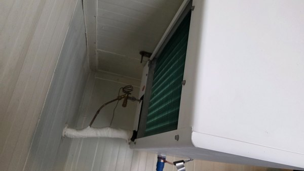</a> 20260701_115203(1).jpg 유니트쿨러 측면, 팽창밸브 및 냉매 배관</td>
<td width="33%" valign="top" align="center"><a href="images/originals/20260701_115206(1).jpg">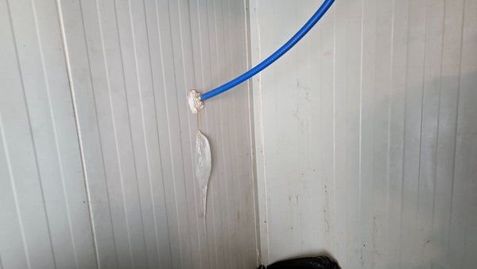</a> 20260701_115206(1).jpg 배수 호스와 벽체 관통부</td>
<td width="33%" valign="top" align="center"><a href="images/originals/20260701_115210(1).jpg">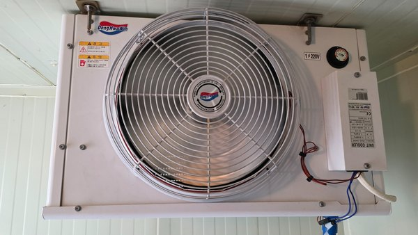</a> 20260701_115210(1).jpg 동화윈 유니트쿨러 전면 및 팬</td>
</tr>
<tr>
<td width="33%" valign="top" align="center"><a href="images/originals/20260701_115213(1).jpg">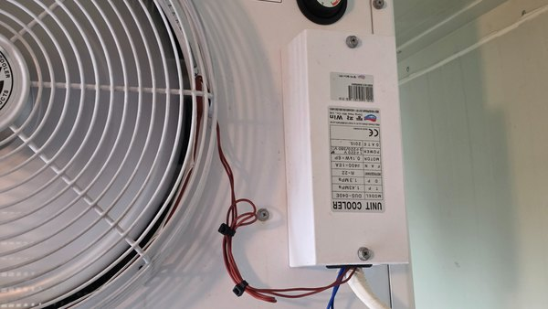</a> 20260701_115213(1).jpg 유니트쿨러 명판: DUS-040E / R-22</td>
<td width="33%" valign="top" align="center"><a href="images/originals/20260701_115217(1).jpg">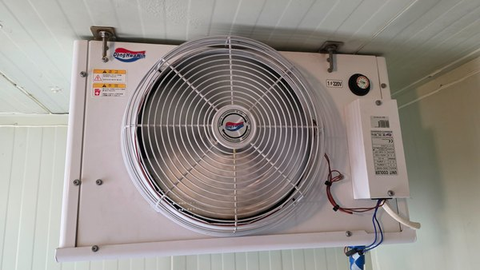</a> 20260701_115217(1).jpg 유니트쿨러 전면 전체</td>
<td width="33%" valign="top" align="center"><a href="images/originals/20260701_115220(1).jpg">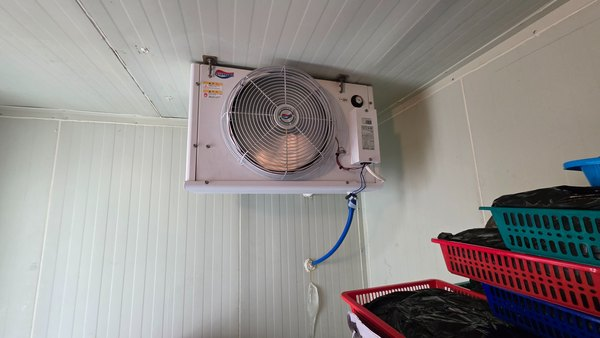</a> 20260701_115220(1).jpg 실내기 설치 위치와 배수 호스</td>
</tr>
</table>

### 2. 냉동고 내부·적재 상태

<table>
<tr>
<td width="33%" valign="top" align="center"><a href="images/originals/20260701_115228(1).jpg">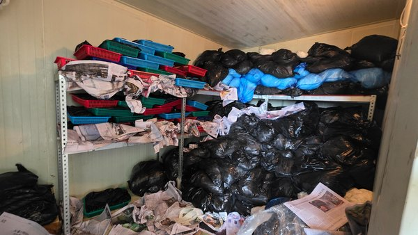</a> 20260701_115228(1).jpg 내부 선반 및 적재 상태</td>
<td width="33%" valign="top" align="center"><a href="images/originals/20260701_115231(1).jpg">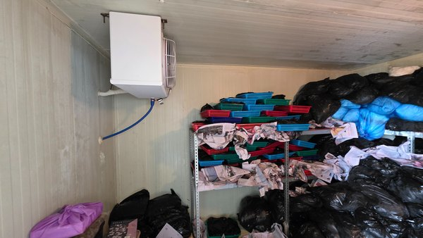</a> 20260701_115231(1).jpg 실내기와 적재물 배치</td>
<td width="33%" valign="top" align="center"><a href="images/originals/20260701_115237(1).jpg">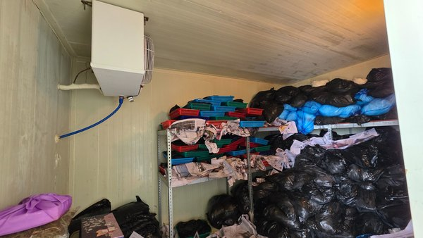</a> 20260701_115237(1).jpg 냉동고 내부 전경</td>
</tr>
</table>

### 3. 제어반·수리 전 온도

<table>
<tr>
<td width="33%" valign="top" align="center"><a href="images/originals/20260701_115523(1).jpg">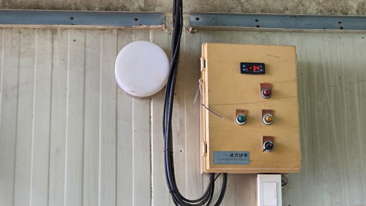</a> 20260701_115523(1).jpg FOX-S1004 표시온도 약 -3.4℃</td>
<td width="33%" valign="top" align="center"><a href="images/originals/20260701_115535(1).jpg">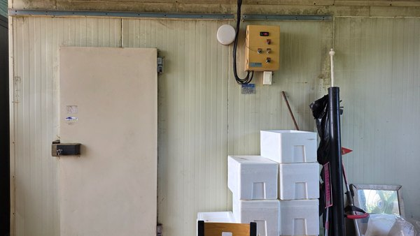</a> 20260701_115535(1).jpg 냉동고 출입문과 제어반 위치</td>
<td width="33%" valign="top" align="center"><a href="images/originals/20260701_115538(1).jpg">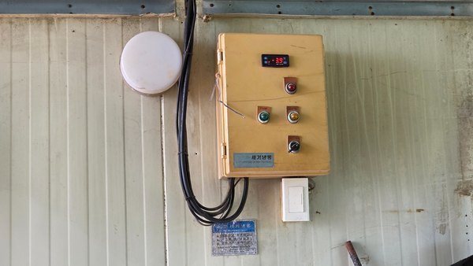</a> 20260701_115538(1).jpg FOX-S1004 표시온도 약 -3.9℃</td>
</tr>
</table>

### 4. 실외기 분해·컴프레서 교체 작업

<table>
<tr>
<td width="33%" valign="top" align="center"><a href="images/originals/20260701_210129(1).jpg">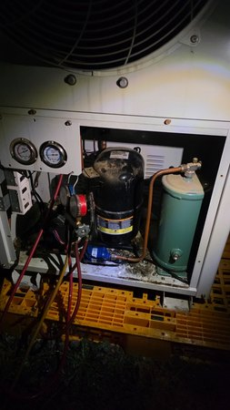</a> 20260701_210129(1).jpg 야간 실외기 점검과 서비스 게이지 연결</td>
<td width="33%" valign="top" align="center"><a href="images/originals/20260702_095715(1).jpg">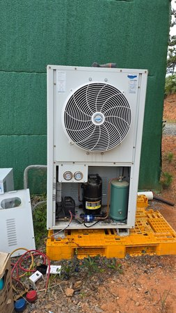</a> 20260702_095715(1).jpg 실외기 하부 커버 개방 및 신규 컴프레서 장착</td>
<td width="33%" valign="top" align="center"><a href="images/originals/20260702_095718(1).jpg">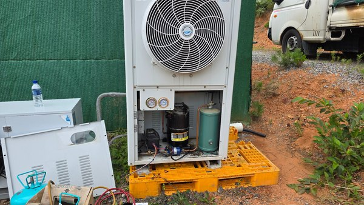</a> 20260702_095718(1).jpg 실외기 작업부와 서비스 장비</td>
</tr>
<tr>
<td width="33%" valign="top" align="center"><a href="images/originals/20260702_095720(1).jpg">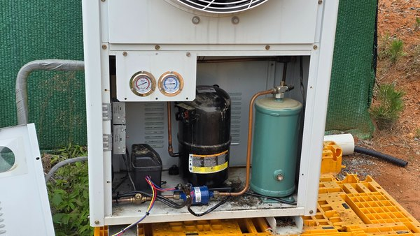</a> 20260702_095720(1).jpg 신규 컴프레서·수액기·배관·배선</td>
<td width="33%" valign="top" align="center"><a href="images/originals/20260702_095723(1).jpg">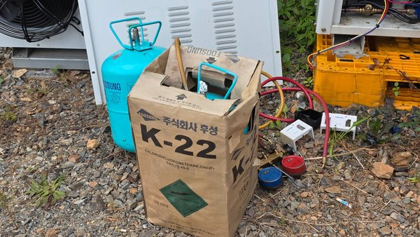</a> 20260702_095723(1).jpg R-22 냉매 용기와 매니폴드 게이지</td>
<td width="33%" valign="top" align="center"><a href="images/originals/20260702_095724(1).jpg">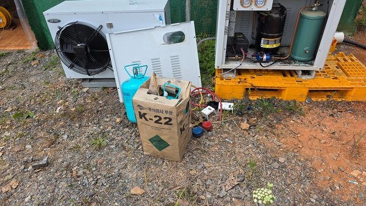</a> 20260702_095724(1).jpg 실외기 및 작업 현장 전경</td>
</tr>
<tr>
<td width="33%" valign="top" align="center"><a href="images/originals/20260702_102139(1).jpg">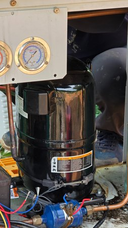</a> 20260702_102139(1).jpg 신규 컴프레서와 압력계 근접 확인</td>
<td width="33%" valign="top" align="center"><a href="images/originals/20260702_102141(1).jpg">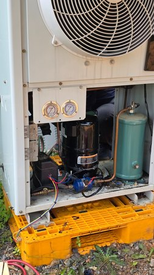</a> 20260702_102141(1).jpg 컴프레서·수액기·배관 조립 상태</td>
</tr>
</table>

### 5. 신·구 컴프레서 비교

<table>
<tr>
<td width="33%" valign="top" align="center"><a href="images/originals/20260702_102142(1).jpg">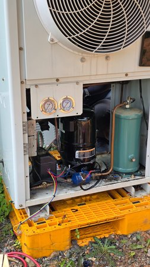</a> 20260702_102142(1).jpg 신규 컴프레서 장착 상태</td>
<td width="33%" valign="top" align="center"><a href="images/originals/20260702_102148(1).jpg">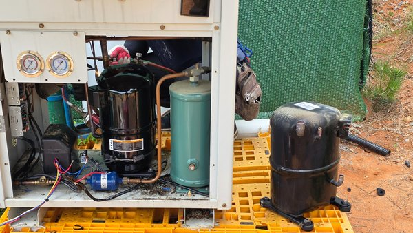</a> 20260702_102148(1).jpg 신규 장착품과 탈거된 기존 컴프레서</td>
<td width="33%" valign="top" align="center"><a href="images/originals/20260702_102150(1).jpg">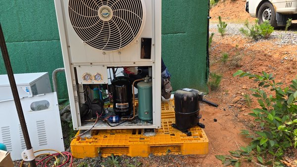</a> 20260702_102150(1).jpg 실외기 전경 및 탈거 컴프레서 비교</td>
</tr>
</table>

### 6. 제어부 점검

<table>
<tr>
<td width="33%" valign="top" align="center"><a href="images/originals/20260702_152103(1).jpg">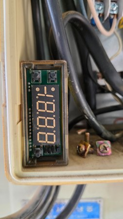</a> 20260702_152103(1).jpg 분리된 디지털 표시 모듈의 세그먼트 상태</td>
<td width="33%" valign="top" align="center"><a href="images/originals/20260702_152247(1).jpg">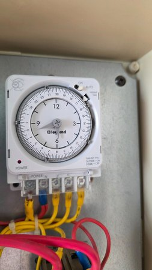</a> 20260702_152247(1).jpg 제어함 내부 Legrand 24시간 기계식 타이머</td>
</tr>
</table>

### 7. 조립 완료·명판·압력 확인

<table>
<tr>
<td width="33%" valign="top" align="center"><a href="images/originals/20260702_161221(1).jpg">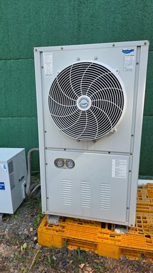</a> 20260702_161221(1).jpg 하부 커버 복구 후 실외기 전경</td>
<td width="33%" valign="top" align="center"><a href="images/originals/20260702_161242(1).jpg">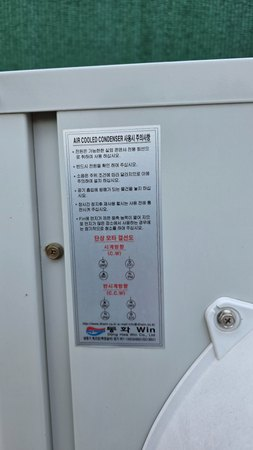</a> 20260702_161242(1).jpg 공랭식 응축기 사용 주의사항 명판</td>
<td width="33%" valign="top" align="center"><a href="images/originals/20260702_161243(1).jpg">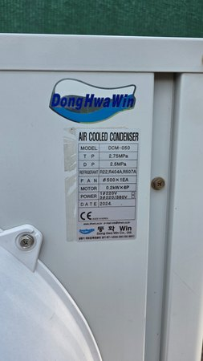</a> 20260702_161243(1).jpg 실외기 명판: DCM-050 / 2024년</td>
</tr>
<tr>
<td width="33%" valign="top" align="center"><a href="images/originals/20260702_161246(1).jpg">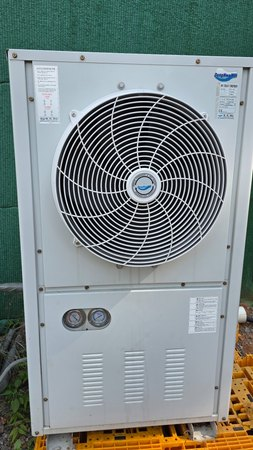</a> 20260702_161246(1).jpg 동화윈 DCM-050 조립 완료 전면</td>
<td width="33%" valign="top" align="center"><a href="images/originals/20260702_161250(1).jpg">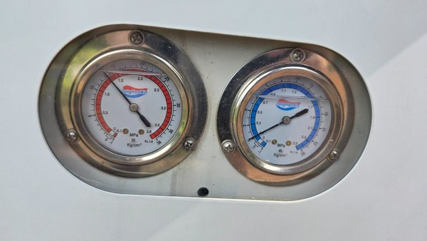</a> 20260702_161250(1).jpg 실외기 고·저압 게이지 근접 기록</td>
</tr>
</table>

### 8. 인접 별도 장비

<table>
<tr>
<td width="33%" valign="top" align="center"><a href="images/originals/20260702_161226(1).jpg">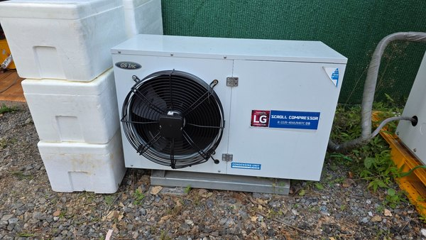</a> 20260702_161226(1).jpg 인접 GS Inc 응축기 — 대상 4마력 냉동고 실외기와 구분</td>
</tr>
</table>

### 9. 당일 시운전 온도

<table>
<tr>
<td width="33%" valign="top" align="center"><a href="images/originals/20260702_183849(1).jpg">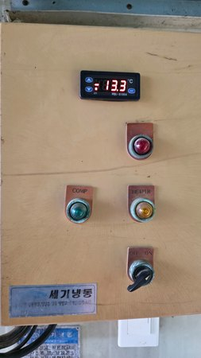</a> 20260702_183849(1).jpg FOX-S1004 표시온도 -13.3℃</td>
<td width="33%" valign="top" align="center"><a href="images/originals/20260702_183851(1).jpg">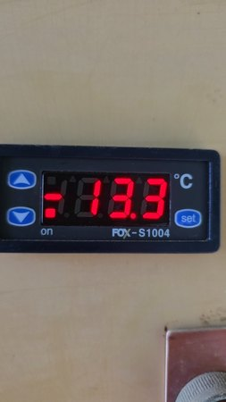</a> 20260702_183851(1).jpg 18시 38분경 표시온도 -13.3℃ 근접 기록</td>
</tr>
</table>

---

**기록 기준:** 사용자 촬영사진과 수리 메모를 기준으로 작성했으며, 비용은 포함하지 않았습니다.
