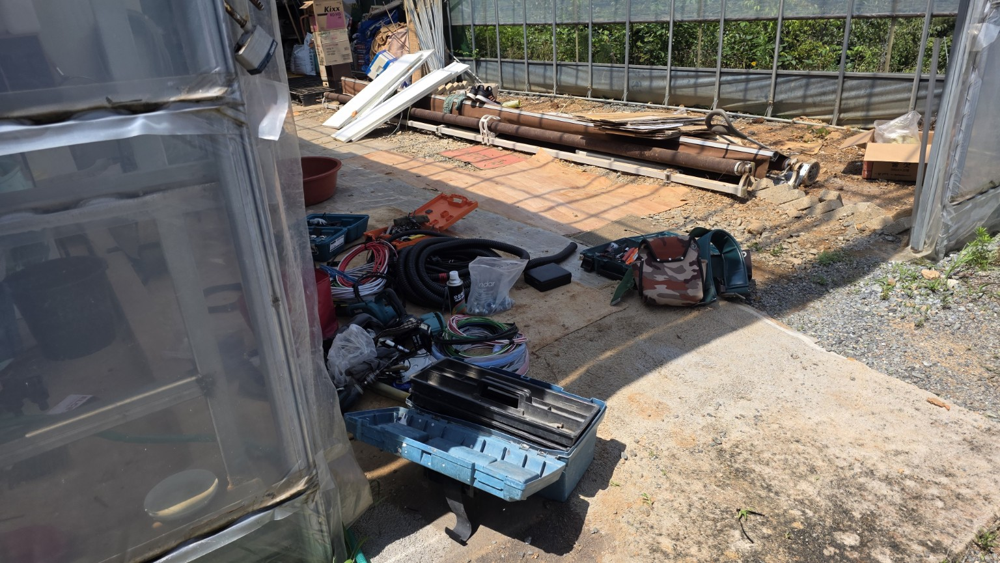
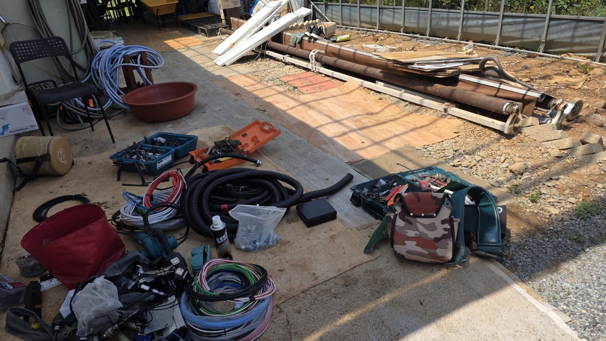
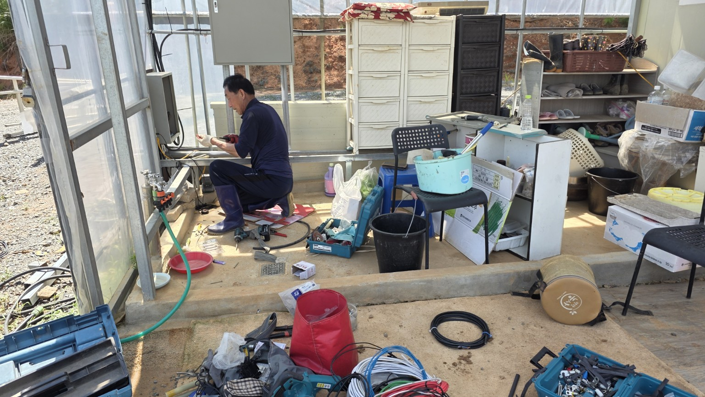
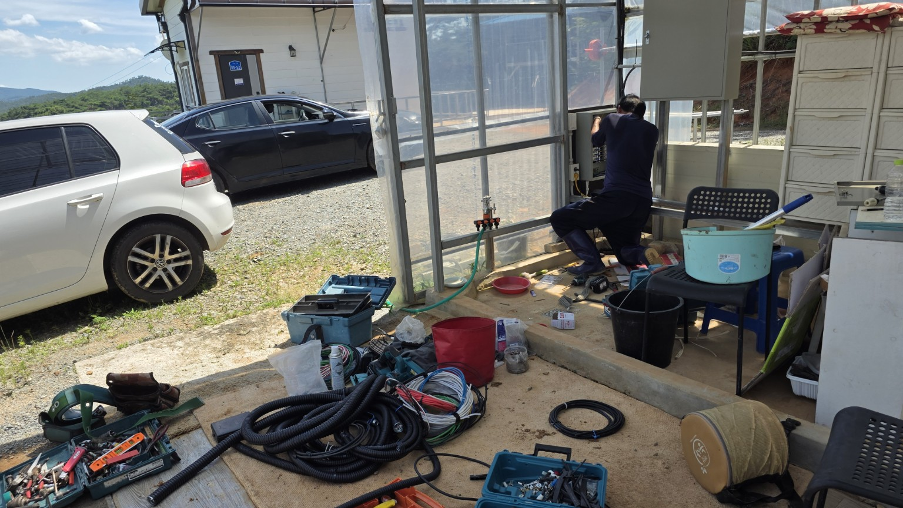
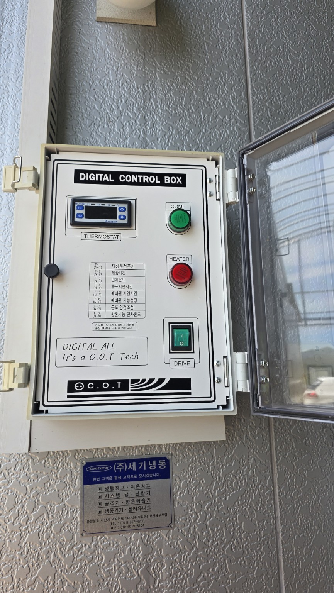
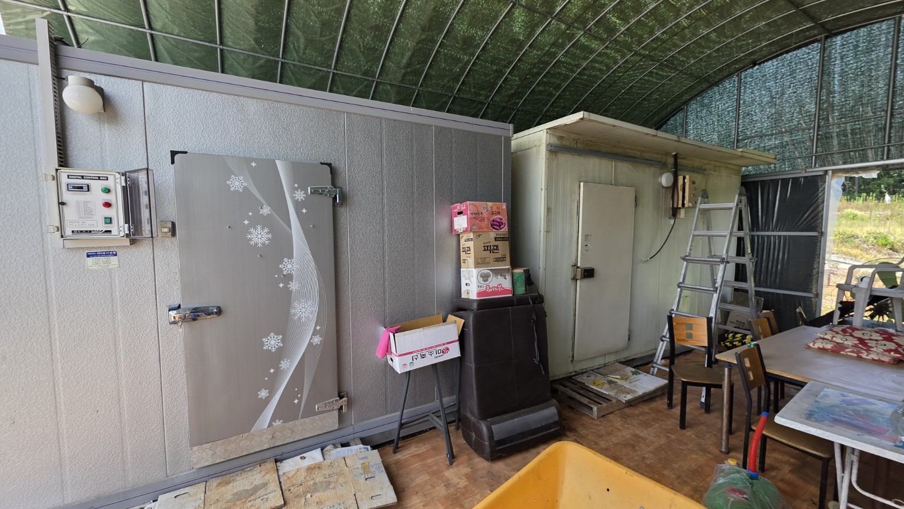
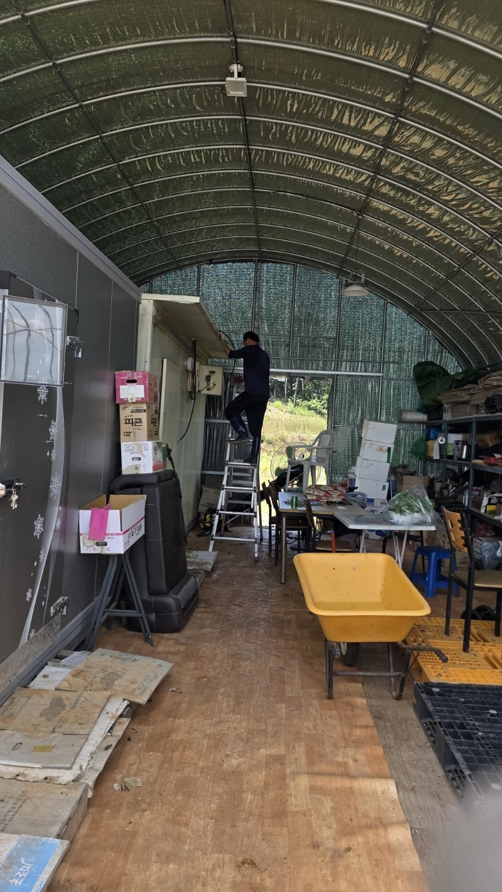
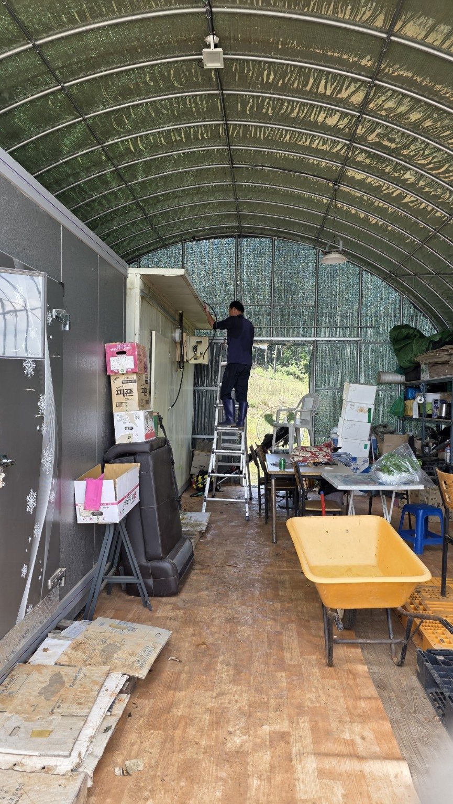
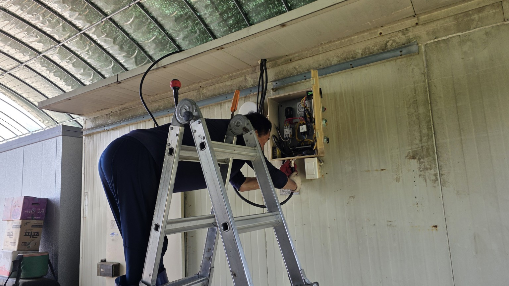
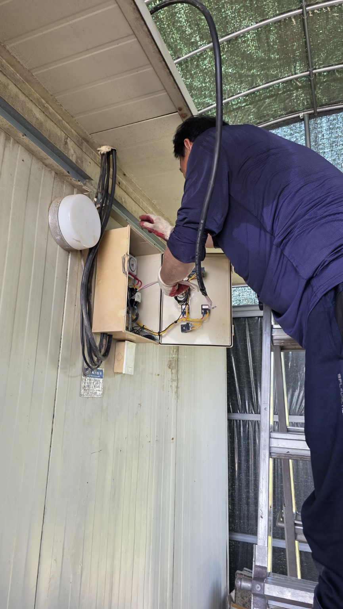

# 2026-07-11 화곡농장 냉동고 전기 증설 작업 기록

> 썸네일 이미지를 누르면 원본 크기로 열립니다.  
> 이미지 배열은 그룹별로 나누고, 한 줄에 3개씩 배치했습니다.

## 1. 작업 개요

| 항목 | 내용 |
|---|---|
| 작업일 | 2026-07-11 |
| 작업 장소 | 화곡농장 농막·하우스 내 냉동고 및 저온창고 |
| 작업자 | 다경당숙 |
| 주요 목적 | 냉동고 전용 전원 공급 안정화 및 기존 차단기 용량 증설 |
| 전선 | 10SQ 전선 약 20m |
| 차단기 | 누전차단기 40A로 증설 |
| 작업 범위 | 전선 포설, 전선관 정리, 냉동고·저온창고 제어반 연결, 제어함 내부 배선 정리 및 전원 점검 |

## 2. 주요 작업 내용

1. 작업 구간에 필요한 전선, 전선관, 단자 및 공구를 준비했습니다.
2. 냉동고 전용으로 10SQ 전선 약 20m를 포설했습니다.
3. 기존 전원 회로의 누전차단기를 40A 용량으로 증설했습니다.
4. 냉동고 디지털 컨트롤박스와 저온창고 제어함을 연결했습니다.
5. 상부 배선 구간을 따라 케이블을 정리하고, 제어함 내부 결선을 점검했습니다.
6. 배선 완료 후 전원을 투입해 컨트롤박스와 냉동 설비의 동작 상태를 확인했습니다.

## 3. 작업 결과

- 냉동고 전용 전원선이 기존보다 굵은 10SQ 규격으로 구성되었습니다.
- 약 20m 구간의 전력 공급선이 새로 연결되었습니다.
- 누전차단기 용량이 40A로 증설되었습니다.
- 냉동고 및 저온창고 제어반의 전원 연결과 배선 정리가 완료되었습니다.
- 사진상 컨트롤박스와 제어함 내부 배선 작업 및 전원 연결 작업이 확인됩니다.

## 4. 추후 확인할 사항

- 실제 운전 중 차단기 발열이나 반복 트립 여부
- 냉동고 기동 시 전압 강하 여부
- 단자 체결부의 풀림 및 변색 여부
- 접지 연결 상태
- 케이블과 전선관이 날카로운 금속 모서리에 닿는지 여부
- 누전차단기 시험 버튼의 정기 작동 확인

> 10SQ 전선과 40A 차단기의 적정성은 전원 방식, 전선 종류, 포설 환경, 접지 및 설비 정격에 따라 달라질 수 있으므로 최종 안전성은 전기기술자 점검 기준으로 판단해야 합니다.

# 사진 기록

## 1. 자재 및 배선 준비
<table><tr><td style='width:33%; vertical-align:top'>

 
전선·전선관·공구 준비 전경

</td><td style='width:33%; vertical-align:top'>

 
10SQ 전선과 전선관 및 작업 공구

</td><td style='width:33%; vertical-align:top'></td></tr></table>
## 2. 제어반 연결 및 설비 전경
<table><tr><td style='width:33%; vertical-align:top'>

 
저온창고 제어반 연결 작업

</td><td style='width:33%; vertical-align:top'>

 
제어반 작업 위치와 주변 전경

</td><td style='width:33%; vertical-align:top'>

 
냉동고 디지털 컨트롤박스

</td></tr></table>
<table><tr><td style='width:33%; vertical-align:top'>

 
냉동고와 저온창고 설치 전경

</td><td style='width:33%; vertical-align:top'></td><td style='width:33%; vertical-align:top'></td></tr></table>
## 3. 상부 배선 및 제어함 내부 작업
<table><tr><td style='width:33%; vertical-align:top'>

 
저온창고 상부 케이블 배선 작업

</td><td style='width:33%; vertical-align:top'>

 
상부 배선 작업 정면

</td><td style='width:33%; vertical-align:top'>

 
전기함 및 차단기 배선 작업

</td></tr></table>
<table><tr><td style='width:33%; vertical-align:top'>

 
제어함 내부 배선 정리 및 연결

</td><td style='width:33%; vertical-align:top'></td><td style='width:33%; vertical-align:top'></td></tr></table>

## 5. 설비 관리 이력

| 날짜 | 작업 내용 | 작업자 |
|---|---|---|
| 2026-07-11 | 냉동고 전용 10SQ 전선 약 20m 연결, 누전차단기 40A 증설, 제어반 및 제어함 배선 정리 | 다경당숙 |
