# 20260803 나리온 미니 컷쏘 구매 기록

> 구매일: 2026년 8월 3일  
> 수령·개봉일: 2026년 8월 6일  
> 최종 정리일: 2026년 8월 6일  
> 주된 사용 목적: 두꺼운 박 껍질 절단

## 1. 구매 요약

| 구분 | 내용 |
|---|---|
| 제품명 | 나리온 21V 미니 전기톱·소형 컷쏘·왕복톱 |
| 주문번호 | 20260803-0000610 |
| 주문일시 | 2026-08-03 18:21:46 |
| 선택 옵션 | 배터리 2개 세트(+29,000원) |
| 수량 | 1세트 |
| 상품금액 | 118,000원 |
| 할인금액 | 5,900원(5%) |
| 배송비 | 무료 |
| 최종 결제금액 | **112,100원** |
| 결제수단 | 신용카드 |
| 주문 당시 상태 | 배송 전·상품 준비 중 |
| 수령 상태 | **2026년 8월 6일 수령·개봉 확인** |

### 결제금액 계산

- 기본 배터리 1개 세트: 89,000원
- 배터리 1개 추가 옵션: 29,000원
- 주문금액: 89,000원 + 29,000원 = 118,000원
- 5% 할인: 5,900원
- 최종 결제: 118,000원 − 5,900원 = **112,100원**

## 2. 제품 사양

아래 수치는 제조·판매 페이지에 표시된 사양이다. 실제 사용시간과 절단 성능은 재료의 경도, 두께, 날 상태, 배터리 상태 및 작업 방법에 따라 달라질 수 있다.

| 항목 | 표시 사양 |
|---|---|
| 전압·배터리 | 21V·2.0Ah |
| 구매 배터리 수 | 2개 |
| 모터 | 브러시리스 모터 |
| 무부하 왕복수 | 3,500 SPM |
| 스트로크 길이 | 15mm |
| 톱날 길이 | 약 90mm |
| 표시 절단 직경 | 80~90mm |
| 충전시간 | 약 1시간 |
| 표시 사용시간 | 배터리 1개당 약 30분 |
| 모델명 | NS21 |
| 적합등록번호 | R-R-fjk-NS21 |
| 제조자·제조국 | Auston Machinery Equipment Co., Ltd.·중국 |
| 수입자 | (주)나리네이션 |

> **주의:** 날 길이 90mm 또는 절단 직경 80~90mm라는 표시는 큰 박을 한 번에 관통할 수 있다는 뜻이 아니다. 박의 크기와 형상에 따라 한쪽을 절단한 뒤 돌려가며 이어서 잘라야 한다.

## 3. 수령·개봉 확인

2026년 8월 6일 제품을 수령하여 포장, 본체와 기본 구성품, 톱날 및 설명서를 사진으로 확인했다. 외부 종이상자에는 일부 눌림과 운송 흔적이 있으나, 사진상 전용 케이스와 본체에는 뚜렷한 파손이 보이지 않는다.

| 확인 항목 | 실제 확인 내용 |
|---|---|
| 본체 | NS21 브러시리스 미니 컷쏘 1개 |
| 배터리 | 21V·2.0Ah 2개 |
| 충전기 | 고속충전기 1개 |
| 보관 | 전용 하드 케이스 1개, 톱날 보관 파우치 |
| 목공용 톱날 | **4개 확인** — `N6 Wood`, `6TPI`, `HCS` 표기 |
| 금속용 톱날 | **2개 확인** — `N6 Metal`, `14TPI`, `Bi-metal` 계열 표기 |
| 보호구 | 나리온 작업장갑 1켤레 및 작업용 토시로 보이는 보호구 포함 |
| 설명서 | 나리온 미니 전기톱 NS21 사용설명서 포함 |

> 보호구의 정확한 상품명·수량 표기는 사진과 설명서에서 확인되지 않아, 외관을 기준으로 기록했다.

## 4. 구성품

| 구분 | 수량·내용 |
|---|---|
| 본체 | 1개 |
| 보관 케이스 | 1개 |
| 21V·2.0Ah 배터리 | **2개**(실물 확인) |
| 고속충전기 | 1개 |
| 톱날 보관 파우치 | 1개 |
| 목공용 톱날 | **4개**(실물 확인) |
| 금속용 톱날 | **2개**(실물 확인) |
| 작업장갑 | 1켤레(사진 확인) |
| 작업용 토시 추정 보호구 | 사진 확인 |
| 사용설명서 | 1부 |

판매 페이지의 기본 구성과 주문 옵션에 맞는 본체·배터리·충전기·톱날을 모두 사진으로 확인했다.

## 5. 설명서 핵심 사용법

- 배터리를 완전히 장착한 뒤 안전 버튼을 왼쪽 또는 오른쪽 끝까지 밀어 잠금을 해제하고 트리거를 당긴다.
- 트리거를 당기는 정도에 따라 왕복 속도가 조절되며, 트리거를 놓으면 정지한다.
- 트리거를 당기면 LED 작업등이 자동으로 켜진다.
- 톱날 장착·교체 전에는 반드시 배터리를 분리한다.
- 고정 클램프를 시계 반대 방향으로 돌린 상태에서 톱날을 끝까지 끼운 뒤 놓아 고정한다.
- 톱날이 심하게 마모되거나 절삭력이 떨어지면 교체한다.
- 배터리는 동봉된 순정 충전기를 사용한다. 충전 중 빨간색, 충전 완료 시 초록색 표시등이 켜진다.
- 배터리를 분리할 때는 톱날의 왕복이 완전히 멈춘 뒤 해제 버튼을 누른다.

## 6. 박 껍질 절단 적합성

### 결론

이 제품은 **박 껍질 절단용으로 사용할 수 있다.** 체인톱보다 날이 작고 절단 위치를 조절하기 쉬워 박을 부분 절개하거나 둘레를 따라 자르는 작업에 알맞다. 다만 왕복톱은 재료가 흔들리면 진동만 커지고 절단 효율이 크게 떨어지므로, 박을 단단하게 고정하고 본체 앞쪽 지지대를 박 표면에 밀착하는 것이 핵심이다.

### 권장 날

- 기본적으로 **목공용 톱날**을 사용한다.
- 말라서 매우 단단한 박 껍질은 새 목공날로 시작한다.
- 금속용 톱날은 이가 촘촘해 박 껍질 절단에는 속도가 느리고 막힐 수 있으므로 우선 선택하지 않는다.

### 권장 절단 방법

1. 배터리를 분리한 상태에서 목공용 톱날을 끝까지 정확하게 체결한다.
2. 박이 굴러가지 않도록 상자, 고임목 또는 작업대에 단단히 고정한다.
3. 자를 선을 먼저 표시하고, 손과 고정구가 톱날 진행 방향에 없는지 확인한다.
4. 배터리를 장착한 뒤 본체 앞쪽 지지대를 박 표면에 밀착한다.
5. 날이 충분히 왕복하기 시작한 다음 표시선을 따라 무리하게 누르지 말고 절단한다.
6. 박이 크면 한 번에 관통하려 하지 말고 한쪽을 자른 뒤 박을 돌려 반대쪽에서 이어 자른다.
7. 절단이 끝나면 배터리를 분리한 뒤 날과 본체의 가루·찌꺼기를 제거한다.

## 7. 안전수칙

- 보안경, 두꺼운 작업장갑, 긴소매 작업복을 착용한다.
- 박을 손으로 잡은 채 절단하지 않는다. 반드시 굴러가지 않도록 고정한다.
- 톱날을 교체하거나 걸린 이물질을 제거할 때는 반드시 배터리를 분리한다.
- 날을 비틀거나 옆으로 밀지 않는다. 얇은 왕복톱 날은 휘거나 부러질 수 있다.
- 젖은 박을 절단할 때는 수분이 본체·배터리·충전기에 닿지 않도록 한다.
- 충전기는 건조하고 통풍되는 곳에서 사용하고, 충전 중 자리를 장시간 비우지 않는다.
- 주문 상세 이미지에는 주소와 전화번호 등 개인정보가 포함되어 있으므로 외부 공유 시 주의한다.

## 8. 확인 상태

- [x] 본체 외관과 전용 케이스에 사진상 뚜렷한 파손 없음
- [x] 21V·2.0Ah 배터리 2개 수량 확인
- [x] 고속충전기 및 케이스 포함 확인
- [x] 목공용 날 4개·금속용 날 2개 포함 확인
- [x] 톱날 파우치·작업장갑·보호용 토시로 보이는 구성품 확인
- [ ] 톱날 잠금장치와 안전스위치 작동 여부
- [ ] 배터리 2개 모두 충전·작동 여부
- [ ] 박에 사용하기 전 폐목재로 짧게 시험 절단

## 9. 관련 이미지

썸네일을 누르면 원본 크기로 확인할 수 있다.

### 9-1. 주문·제품 정보

<table>
  <tr>
    <td align="center"> 제품 사양</td>
    <td align="center"> 주문 상세</td>
    <td align="center"> 기본 구성품</td>
  </tr>
  <tr>
    <td align="center"><a href="images/04_제품소개.png">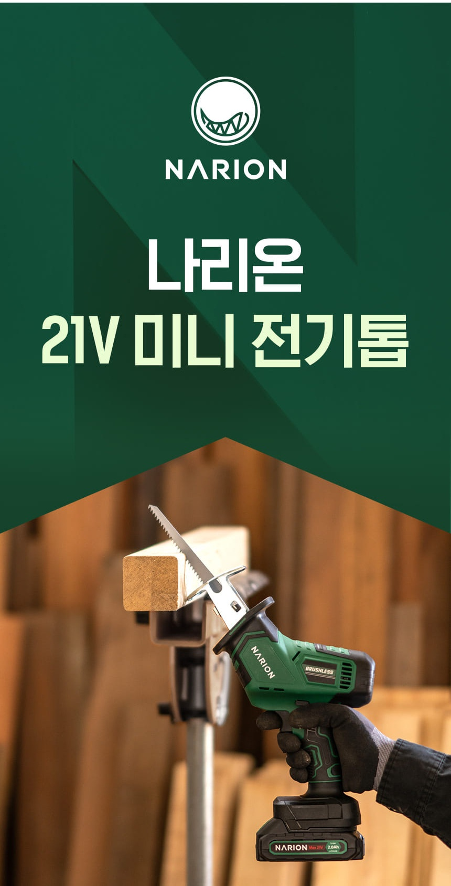</a> 제품 소개</td>
    <td align="center"> 90mm 톱날</td>
    <td></td>
  </tr>
</table>

### 9-2. 2026년 8월 6일 포장·개봉

<table>
  <tr>
    <td align="center"><a href="images/06_수령_케이스전체.jpg">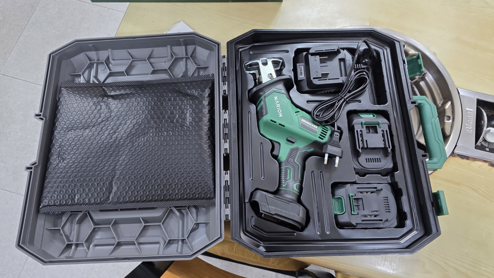</a> 케이스와 전체 구성</td>
    <td align="center"><a href="images/07_수령_상자측면1.jpg">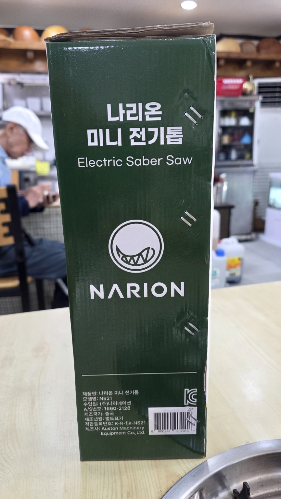</a> 제품 상자 측면</td>
    <td align="center"><a href="images/08_수령_제품상자1.jpg">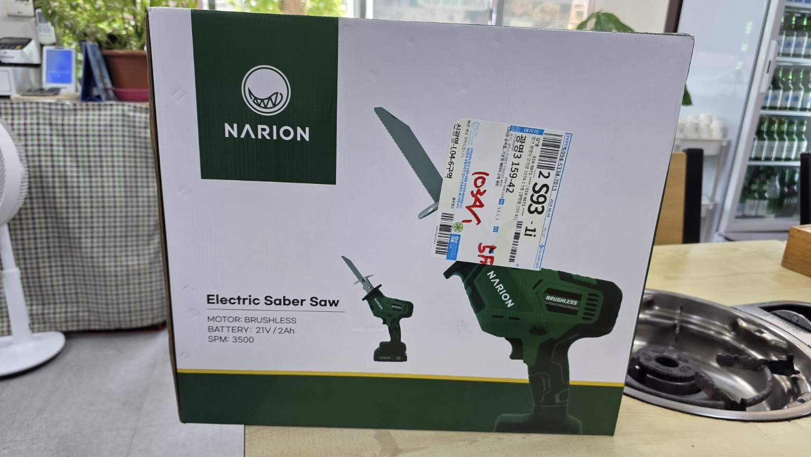</a> 제품 상자 전면</td>
  </tr>
  <tr>
    <td align="center"><a href="images/09_수령_상자측면2.jpg">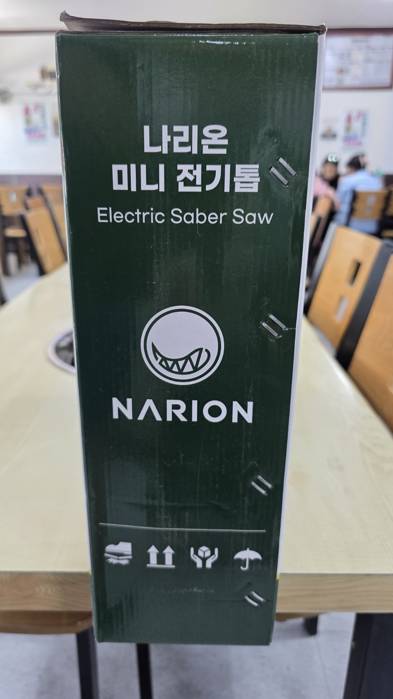</a> 제품 상자 측면 추가</td>
    <td align="center"><a href="images/10_수령_제품상자2.jpg">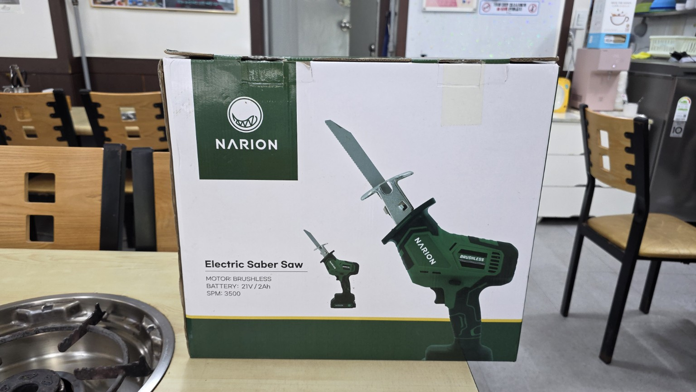</a> 제품 상자 전면 추가</td>
    <td></td>
  </tr>
</table>

### 9-3. 구성품·톱날·사용설명서

<table>
  <tr>
    <td align="center"><a href="images/11_보호구_파우치.jpg">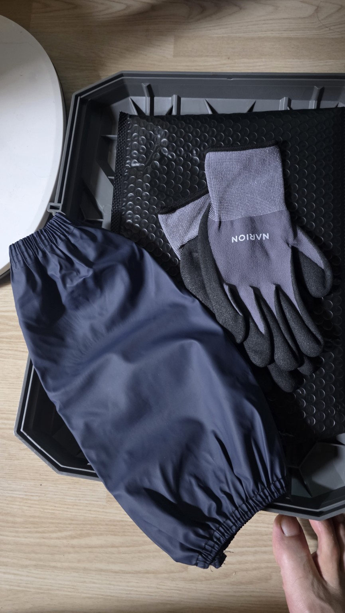</a> 작업장갑·보호구·파우치</td>
    <td align="center"><a href="images/12_본체_배터리_톱날.jpg">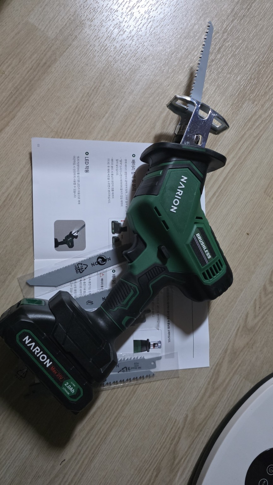</a> 본체·배터리·톱날</td>
    <td align="center"><a href="images/13_톱날6개.jpg">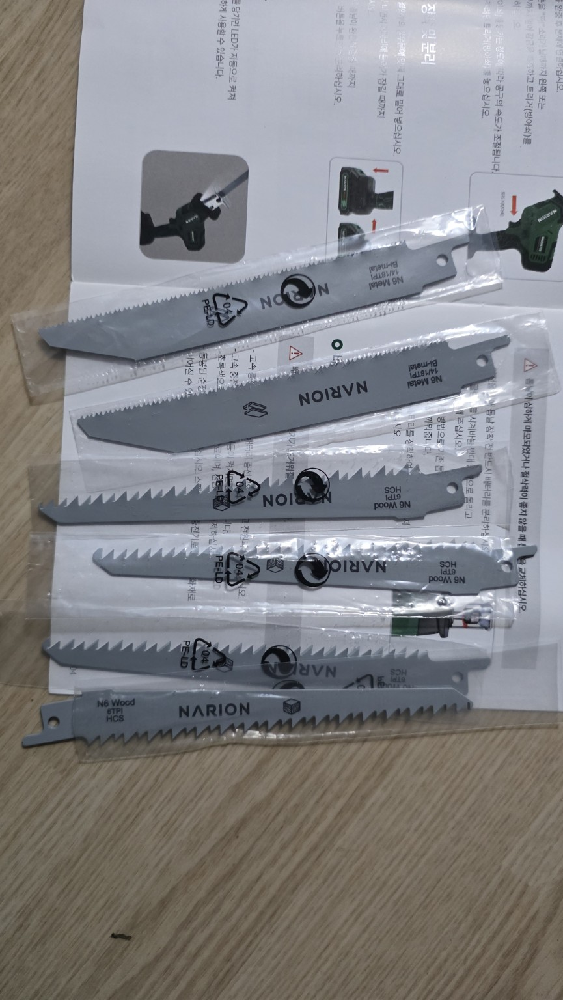</a> 목공용 4개·금속용 2개</td>
  </tr>
  <tr>
    <td align="center"><a href="images/14_설명서_표지.jpg">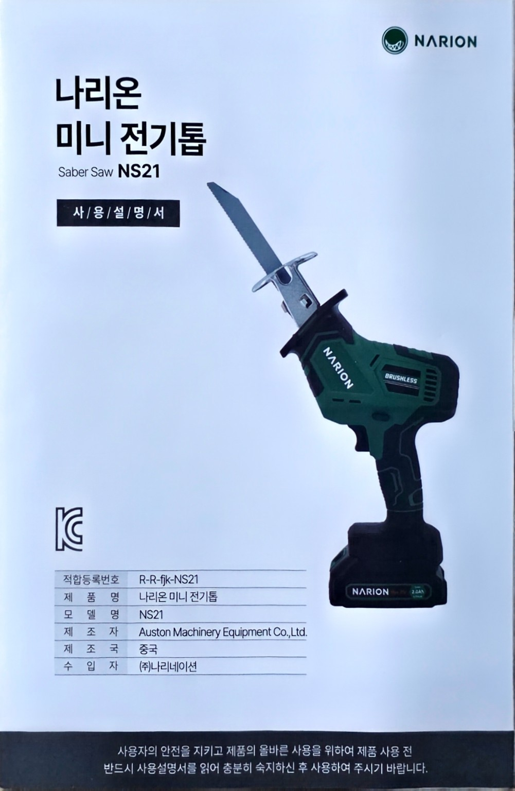</a> NS21 사용설명서 표지</td>
    <td align="center"><a href="images/15_설명서_기본사용.jpg">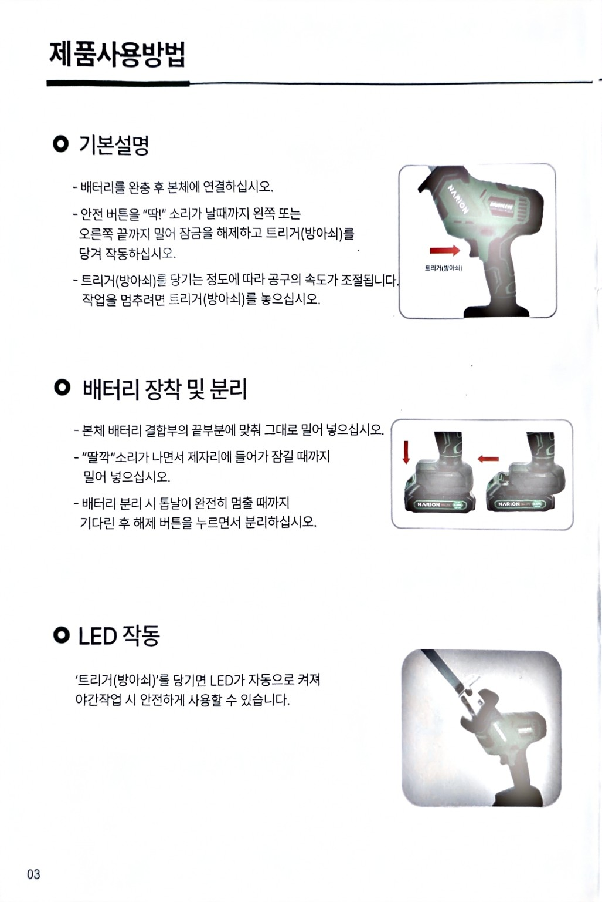</a> 기본 사용·배터리·LED</td>
    <td align="center"><a href="images/16_설명서_톱날충전.jpg">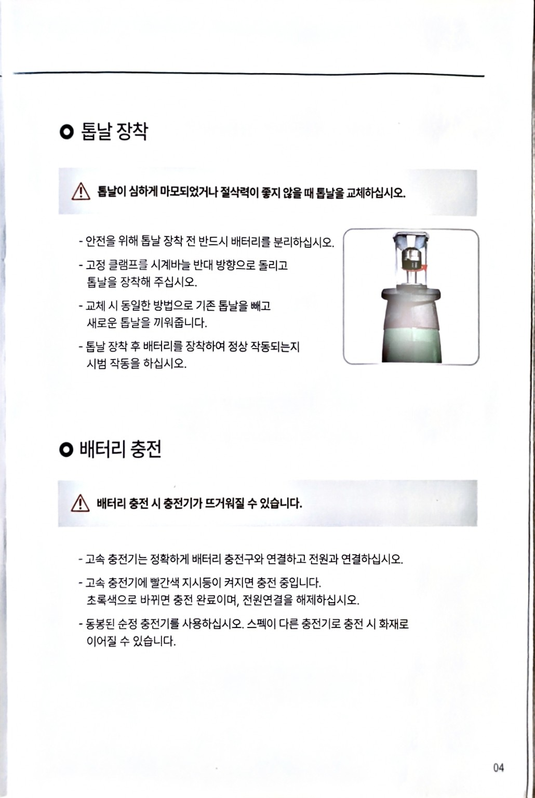</a> 톱날 장착·배터리 충전</td>
  </tr>
</table>

## 10. 참고 링크

- [나리온 공식 제품 페이지](https://narion.kr/product/%EB%AF%B8%EB%8B%88%EC%A0%84%EA%B8%B0%ED%86%B1-%EC%86%8C%ED%98%95-%EC%BB%B7%EC%8F%98-%EC%99%95%EB%B3%B5%ED%86%B1/22/category/71/)
- [나리온 공식 제품 시연 영상](https://www.youtube.com/watch?v=0bkYMuLm5HI)

---

본 기록의 가격·사양은 2026년 8월 3일 주문내역과 당시 판매 자료를, 수령 상태와 구성품은 2026년 8월 6일 개봉 사진 및 동봉 설명서를 기준으로 정리했다.
