# 2026-08-11 화곡농장 박 수확 기록

## 기본 정보

| 항목 | 내용 |
|---|---|
| 작업일 | 2026년 8월 11일 |
| 장소 | 화곡농장 |
| 작업 내용 | 박 수확 및 재배지 현장 기록 |
| 수확량 | 약 50통(당일 작업 기록 기준) |
| 사진 | 53장 |
| 촬영 시간 | 17:23:01~17:45:26 |
| 원본 사진 용량 | 172.0 MB |
| 정리일 | 2026년 8월 13일 |

## 작업 요약

- 수확한 박을 모아 놓은 결과 사진과 밭에서 발견한 박의 생육 상태를 함께 기록했다.
- 여러 통이 한곳에 모여 있는 모습, 줄기에 매달린 박, 지면에 놓인 박을 확인할 수 있다.
- 표피는 진한 녹색·연한 녹색·갈색 반점 등 차이가 있다. 선별할 때는 사진에 보이는 색상뿐 아니라 무름, 눌림, 냄새, 상처 깊이를 함께 확인한다.
- 농장 전경은 40장의 연속 사진으로 보존했다. 박 덩굴과 잡초가 함께 무성해 수확 후 남은 박 확인과 통로 정리가 필요한 상태다.

## 사진 구성

| 구분 | 사진 수 | 핵심 내용 |
|---|---:|---|
| 수확 결과 | 1장 | 수확한 박을 한곳에 모아 놓은 모습입니다. 당일 작업 기록상 약 50통을 수확했습니다. |
| 밭에서 확인한 박 | 4장 | 덩굴 아래 모여 있는 박과 줄기에 달린 개별 박을 확인한 기록입니다. |
| 표면·성숙 상태 점검 | 6장 | 짙은 녹색부터 옅은 녹색까지 색상 차이가 있고, 일부 박에서는 갈색 반점과 표피 흔적이 보입니다. 사진만으로 부패 여부를 단정하지 않고 선별 시 눌림·냄새·무름을 함께 확인하는 것이 좋습니다. |
| 재배지 전경 연속 기록 | 40장 | 17:45:11~17:45:22에 방향을 바꾸며 연속 촬영한 40장입니다. 박 덩굴 분포, 잡초 생육, 주변 산림과 하우스 방향 등 밭 전체 상태를 확인할 수 있습니다. |
| 덩굴·지면 근접 기록 | 2장 | 촬영 마지막에 남긴 지면 근접 사진입니다. 박 덩굴과 잡초가 함께 무성한 상태가 확인됩니다. |
| **합계** | **53장** | 원본 사진 전체 수록 |

> 아래 썸네일을 누르면 원본 사진이 열립니다. Markdown 뷰어에 따라 새 화면으로 표시될 수 있습니다.

## 1. 수확 결과

수확한 박을 한곳에 모아 놓은 모습입니다. 당일 작업 기록상 약 50통을 수확했습니다.

<table>
<tr>
<td width="33%" valign="top" align="center"><a href="images/original/20260811_172301.jpg">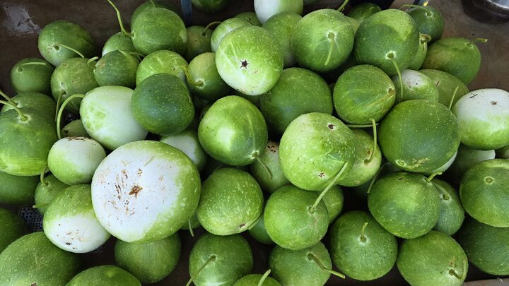</a> <strong>20260811_172301.jpg</strong> 17:23:01 · 원본 보기</td>
<td width="33%" valign="top" align="center"></td>
<td width="33%" valign="top" align="center"></td>
</tr>
</table>

## 2. 밭에서 확인한 박

덩굴 아래 모여 있는 박과 줄기에 달린 개별 박을 확인한 기록입니다.

<table>
<tr>
<td width="33%" valign="top" align="center"><a href="images/original/20260811_173902.jpg">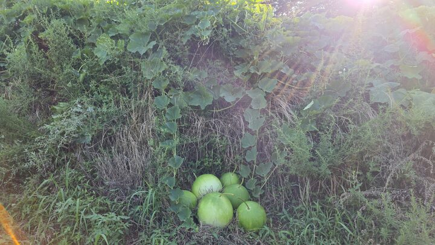</a> <strong>20260811_173902.jpg</strong> 17:39:02 · 원본 보기</td>
<td width="33%" valign="top" align="center"><a href="images/original/20260811_174018.jpg">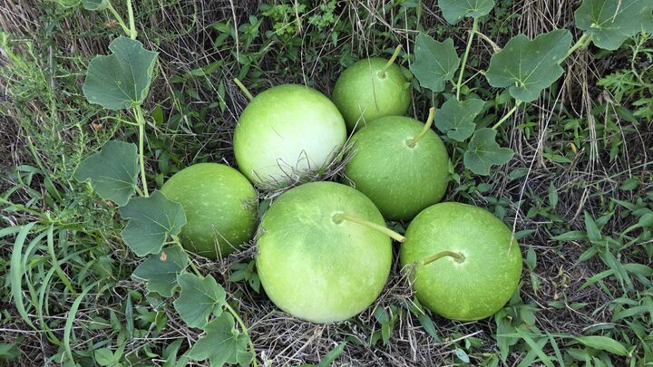</a> <strong>20260811_174018.jpg</strong> 17:40:18 · 원본 보기</td>
<td width="33%" valign="top" align="center"><a href="images/original/20260811_174229.jpg">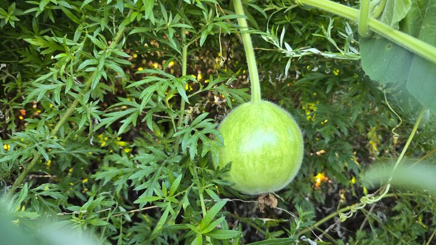</a> <strong>20260811_174229.jpg</strong> 17:42:29 · 원본 보기</td>
</tr>
<tr>
<td width="33%" valign="top" align="center"><a href="images/original/20260811_174230.jpg">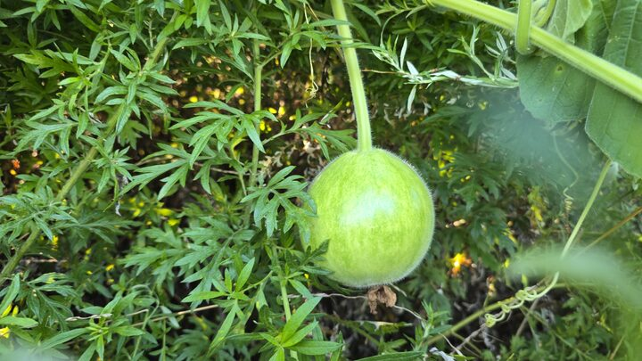</a> <strong>20260811_174230.jpg</strong> 17:42:30 · 원본 보기</td>
<td width="33%" valign="top" align="center"></td>
<td width="33%" valign="top" align="center"></td>
</tr>
</table>

## 3. 표면·성숙 상태 점검

짙은 녹색부터 옅은 녹색까지 색상 차이가 있고, 일부 박에서는 갈색 반점과 표피 흔적이 보입니다. 사진만으로 부패 여부를 단정하지 않고 선별 시 눌림·냄새·무름을 함께 확인하는 것이 좋습니다.

<table>
<tr>
<td width="33%" valign="top" align="center"><a href="images/original/20260811_174355.jpg">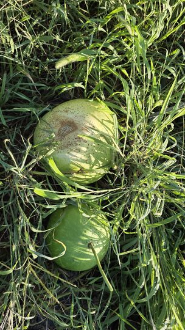</a> <strong>20260811_174355.jpg</strong> 17:43:55 · 원본 보기</td>
<td width="33%" valign="top" align="center"><a href="images/original/20260811_174409.jpg">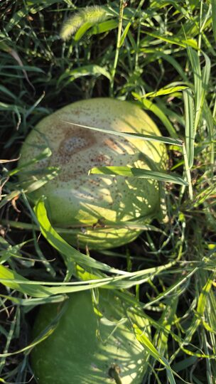</a> <strong>20260811_174409.jpg</strong> 17:44:09 · 원본 보기</td>
<td width="33%" valign="top" align="center"><a href="images/original/20260811_174412.jpg">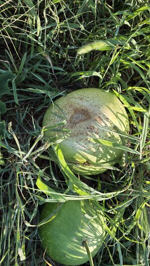</a> <strong>20260811_174412.jpg</strong> 17:44:12 · 원본 보기</td>
</tr>
<tr>
<td width="33%" valign="top" align="center"><a href="images/original/20260811_174448.jpg">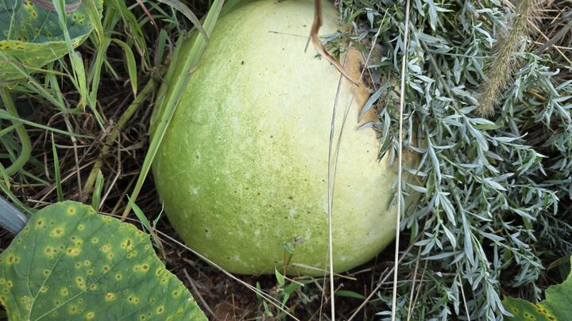</a> <strong>20260811_174448.jpg</strong> 17:44:48 · 원본 보기</td>
<td width="33%" valign="top" align="center"><a href="images/original/20260811_174500.jpg">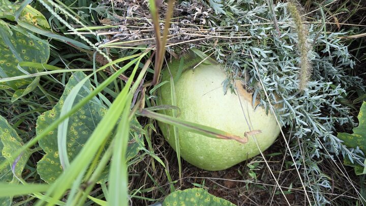</a> <strong>20260811_174500.jpg</strong> 17:45:00 · 원본 보기</td>
<td width="33%" valign="top" align="center"><a href="images/original/20260811_174501.jpg">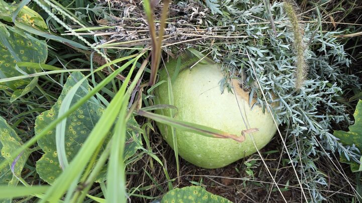</a> <strong>20260811_174501.jpg</strong> 17:45:01 · 원본 보기</td>
</tr>
</table>

## 4. 재배지 전경 연속 기록

17:45:11~17:45:22에 방향을 바꾸며 연속 촬영한 40장입니다. 박 덩굴 분포, 잡초 생육, 주변 산림과 하우스 방향 등 밭 전체 상태를 확인할 수 있습니다.

<table>
<tr>
<td width="33%" valign="top" align="center"><a href="images/original/20260811_174511.jpg">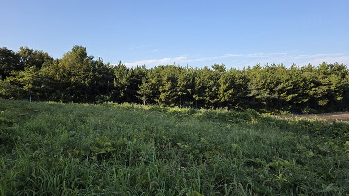</a> <strong>20260811_174511.jpg</strong> 17:45:11 · 원본 보기</td>
<td width="33%" valign="top" align="center"><a href="images/original/20260811_174512.jpg">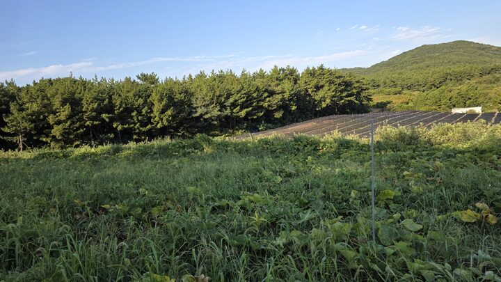</a> <strong>20260811_174512.jpg</strong> 17:45:12 · 원본 보기</td>
<td width="33%" valign="top" align="center"><a href="images/original/20260811_174512(0).jpg">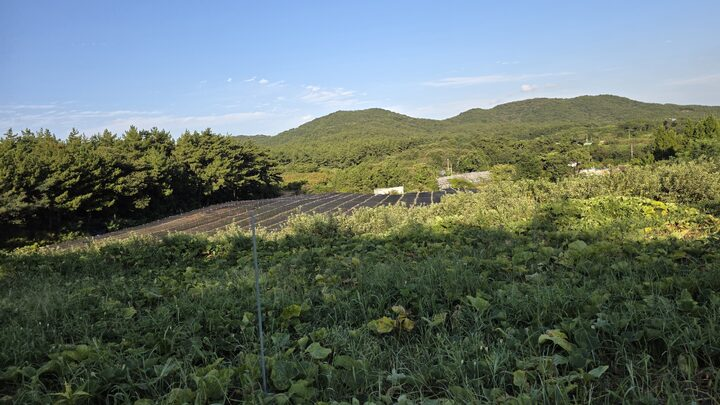</a> <strong>20260811_174512(0).jpg</strong> 17:45:12 · 원본 보기</td>
</tr>
<tr>
<td width="33%" valign="top" align="center"><a href="images/original/20260811_174513.jpg">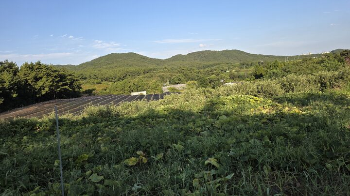</a> <strong>20260811_174513.jpg</strong> 17:45:13 · 원본 보기</td>
<td width="33%" valign="top" align="center"><a href="images/original/20260811_174513(0).jpg">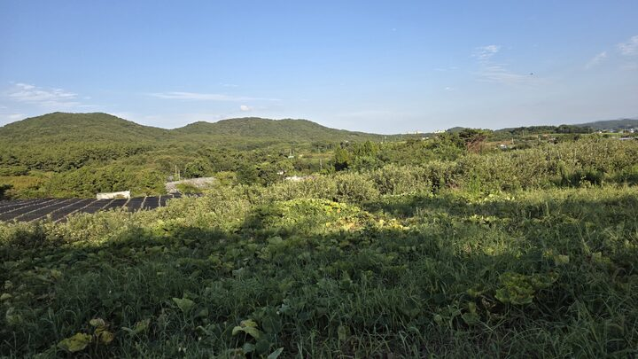</a> <strong>20260811_174513(0).jpg</strong> 17:45:13 · 원본 보기</td>
<td width="33%" valign="top" align="center"><a href="images/original/20260811_174514.jpg">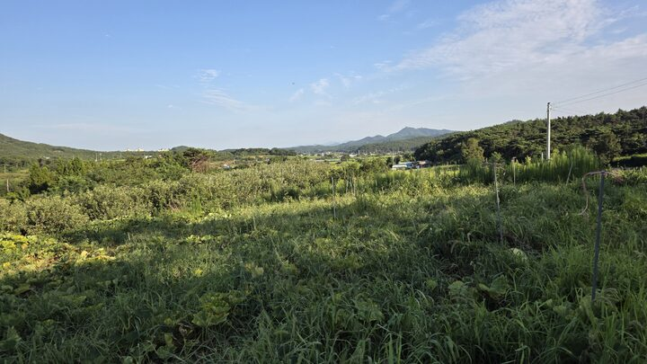</a> <strong>20260811_174514.jpg</strong> 17:45:14 · 원본 보기</td>
</tr>
<tr>
<td width="33%" valign="top" align="center"><a href="images/original/20260811_174514(0).jpg">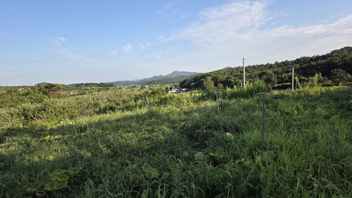</a> <strong>20260811_174514(0).jpg</strong> 17:45:14 · 원본 보기</td>
<td width="33%" valign="top" align="center"><a href="images/original/20260811_174514(1).jpg">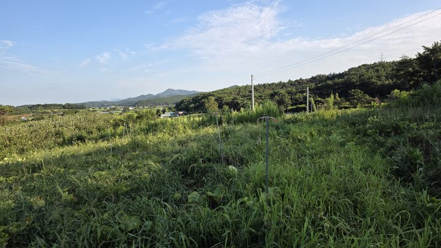</a> <strong>20260811_174514(1).jpg</strong> 17:45:14 · 원본 보기</td>
<td width="33%" valign="top" align="center"><a href="images/original/20260811_174514(2).jpg">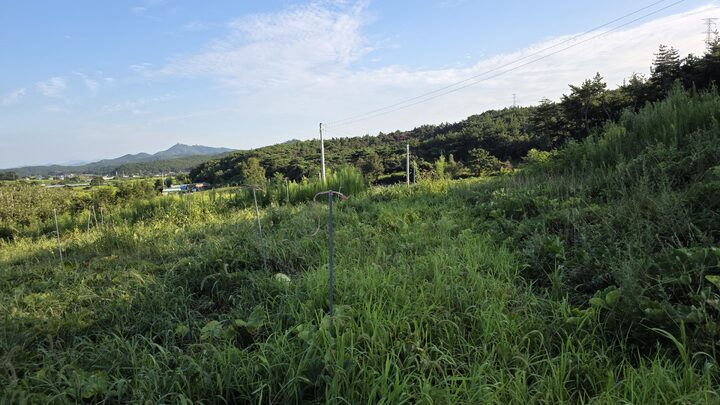</a> <strong>20260811_174514(2).jpg</strong> 17:45:14 · 원본 보기</td>
</tr>
<tr>
<td width="33%" valign="top" align="center"><a href="images/original/20260811_174514(3).jpg">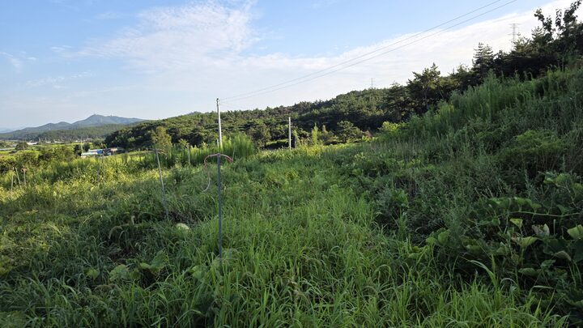</a> <strong>20260811_174514(3).jpg</strong> 17:45:14 · 원본 보기</td>
<td width="33%" valign="top" align="center"><a href="images/original/20260811_174515.jpg">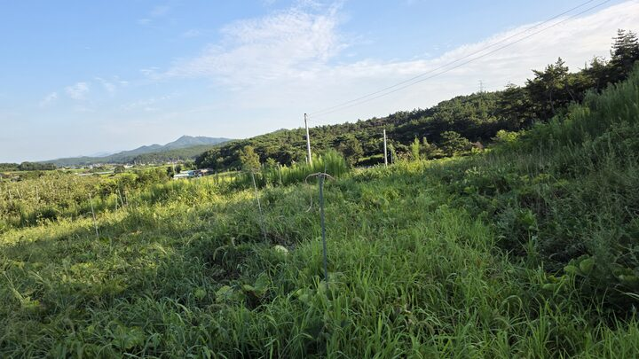</a> <strong>20260811_174515.jpg</strong> 17:45:15 · 원본 보기</td>
<td width="33%" valign="top" align="center"><a href="images/original/20260811_174515(0).jpg">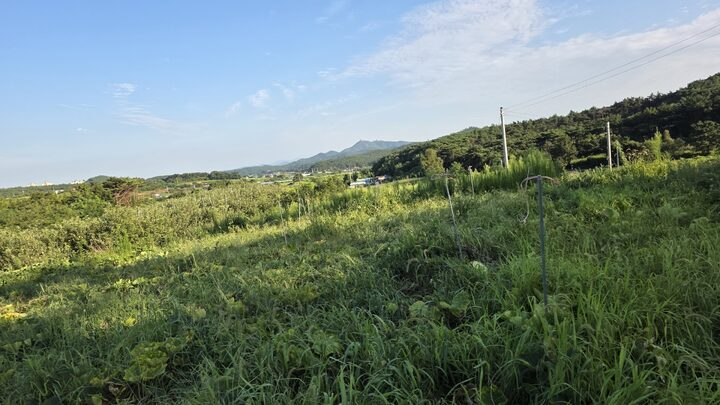</a> <strong>20260811_174515(0).jpg</strong> 17:45:15 · 원본 보기</td>
</tr>
<tr>
<td width="33%" valign="top" align="center"><a href="images/original/20260811_174515(1).jpg">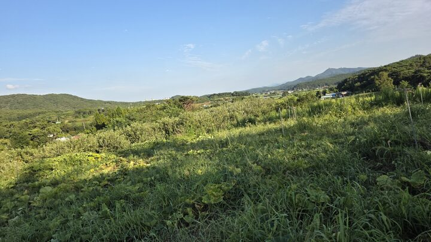</a> <strong>20260811_174515(1).jpg</strong> 17:45:15 · 원본 보기</td>
<td width="33%" valign="top" align="center"><a href="images/original/20260811_174516.jpg">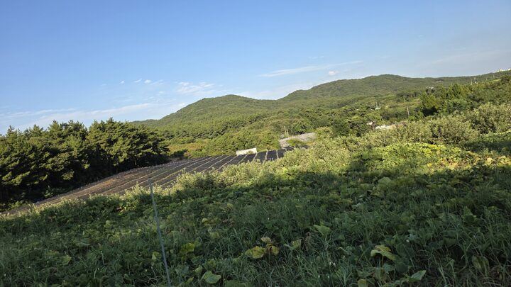</a> <strong>20260811_174516.jpg</strong> 17:45:16 · 원본 보기</td>
<td width="33%" valign="top" align="center"><a href="images/original/20260811_174516(0).jpg">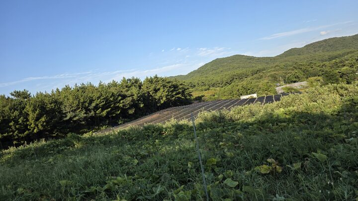</a> <strong>20260811_174516(0).jpg</strong> 17:45:16 · 원본 보기</td>
</tr>
<tr>
<td width="33%" valign="top" align="center"><a href="images/original/20260811_174516(1).jpg">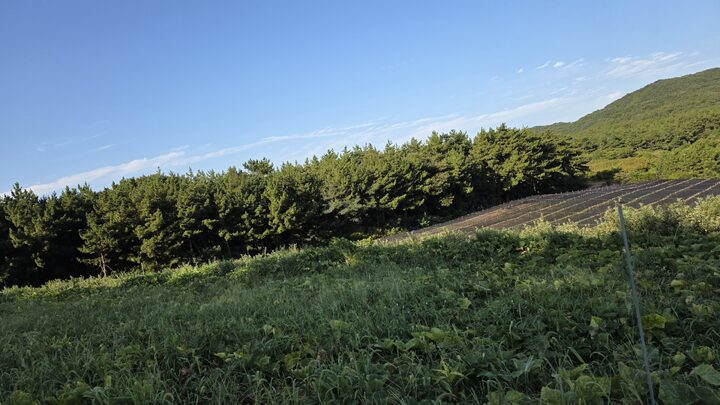</a> <strong>20260811_174516(1).jpg</strong> 17:45:16 · 원본 보기</td>
<td width="33%" valign="top" align="center"><a href="images/original/20260811_174516(2).jpg">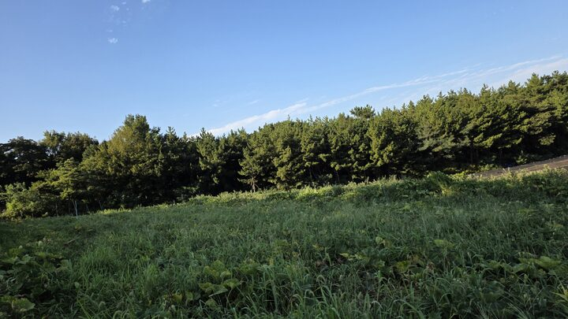</a> <strong>20260811_174516(2).jpg</strong> 17:45:16 · 원본 보기</td>
<td width="33%" valign="top" align="center"><a href="images/original/20260811_174517.jpg">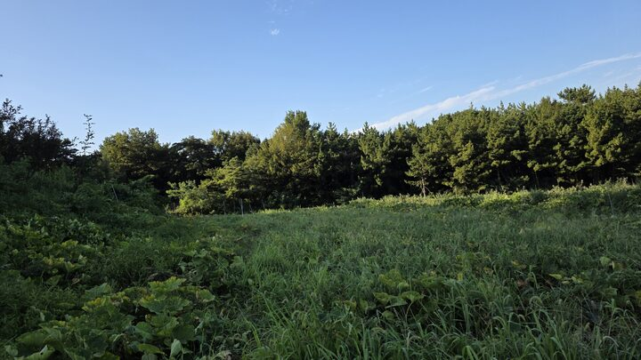</a> <strong>20260811_174517.jpg</strong> 17:45:17 · 원본 보기</td>
</tr>
<tr>
<td width="33%" valign="top" align="center"><a href="images/original/20260811_174517(0).jpg">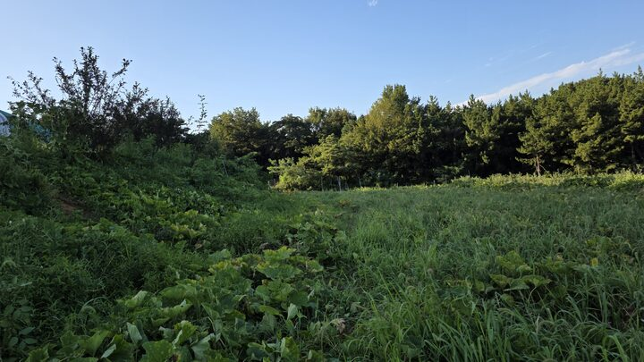</a> <strong>20260811_174517(0).jpg</strong> 17:45:17 · 원본 보기</td>
<td width="33%" valign="top" align="center"><a href="images/original/20260811_174517(1).jpg">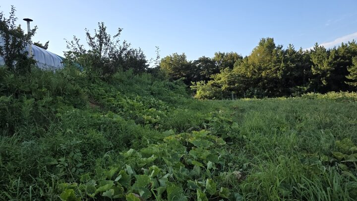</a> <strong>20260811_174517(1).jpg</strong> 17:45:17 · 원본 보기</td>
<td width="33%" valign="top" align="center"><a href="images/original/20260811_174517(2).jpg">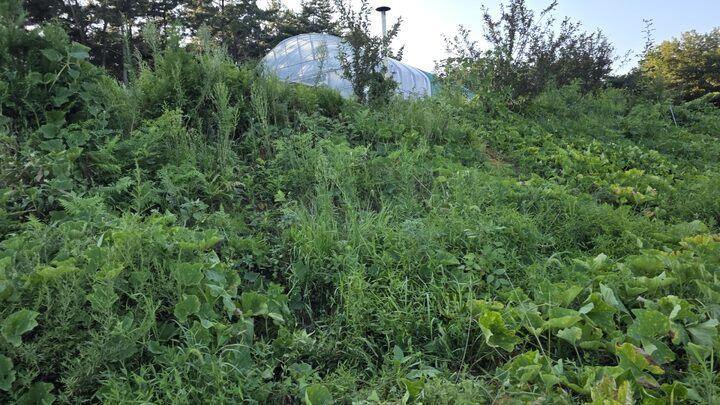</a> <strong>20260811_174517(2).jpg</strong> 17:45:17 · 원본 보기</td>
</tr>
<tr>
<td width="33%" valign="top" align="center"><a href="images/original/20260811_174517(3).jpg">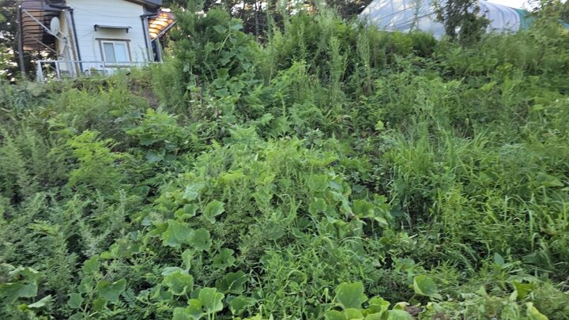</a> <strong>20260811_174517(3).jpg</strong> 17:45:17 · 원본 보기</td>
<td width="33%" valign="top" align="center"><a href="images/original/20260811_174518.jpg">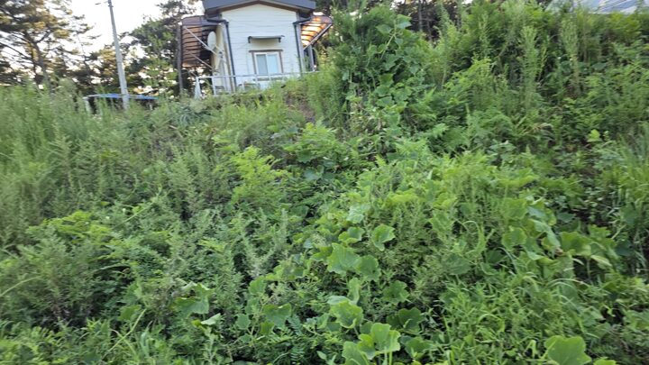</a> <strong>20260811_174518.jpg</strong> 17:45:18 · 원본 보기</td>
<td width="33%" valign="top" align="center"><a href="images/original/20260811_174518(0).jpg">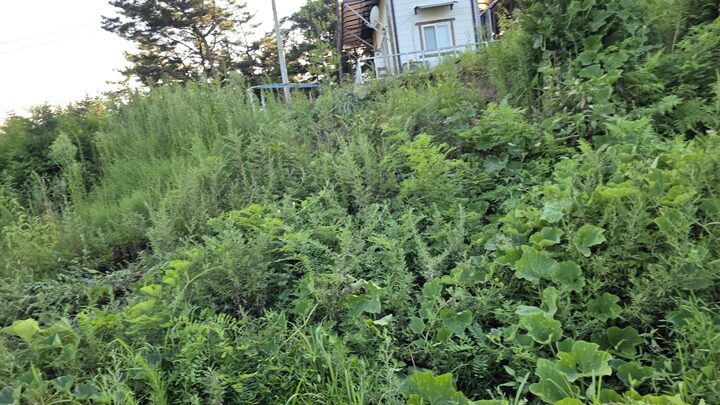</a> <strong>20260811_174518(0).jpg</strong> 17:45:18 · 원본 보기</td>
</tr>
<tr>
<td width="33%" valign="top" align="center"><a href="images/original/20260811_174518(1).jpg">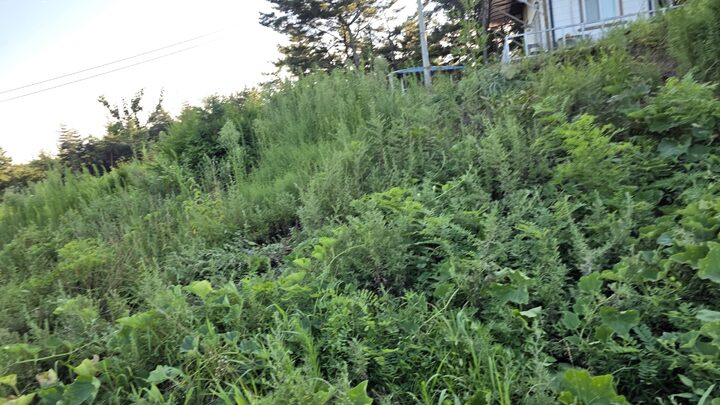</a> <strong>20260811_174518(1).jpg</strong> 17:45:18 · 원본 보기</td>
<td width="33%" valign="top" align="center"><a href="images/original/20260811_174518(2).jpg">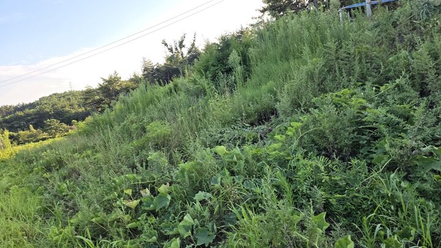</a> <strong>20260811_174518(2).jpg</strong> 17:45:18 · 원본 보기</td>
<td width="33%" valign="top" align="center"><a href="images/original/20260811_174519.jpg">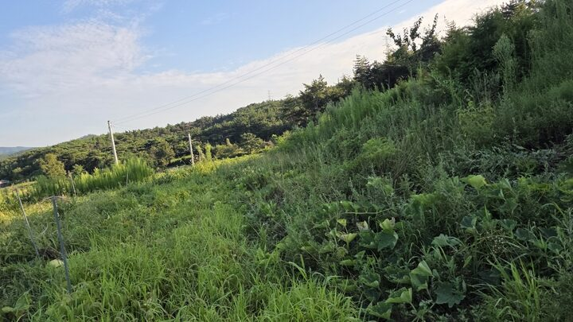</a> <strong>20260811_174519.jpg</strong> 17:45:19 · 원본 보기</td>
</tr>
<tr>
<td width="33%" valign="top" align="center"><a href="images/original/20260811_174519(0).jpg">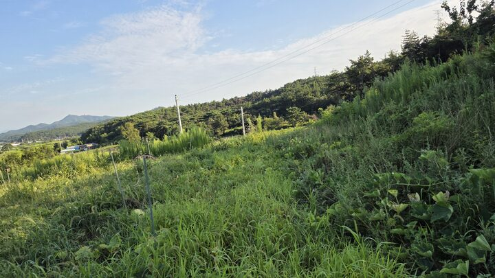</a> <strong>20260811_174519(0).jpg</strong> 17:45:19 · 원본 보기</td>
<td width="33%" valign="top" align="center"> <strong>20260811_174519(1).jpg</strong> 17:45:19 · 원본 보기</td>
<td width="33%" valign="top" align="center"><a href="images/original/20260811_174519(2).jpg">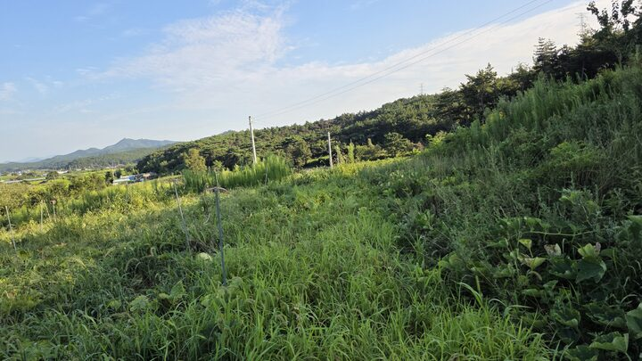</a> <strong>20260811_174519(2).jpg</strong> 17:45:19 · 원본 보기</td>
</tr>
<tr>
<td width="33%" valign="top" align="center"><a href="images/original/20260811_174520.jpg">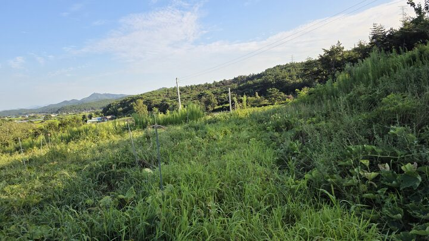</a> <strong>20260811_174520.jpg</strong> 17:45:20 · 원본 보기</td>
<td width="33%" valign="top" align="center"><a href="images/original/20260811_174520(0).jpg">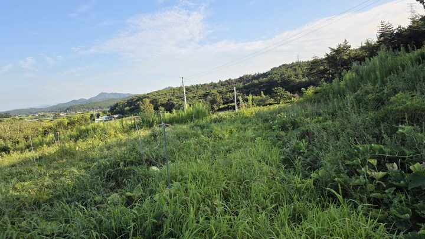</a> <strong>20260811_174520(0).jpg</strong> 17:45:20 · 원본 보기</td>
<td width="33%" valign="top" align="center"><a href="images/original/20260811_174520(1).jpg">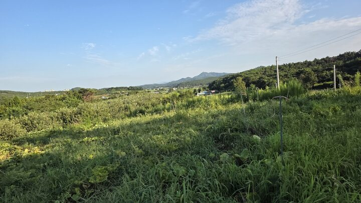</a> <strong>20260811_174520(1).jpg</strong> 17:45:20 · 원본 보기</td>
</tr>
<tr>
<td width="33%" valign="top" align="center"><a href="images/original/20260811_174520(2).jpg">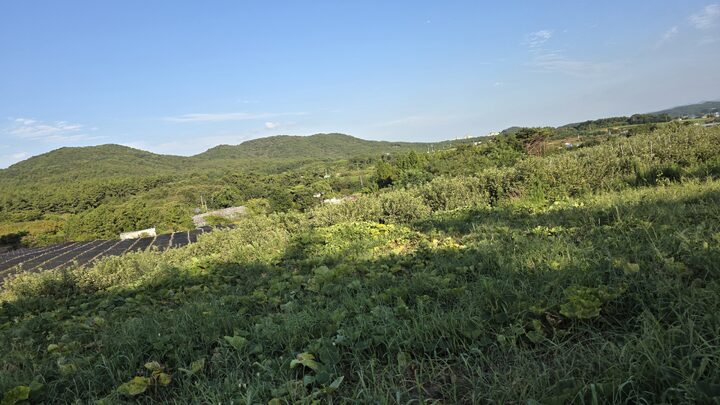</a> <strong>20260811_174520(2).jpg</strong> 17:45:20 · 원본 보기</td>
<td width="33%" valign="top" align="center"><a href="images/original/20260811_174521.jpg">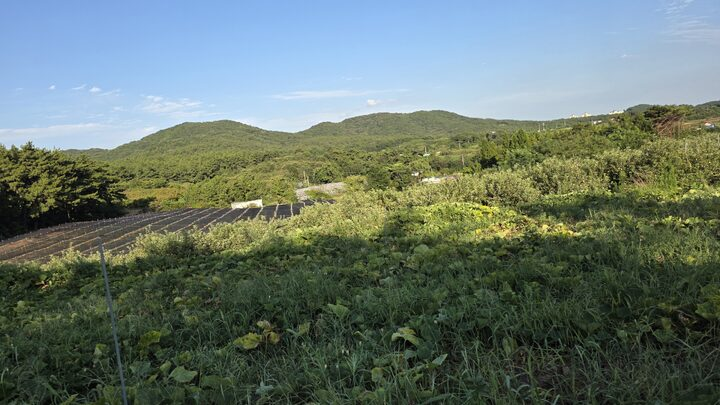</a> <strong>20260811_174521.jpg</strong> 17:45:21 · 원본 보기</td>
<td width="33%" valign="top" align="center"><a href="images/original/20260811_174521(0).jpg">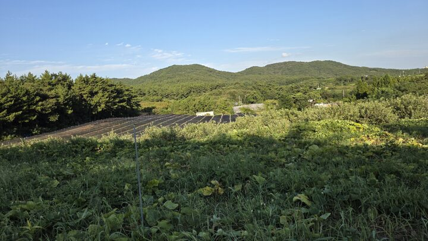</a> <strong>20260811_174521(0).jpg</strong> 17:45:21 · 원본 보기</td>
</tr>
<tr>
<td width="33%" valign="top" align="center"><a href="images/original/20260811_174521(1).jpg">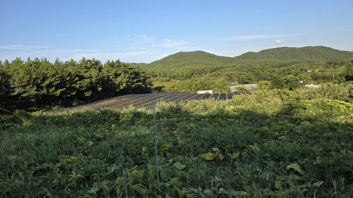</a> <strong>20260811_174521(1).jpg</strong> 17:45:21 · 원본 보기</td>
<td width="33%" valign="top" align="center"><a href="images/original/20260811_174521(2).jpg">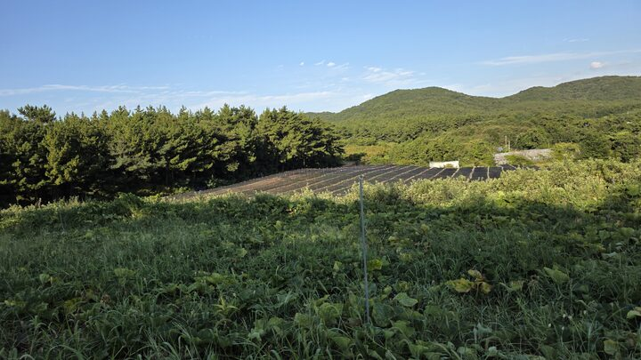</a> <strong>20260811_174521(2).jpg</strong> 17:45:21 · 원본 보기</td>
<td width="33%" valign="top" align="center"><a href="images/original/20260811_174522.jpg">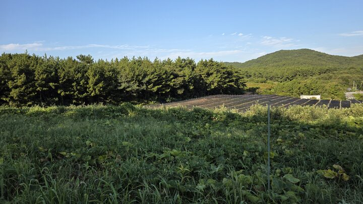</a> <strong>20260811_174522.jpg</strong> 17:45:22 · 원본 보기</td>
</tr>
<tr>
<td width="33%" valign="top" align="center"><a href="images/original/20260811_174522(0).jpg">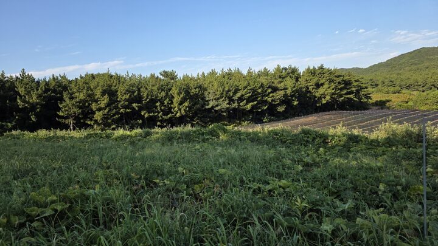</a> <strong>20260811_174522(0).jpg</strong> 17:45:22 · 원본 보기</td>
<td width="33%" valign="top" align="center"></td>
<td width="33%" valign="top" align="center"></td>
</tr>
</table>

## 5. 덩굴·지면 근접 기록

촬영 마지막에 남긴 지면 근접 사진입니다. 박 덩굴과 잡초가 함께 무성한 상태가 확인됩니다.

<table>
<tr>
<td width="33%" valign="top" align="center"><a href="images/original/20260811_174523.jpg">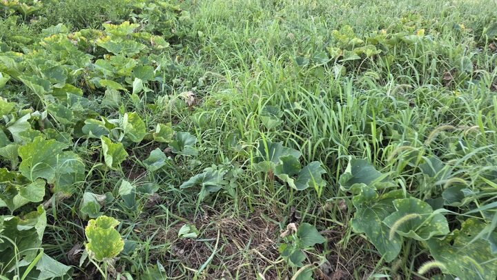</a> <strong>20260811_174523.jpg</strong> 17:45:23 · 원본 보기</td>
<td width="33%" valign="top" align="center"><a href="images/original/20260811_174526.jpg">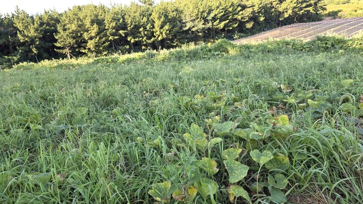</a> <strong>20260811_174526.jpg</strong> 17:45:26 · 원본 보기</td>
<td width="33%" valign="top" align="center"></td>
</tr>
</table>

## 현장 관리 메모

1. 수확 후 덩굴 아래와 잡초 사이에 남은 박이 없는지 한 번 더 확인한다.
2. 갈색 반점이나 상처가 있는 박은 별도 분류하고, 무르거나 냄새가 나는 것은 우선 처리한다.
3. 밭 통로를 가리는 잡초와 덩굴을 정리해 다음 수확·운반 동선을 확보한다.
4. 보관 전 흙과 수분을 털고 통풍되는 곳에서 표면을 말린 뒤 상태별로 구분한다.

## 파일 안내

- 원본 사진: `images/original/`
- 웹용 썸네일: `images/thumbnails/`
- HTML 문서에서는 사진을 누르면 같은 화면의 레이어 팝업으로 확대됩니다.
