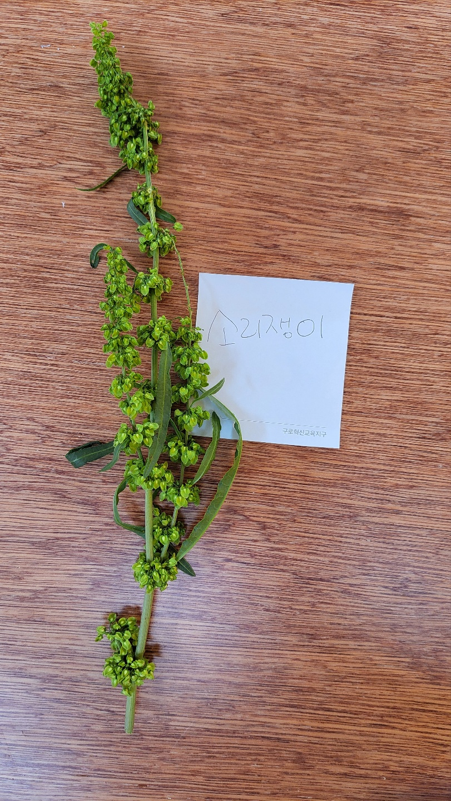
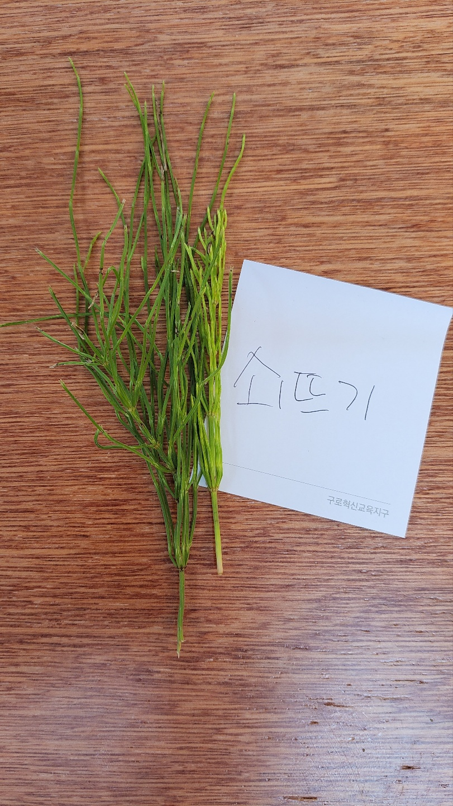

### # 소리쟁이 샴프만들기
  - 약성이 뿌리 있음
  - 유통기한 6개월 한꺼번에 많이 만드는건 안좋음.
  - 사포닌 === 거품
  - 뿌리를 말렸다가 만듬. 
  - 강사님 참여 모임중 "소리쟁이 부리를 찾아서"가 있다고함.
  - 겨울나고 2년생 : 봄에 캠.

### # 참고
  - "비름"도 좋은 재료임 : 비듬에 좋음.
  - "아욱"도 좋은 재료임 : 거품이 많이 나서 좋음
  - "꽃창포"도 좋음.

### # 재료 
  > 1인분 400~500ml 

  > 10인분 4l기준으로 10배 잡으면됨.

  - 증류수 400ml
  - 폴리쿼터 4g : 코코넛 안쪽의 하얀색
  - 식물성계면활성제 100ml(LES)
  - 천연 글리세린 4ml : 보습에 좋음 : 천연당
  - 에센셜 오일(라벤더)
  - 한방방부제 : 쇠뜨기 사용 (동일효능)

### # 순서
  1. 증류수에 소리쟁이를 넣고 끓인다. ( 쇠뜨기도 같이 넣고 끓임 )
  2. 끓으면 바로 끄고 20분정도 우려낸다.
  3. 우린 물을 채로 걸러준다.
  4. 폴리쿼터를 넣고 저어준다.(점도조절, 모발의 흐트러짐 방지, 촉감을 개선) - 중탕하여 녹인다 ( 약 50도)
  5. 식물성계면활성제를 넣어 저어준다.
  6. 천연글리세린을 넣고 저어준다.
  7. 에센셜오일로 향을 첨가한다.
  8. 병입한다.

#### # 식물성계면활성제

#### # 폴리쿼터

##### # 글리세린

##### # 끓여서 걸러내고, 식물성계면활성제, 폴리쿼터 저으면서 투입. 
<video src="./KakaoTalk_Video_2022-07-11-13-46-32.mp4"></video>

##### # 소리쟁이

##### # 쇠뜨기

